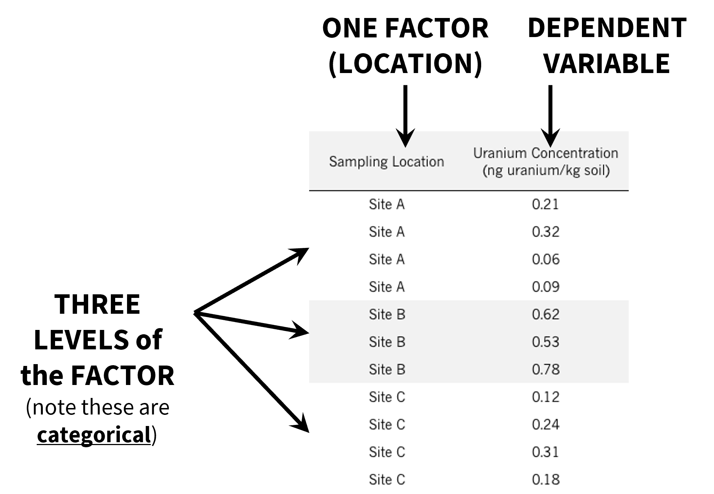
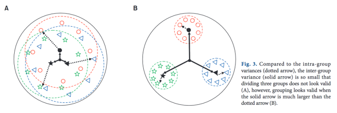
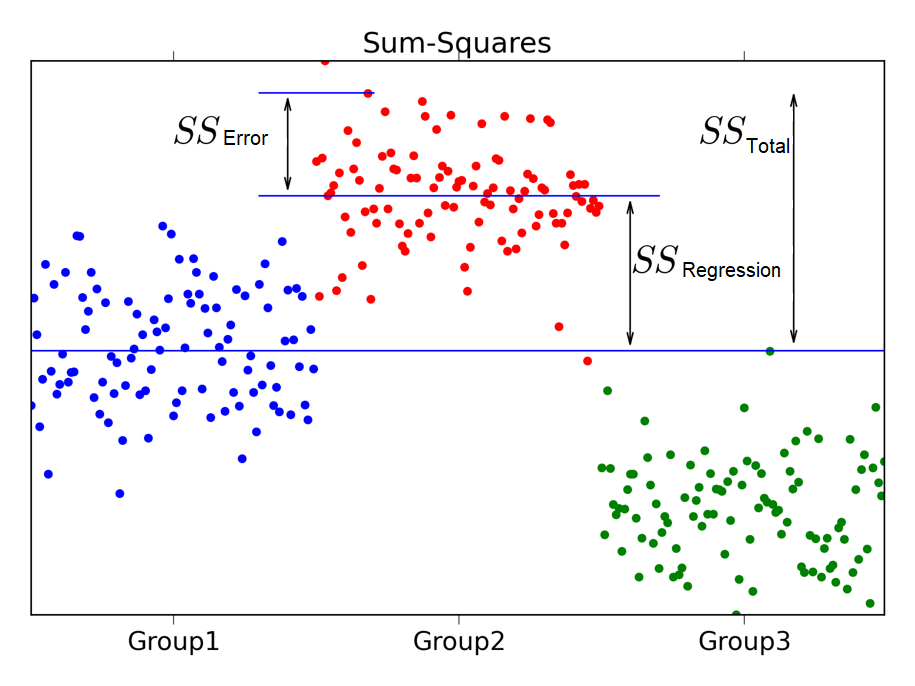

```{r setup, include=FALSE}
options(htmltools.dir.version = FALSE,
        eval = TRUE, warning = FALSE, message = FALSE)
knitr::opts_chunk$set(warning = FALSE, message = FALSE, fig.retina = 3, fig.asp = 0.8, fig.width = 7, out.width = "120%")

library(tidyverse)
library(gt)
library(gtExtras)
library(rstatix)
library(palmerpenguins)

```


class: title-slide, left, top

# `r rmarkdown::metadata$title`

## `r rmarkdown::metadata$subtitle`

### `r rmarkdown::metadata$author`

<br>


<span style='color:white;'>Slides released under</span> [CC-BY 2.0](https://creativecommons.org/licenses/by/2.0/)&nbsp;&nbsp;`r fontawesome::fa("creative-commons", "white")``r fontawesome::fa("creative-commons-by", "white")` ]   

<div style = "position: absolute;top: 0px;right: 0px;"></img></div>

---

layout: true

<div class="my-footer"><span>Philip Leftwich - Physalia Courses</span></div>

---
## Model summary

In this example of a simple linear model, we run the equivalent to a Student's t-test.

```{r, echo = FALSE, out.width="50%", fig.alt = "R model summary provides, the formula of the regression, the estimate of the intercept and standard error, estimated differences and uncertainity for each slope, the degrees of freedom for the whole model, F value and R squared"}
knitr::include_graphics("images/model_summary.png")
```

**Q. What happens when we have more than two groups in our predictor variable? Why can't we just do more t-tests?**

---

class: center

# ANalysis Of VAriance (ANOVA)

ANOVAs use information about variances, but the main goal of analysis is comparison of MEANS (don’t let the name mix you up - more on this later).


**ANOVA is an omnibus test** – it tests for significant differences between any means in the study

**ANOVA is just a special case of the linear model**

---

## ANOVA Hypotheses:

**Null Hypothesis (H0):** All means are equal (in other words, all groups are from populations with the same mean)

**Alternative Hypothesis (HA):** At least two group means are NOT equal (that means that just two could be different, or they could ALL be different)


---

## Example 


.pull-left[
We have collected data for soil uranium concentrations at three locations on Los Alamos National Lab property: Site A, Site B, and Site C. The data structure is shown below: 
]


.pull-right[
```{r, echo = FALSE, out.width="110%", fig.alt = "A tidy dataframe illustrating one continuous dependent variable and and one factor predictor variable (with three levels)"}

```
]

--

A one-way ANOVA can be used to assess whether there is a statistically significant difference in uranium concentration in soil at three locations

---

## One-way ANOVA (single factor)

What does this one-way/single-factor refer to? 

There is a **single factor** (*variable*), with at least 3 **levels**, where we are trying to compare means across the different levels of that factor.

ANOVA does this *indirectly* by looking at total *between* and *within* group variances as a ratio

```{r, echo = FALSE, out.width="70%", fig.alt = ""}

```

---

.left-code[

$$
SSE = \underset{i=1}{n \atop{\sum}}(y_i - \hat{y_i})^2
$$


$$
SSR = \underset{i=1}{n \atop{\sum}}(\hat{y_i} - \overline{y})^2
$$


$$
SST = \underset{i=1}{n \atop{\sum}}(y_i - \overline{y})^2
$$

where:

$y_i$ = Observed value

$\hat{y_i}$ = Value estimated by regression

$\overline{y}$ = The Grand Mean


]

.right-plot[
```{r, echo = FALSE, out.width="100%", fig.alt = "A tidy dataframe illustrating one continuous dependent variable and and one factor predictor variable (with three levels)"}

```

]

$SSE + SSR = SST$

---

## What does an ANOVA actually do?

$$
F = {{SSR/(k - 1)}\over{SSE/N-k}}
$$

$N$ = numerator degrees of freedom = Total number of observations across all groups

$k$ = Total number of groups

$N-k$ = denominator degrees of freedom

This is a ratio of the between group variance and the the within group variance. 

```{r, echo = FALSE, out.width="35%", fig.alt = ""}
knitr::include_graphics("images/one-way-ANOVA.png")
```

---

## F distribution

.left-code[

The F-value or ratio of variances, over their respective degrees of freedom will have an F-distribution. 

This F distribution is used when we want to compare within and between group variances.

The curve of the distribution depends on the degrees of freedom, and it is always positively skewed

]

.right-plot[

```{r, echo = FALSE, out.width="100%", fig.cap = "Q. why can this distribution never be negative?*"}
knitr::include_graphics("images/F-distribution.png")
```

]

---

The higher the *F*-value the greater the *signal-to-noise* ratio. 

For a given value of numerator and denominator degrees of freedom we can look up the probability of observing this ratio under a null hypothesis of identical means between populations


If F value is high enough then we might have enough evidence to conclude that samples are likely drawn from populations with *different* means.

```{r, echo = FALSE, out.width="60%", fig.alt = ""}
knitr::include_graphics("images/F-test-sig.jpg")
```

---
class: center, middle, inverse

#Ask a question about: ANOVA

---

## Example

.left-code[
```{r}
bulbs <- read_csv(here::here("data", "bulbs.csv"))
bulbs %>% 
  head() %>% 
  gt()

```
]

.right-plot[

```{r}
bulb_lsmodel0 <- lm(lifetime_hours ~ bulb_type, data = bulbs)

summary(bulb_lsmodel0)

anova(bulb_lsmodel0)

```

]

---

class: center, middle, inverse

# Post-hoc

## You decide that *at least* two means differ within your groups, what next?

---

## Post hoc testing

.left-code[

Pairwise comparisons with different optional adjustments for multiple comparisons

Confidence intervals provide information on minimum predicted differences on dependent variable scale
]

.right-plot[

```{r}
library(emmeans)

means <- emmeans(bulb_lsmodel0, 
                 specs = pairwise ~ bulb_type)

confint(means)

```
]


