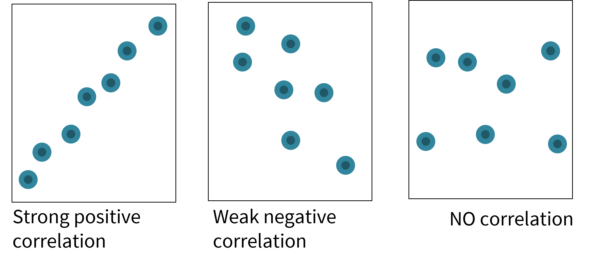
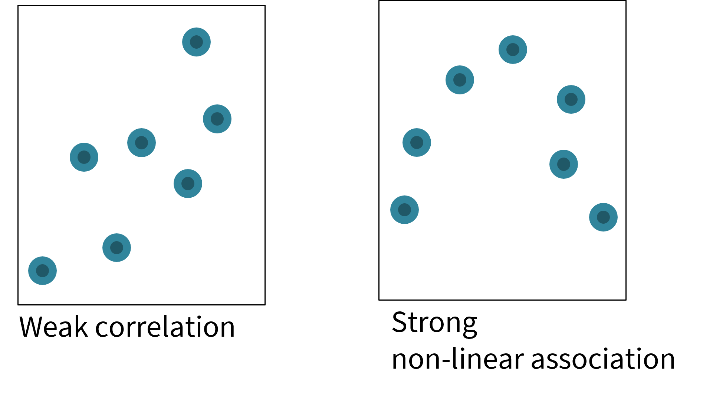
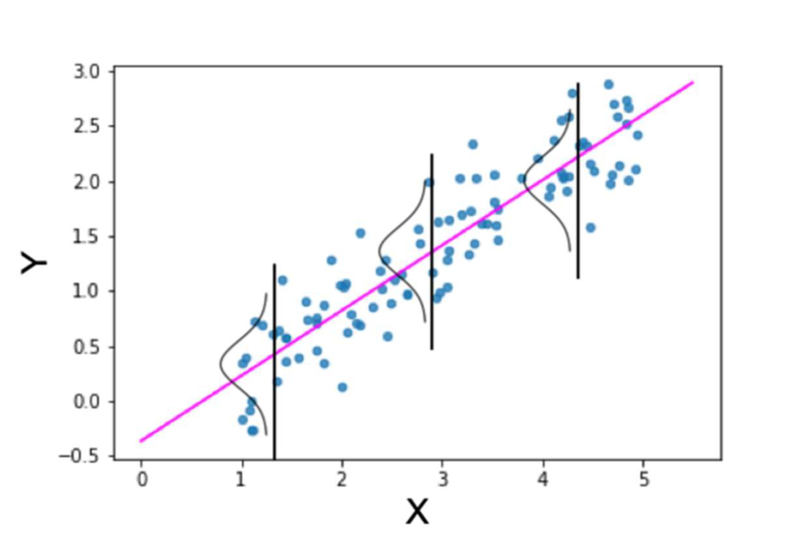

```{r setup, include=FALSE}
options(htmltools.dir.version = FALSE,
        eval = TRUE, warning = FALSE, message = FALSE)
knitr::opts_chunk$set(warning = FALSE, message = FALSE, fig.retina = 3, fig.asp = 0.8, fig.width = 7, out.width = "120%")
library(tidyverse)
library(gt)
library(gtExtras)
library(palmerpenguins)
library(wesanderson)

```


class: title-slide, left, top

# `r rmarkdown::metadata$title`

## `r rmarkdown::metadata$subtitle`

### `r rmarkdown::metadata$author`

<br>


<span style='color:white;'>Slides released under</span> [CC-BY 2.0](https://creativecommons.org/licenses/by/2.0/)&nbsp;&nbsp;`r fontawesome::fa("creative-commons", "white")``r fontawesome::fa("creative-commons-by", "white")` ]   

<div style = "position: absolute;top: 0px;right: 0px;"></img></div>

---

layout: true

<div class="my-footer"><span>Philip Leftwich - Physalia Courses</span></div>


---

## Correlation tests

We are interested in knowing whether there is a relationship between beak length and beak depth. 

We will describe the different ways of achieving this

---

When we look at data, how do we describe the strength of the relationship between the dependent and independent variable?   Correlation


```{r, echo = FALSE, out.width="70%", fig.alt = "Strength of correlation"}

```

---

Exploratory Data Analysis and Data visualisation MUST be the starting point before applying any formal tests. 

Correlation analysis assumes a linear relationship, but while the figure on the right would produce a low *r* value, the strength of association is HIGH.


```{r, echo = FALSE, out.width="70%", fig.alt = "Strength of correlation"}

```

---

## Pearson's r

$$
\large{r={{\sum(x_i-\overline{x})(y_i-\overline{y})}\over{\sqrt{{\sum(x_i-\overline{x})^2(y_i-\overline{y})^2}}}}}
$$
where:

$r$	=	correlation coefficient
$x_{i}$	=	values of the x-variable in a sample
$\bar{x}$	=	mean of the values of the x-variable
$y_{i}$	=	values of the y-variable in a sample
$\bar{y}$	=	mean of the values of the y-variable


---

## Statistical significance

If we wish to know the probability of observing this strength of association or higher under the assumption that the null hypothesis is true:

1. By looking up $r$ on a correlation coefficient table, with $df=n-2$

where: 

$n$ is the number of observations made

$df$ is degrees of freedom

2. By calculating a *t*-value:

$$
t={r{\sqrt{n-2}\over{1-r^2}}}
$$

Then using a *t* distribution table for $df=n-2$

---

## Correlation analysis in R

```{r}
library(rstatix)

penguins %>% 
  cor_test(bill_length_mm, bill_depth_mm)

```

**Q. What can we conclude from this?**

---

## Simpson's Paradox


.left-code[
```{r, eval = F}
library(ggpubr)#<<

ggplot(penguins, aes(x= bill_length_mm, 
                     y= bill_depth_mm)) +
    geom_point()+
    geom_smooth(method = "lm",
                se = FALSE)+
  theme_classic()+
  stat_cor(method = "pearson", #<<
           label.x = 33, #<<
           label.y = 15)#<<
```

]

.right-plot[

```{r, echo = F}
library(ggpubr)#<<
ggplot(penguins, aes(x= bill_length_mm, 
                     y= bill_depth_mm)) +
    geom_point()+
    geom_smooth(method = "lm",
                se = FALSE)+
  theme_classic()+
  stat_cor(method = "pearson", label.x = 33, label.y = 15)#<<

```

]

---

.left-code[

```{r, eval = F}

penguins %>% 
  group_by(species) %>% 
  cor_test(bill_length_mm, bill_depth_mm)

```

```{r, eval = F}
ggplot(penguins, aes(x= bill_length_mm, 
                     y= bill_depth_mm,
                     colour = species)) +
    geom_point()+
    geom_smooth(method = "lm",
                se = FALSE)+
  theme_classic()+
  stat_cor(method = "pearson", label.x = 25)+
  scale_color_manual(values = wes_palette("Darjeeling1", 3))

```

]

.right-plot[


```{r, echo = F}
ggplot(penguins, 
       aes(x= bill_length_mm, 
                     y= bill_depth_mm,
                     colour = species)) +
    geom_point()+
    geom_smooth(method = "lm",
                se = FALSE)+
  theme_classic()+
  stat_cor(method = "pearson", 
           label.x = 25)+
  scale_color_manual(values = wes_palette(
    "Darjeeling1", 3))

```


]

---

## Assumptions of Pearson's *r*

```{r, echo = FALSE, out.width="70%", fig.alt = "Strength of correlation"}

```

There are several assumptions required for the application of Pearson's *r*

1. Is the covariation linear?

--

2. Are the residuals normally distributed around the best fit line?


---

## QQplots

```{r, echo = FALSE, out.width = "60%"}
penguins %>%  
 
  ggplot(aes(sample = bill_length_mm))+
  geom_qq()+
  geom_qq_line()+
  theme(legend.position = "none")+
  labs(x = " ",
       y = " ")+
  facet_wrap(~species)+
  ggtitle("Bill length")+
  theme_minimal()

```


---

## QQplots

```{r, echo = FALSE,  out.width = "60%"}
penguins %>%  
 
  ggplot(aes(sample = bill_depth_mm))+
  geom_qq()+
  geom_qq_line()+
  theme(legend.position = "none")+
  labs(x = " ",
       y = " ")+
  facet_wrap(~species)+
  ggtitle("Bill depth")+
  theme_minimal()

```


---

## Spearman's Rank Correlation

$$
Spearman's~\rho=1-{{6\sum{d^2}}\over{n(n^2-1)}}
$$
where:

$d$ is the difference between the ranks at each site e.g. 

$n$ is the number of samples

$\sum$ is the sum of


---

## Spearman's in R


**Spearman's**

```{r}

penguins %>% 
  group_by(species) %>% 
  cor_test(bill_length_mm, 
           bill_depth_mm,
           method = "spearman") #<<

```

**Pearson's**

Adelie ~ 0.39; Chinstrap ~ 0.65; Gentoo ~ 0.64


