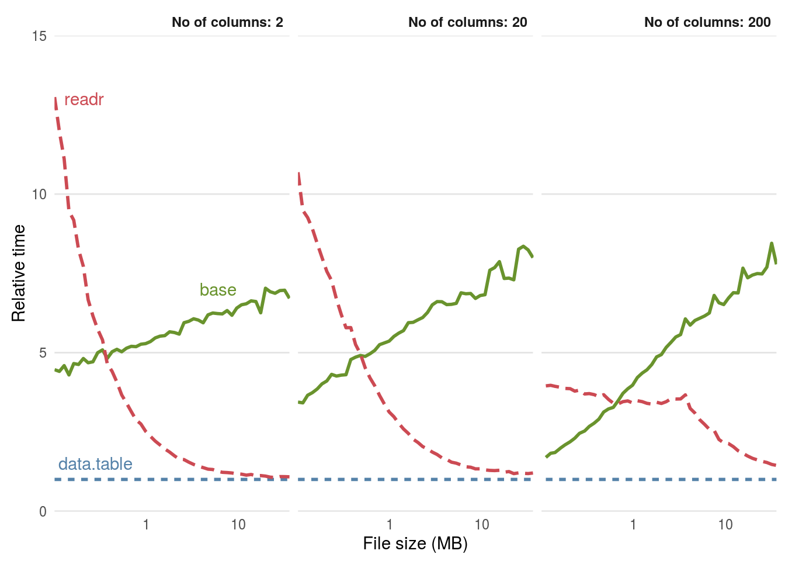

class: title-slide, left, top

# `r rmarkdown::metadata$title`

## `r rmarkdown::metadata$subtitle`

### `r rmarkdown::metadata$author`

<br>


<span style='color:white;'>Slides released under</span> [CC-BY 2.0](https://creativecommons.org/licenses/by/2.0/)&nbsp;&nbsp;`r fontawesome::fa("creative-commons", "white")``r fontawesome::fa("creative-commons-by", "white")` ]   

<div style = "position: absolute;top: 0px;right: 0px;"></img></div>


---

```{r setup, include=FALSE}
options(htmltools.dir.version = FALSE)
knitr::opts_chunk$set(echo = TRUE, eval = FALSE)
library(tidyverse)
library(rlang)
library(knitr)
set.seed(78987)
```


# Efficient Handling of Large Data Files in R


---

# Introduction

- **Why Handle Large Data in R?**

  - Increasing data sizes in real-world applications
  
  - Need for efficient data processing
  
- **Challenges:**

  - Memory limitations
  
  - Slow data import and manipulation
  
- **Overview:**

  - Memory management in R
  
  - Efficient data import with `readr` and `data.table`
  
  - Using SQL within R

---

# Understanding Memory in R

- **R's Memory Model:**
  - R stores objects in physical memory (RAM)
  
- **Implications:**
  - Large datasets can exhaust available memory
  - May lead to slow performance or crashes
  
- **Key Concepts:**
  - Workspace environment
  - Garbage collection


---

# Understanding Memory in R

- R's Memory Model:

  - R stores objects in physical memory (RAM)
  
  - Need roughly 2-3 times as much RAM as used by an object to work with it
  
  
$\text{Estimated Memory (bytes)} = \text{Number of Rows} \times \sum \text{Size per Column}$

---

# Quantifying Memory Usage

- **Measure Object Sizes:**
  - `object.size(object)`
  - `pryr::object_size(object)`
  
- **Clear memory:**
  -  `rm()` - delete objects from the memory
  - `gc()` gabrage collection function - **not actually needed!**


---

# Strategies for Memory Optimization

- **Efficient Coding Practices:**
  - Remove unused objects: `rm(object)`
  - Clear workspace: `rm(list = ls())`
  - Use appropriate data types
  
- **Processing in Chunks:**
  - Read and process data in smaller pieces
  - Only keep what we actually need in memory
  
- **Data Storage Techniques:**
  - Use `data.table` or matrices instead of data frames


---

# Introduction to `readr`

- **What is `readr`?**
  - Part of the `tidyverse` package ecosystem
  - Designed for faster data import than base R functions
  
- **Advantages:**
  - Faster parsing
  - Better handling of encodings and missing data
  
- **Core Functions:**
  - `read_csv()`, `read_tsv()`, `read_delim()`

---

# Using `readr` for Large Files

- **Speed Optimizations:**
  - Specify column types with `col_types`
  - Use `n_max` to read a subset of rows
- **Example:**

```{r eval = FALSE}
 library(readr)

  data <- read_csv("large_file.csv", 
  col_select = c("species_id",
                  "sex",
                  "hindfoot_length"),
                  skip =100,
                  n_max = 500)
                  
```

---

# Introduction to data.table

## What is data.table?

- An enhanced version of data.frame

- High-performance for data manipulation

- Key Features:
    
    - Fast data import with fread()
    - Concise syntax for data operations
    - Syntax Overview:
    
            - [i, j, by] notation for subsetting and aggregation

---

# Using fread() for Fast Data Import

Advantages over read.csv():

- Significantly faster at files > 1GB 

Example:

```{r, eval = FALSE}

library(data.table)
data <- fread("large_file.csv")

```


Utilize multiple threads with `nThread` parameter


--- 

## Speed

```{r, echo = FALSE, out.width="100%"}

```

---

## data.table syntax

```
your_dataset[i, j, by]
             |  |  |
             |  |  --> grouped by
             |  -----> columns/computations
              --------> rows
```


---

## Subset


```
your_dataset[i, j, by]
             |  |  |
             |  |  --> grouped by
             |  -----> columns/computations
              --------> rows
```


Examples:

```
your_dataset[1:5, ]  # Subset first 5 rows
your_dataset[-(1:5), ] # Subset everything but first 5 rows
```

--- 

## Filter

```
< , > , <== , >==
is.na() , !is.na()
%in%
| , &
```

```
Example: dt[year > 1988,]

```
Special data.table() operators:

%like% ← Allows searching for patterns in char or factor

```
Example: dt[species_id %like% “bat”,]

```

---


## Select

```
your_dataset[i, j, by]
             |  |  |
             |  |  --> grouped by
             |  -----> columns/computations
              --------> rows
```
Examples:

```
species <- your_dataset[, .(species_id)]

```

```
subset <- dt[, c(1, 4)]
# Can specify column number
```

Note: extracted columns will save to a data.table object, not a vector.


---


## Summaries

```
your_dataset[i, j, by]
             |  |  |
             |  |  --> grouped by
             |  -----> columns/computations
              --------> rows
```

In data.table, you can run computations directly in `j`. Easiest example to start with is calculating summary statistics.

```
Example: your_dataset[, mean(hindfoot_length)]
```

You can also easily add a filter in `i` to narrow your results:

```
Example: your_dataset[species_id == "bat", mean(hindfoot_length)]
```

---

## dtplyr

`dtplyr` gives us a backdoor to data.table syntax with tidyverse functions

```{r, eval = FALSE}

library(dtplyr)

your_dataset |> 
  filter(species_id == "bat") |> 
  summarise(mean = mean(hindfoot_length)) |> 
  as_tibble() # to convert from data.table format

```


---


## Out of memory

- SQL: Structured query language (SQL) is a standard language for database creation and manipulation.

- The `DBI` package is particularly convenient for interfacing R code with a database


---


## Comparison of databases

- Local SQL Databases: These are databases that are stored and run on the same computer or device you're using. 
      - Example: SQLite 

- Remote SQL Databases: 
        -Example:  MySQL or PostgreSQL are often used remotely.


---


## Connecting to a database

```{r, eval = FALSE}
mammals <- DBI::dbConnect(
  RSQLite::SQLite(),
  "data_raw/portal_mammals.sqlite")
```

This line of code connects your R session to a SQLite database file so you can work with its data. Here's what it does:

- DBI::dbConnect(): A function that opens a connection to a database.

- RSQLite::SQLite(): Specifies that you're connecting to a SQLite database.

- "data_raw/portal_mammals.sqlite": The path to the SQLite database file you're connecting to.

- `dbDisconnect(mammals)` - disconnect when finished!

---

## Database contents

```
DBI::dbListTables(mammals)

[1] "plots"   "species" "surveys"

```

---


## SQL queries

```
dbGetQuery(mammals,'

SELECT `year`, `species_id`, COUNT(*) AS `n`
FROM `surveys`
WHERE (`year` = '1998' OR `year` = '1999' OR `year` = '2000')
GROUP BY `year`, `species_id`"
')

```

From the surveys table select year and species id, perform a groupwise count of the number of species per year

---

## dbplyr

We can use dplyr syntax to query SQL like databases as well

```{r, eval = FALSE}
library(dbplyr)

surveys<- tbl(mammals, "surveys")

surveys |> 
  filter(year == "1998" |
           year == "1999" |
           year == "2000") |> 
  group_by(year, species_id) |> 
  summarise(n = n()) |> 
  collect() # turn results into a tibble


```

