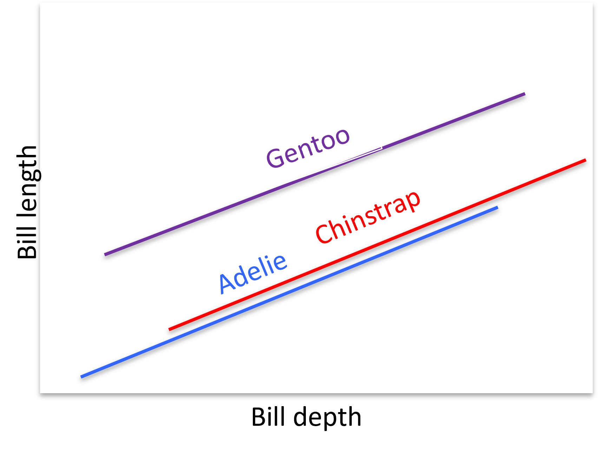
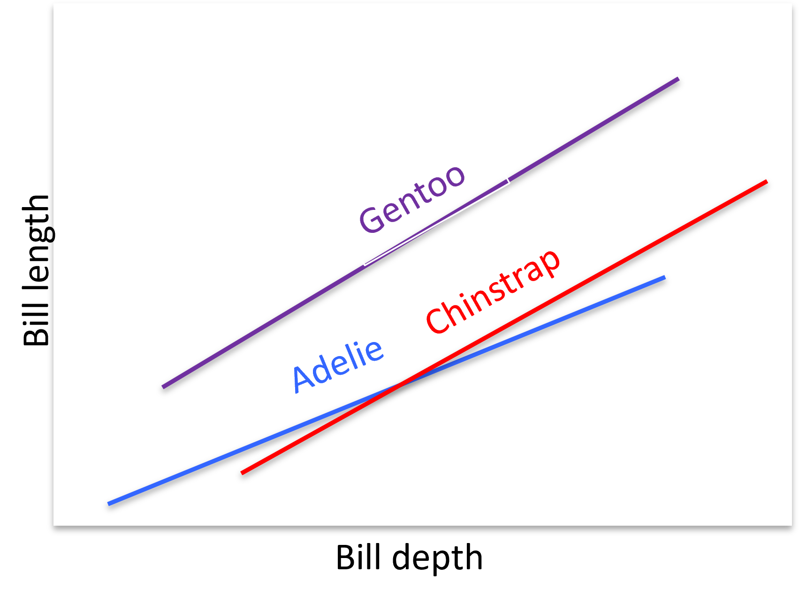

```{r setup, include=FALSE}
options(htmltools.dir.version = FALSE,
        eval = TRUE, warning = FALSE, message = FALSE)
knitr::opts_chunk$set(warning = FALSE, message = FALSE, fig.retina = 3, fig.asp = 0.8, fig.width = 7, out.width = "120%")

library(tidyverse)
library(gt)
library(gtExtras)
library(rstatix)
library(palmerpenguins)
library(ggpubr)

```


class: title-slide, left, top

# `r rmarkdown::metadata$title`

## `r rmarkdown::metadata$subtitle`

### `r rmarkdown::metadata$author`

<br>


<span style='color:white;'>Slides released under</span> [CC-BY 2.0](https://creativecommons.org/licenses/by/2.0/)&nbsp;&nbsp;`r fontawesome::fa("creative-commons", "white")``r fontawesome::fa("creative-commons-by", "white")` ]   

<div style = "position: absolute;top: 0px;right: 0px;"></img></div>

---

layout: true

<div class="my-footer"><span>Philip Leftwich - Physalia Courses</span></div>


---

## Basic linear models

```{r, echo = FALSE, out.width="60%", fig.cap = "Basic linear models aim to describe a linear relationship between a response (outcome) variable and a predictor (input) variable, usually by the method of ordinary least squares"}

knitr::include_graphics("images/basic_linear.png")

```

---

## Straight line equation

$$
\LARGE{y_i = a + bx+\epsilon}
$$

### Where:

$y_i$ is the predicted value of the response variable

$a$ is the intercept (value of y when x = 0)

$b$ is the slope of the regression line

$x$ is the value of the explanatory variable

**$\epsilon$ is the value of the residual error**

---


.left-code[

```{r, echo = FALSE, out.width="80%", fig.alt = "Culmen: the ridge along the top part of a bird's bill"}

knitr::include_graphics("images/culmen.jpg")

```


]

.right-plot[

```{r, out.width = "60%"}
penguins %>% 
  filter(species=="Adelie") %>% 
ggplot(aes(x= bill_length_mm, 
                     y= bill_depth_mm)) +
    geom_point()+
    geom_smooth(method = "lm",
                se = FALSE)+
  theme_classic()+
  stat_cor(method = "pearson", #<<
           aes(label=..r.label..))+#<<
  stat_regline_equation(label.y = 21.7)
```

]

---

## what about an extra variable?

Now we have *two* reasonable predictors of bill depth:

Bill length & Body mass

```{r}
penguins %>% 
  select(bill_length_mm, bill_depth_mm, body_mass_g) %>% 
  as_tibble() %>% 
  head()

```


---

## ANCOVA

```{r}
penguins %>% 
lm(bill_length_mm ~ bill_depth_mm + body_mass_g, data = .)

```

Written as an equation this is:

--

$bill~length=23.31+0.16_{(bill~depth)}+0.004_{(body~mass)}$

---

## Two-way ANOVA

* Bill depth - a continuous quantitative variable

* Body mass - a continuous quantitative variable

* Penguin Species - a categorical variable with three levels


```{r, echo = FALSE, out.width="60%", fig.alt = "Adelie, Chinstrap, Gentoo"}

knitr::include_graphics("images/three_penguins.png")

```

---

##Dummy variables

In order to represent a categorical variable in a model - we need to convert these cases to ones that are compatible with the maths. 

Dummy variables, are coded with 0 and 1's. With three species we would have the following:

* Adelie[0,0] - the reference or *intercept* species

* Chinstrap[1,0]

* Gentoo[0,1]

```{r, echo = FALSE, out.width="30%", fig.alt = "Adelie, Chinstrap, Gentoo"}

knitr::include_graphics("images/three_penguins.png")

```

---

##Practice

```{r}
lm(bill_length_mm ~ 
              bill_depth_mm +
              body_mass_g + 
              species,#<<
   data = penguins) %>% 
  broom::tidy(.)
```

---

##Practice

$$
\large{bill~length=bill~depth+body~mass+species}
$$

$bill~length=15.9+0.71_{bill~depth}+0.003_{body~mass}+9.9_{speciesChinstrap}+7.39_{speciesGentoo}$

If everything else about two penguins is the same (bill depth and body mass), we would expect a **Chinstrap** penguin to have a bill length 9.9mm longer than an Adelie pengun (on average).

If everything else about two penguins is the same (bill depth and body mass), we would expect a **Gentoo** penguin to have a bill length 7.39mm longer than an Adelie pengun (on average).

--

**Q. What would be the bill length for a Gentoo penguin with a bill depth of 13.2mm and a body mass of 4500g?**

--

**46.162mm**

---

## Interactions

###Why?

* What if you think that one of the predictor variables *changes* the *WAY* that another predictor variable influences the outcome?

* Increases our understanding of predictor variables

###Why not?

* Makes coefficient interpretation more difficult

* Increases model complexity


---
class: center, middle

##Example

The species of penguin *changes* the relationship between bill length and bill depth (e.g. the shape of their beaks are different).

---

```{r}
lsmodel1 <- lm(bill_length_mm ~ 
              bill_depth_mm +
              body_mass_g + 
              species + 
              species:bill_depth_mm, #<<
            data = penguins)

lsmodel1

```

---


.pull-left[

```{r, echo = FALSE, out.width="90%", fig.alt = "No Interaction effect"}



```

]

.pull-right[

```{r, echo = FALSE, out.width="90%", fig.alt = "Line fitting"}



```

]

---

```{r}
lsmodel1 %>% 
  broom::tidy()

drop1(lsmodel1,
      test = "F")

```


---
## Interpret an interaction term

Once we add an interaction term we can no longer interpret that "on average bill length increases by 0.29mm for every 1mm increase in bill depth. Because bill depth **also shows up as interaction term with species**


We now have to interpret this as :

For a specific species of penguin e.g. Chinstrap

$Bill~length=23.7+0.29_{bill depth}+0.002_{body mass}+-10.27_{Chinstrap}+1.09_{bill~depth*species}$

--

"For Chinstrap penguin we expect a penguin with a bill depth of 13.2 mm to increase bill length by:"

$(0.002*body~mass)+(1*-10.2)+(0.002*1.09*1)$

---

## When considering interaction terms

* Have a clear basis for *why* you expect an interaction (and visualise the data)

* Know that your coefficients WILL change when you add an interaction

* You can add the interaction term as a way to TEST the hypothesis for a significant interaction, then drop it from your model if not required. 
