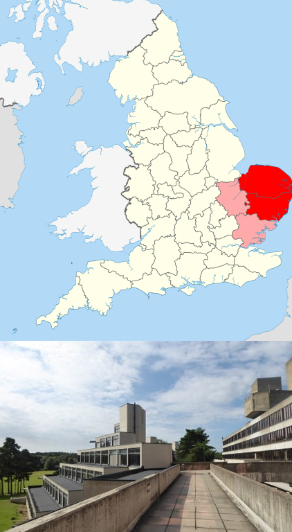
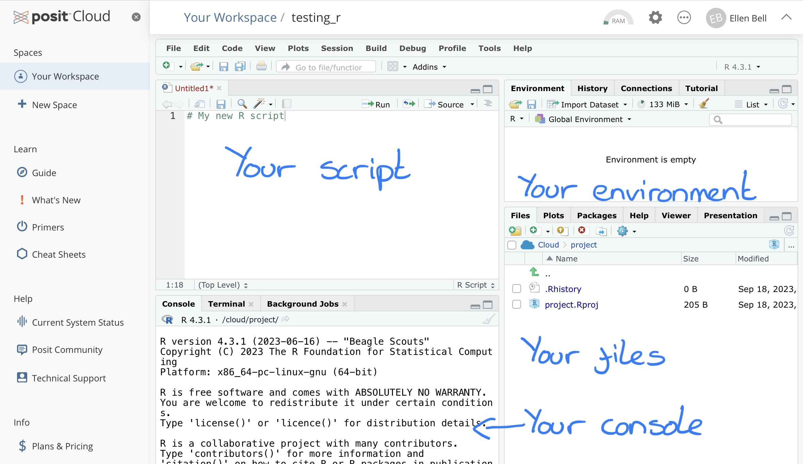

---
title: "Introduction to R Workshop"
subtitle: "A Physalia Course"
author: "Philip Leftwich"
date: "`r Sys.Date()`"
output:
  xaringan::moon_reader:
    css: ["default", "css/my-theme.css", "css/my-fonts.css"]
    seal: false
    lib_dir: libs
    nature:
      ratio: '16:9'
      highlightStyle: dracula
      highlightLines: true
      countIncrementalSlides: false
---

```{r setup, include=FALSE}
options(htmltools.dir.version = FALSE,
        eval = TRUE)
library(tidyverse)
```

class: center, middle, inverse

# Welcome! 

---

# Introductions

.pull-left[

```{r, echo = FALSE, out.width="50%", fig.alt = "Philip Leftwich"}
knitr::include_graphics("images/Me.jpg")
```

* Associate Professor 

* Genetics & Data Science 

* University of East Anglia

]

.pull-right[

```{r, echo = FALSE, out.width="50%", fig.alt = "University of East Anglia and Norwich"}

knitr::include_graphics("images/800px-Norwichcollage2019.png")
```

]
---

class: center, middle, inverse

# Introduce Yourselves

---

class: left, middle

## Outline of the course


Over the next four days we are going to cover: 

.pull-left[

- Intro to R and R basics
  
- Organizing workflows
  
- Learning tidyverse
  
- Writing functions

]

.pull-right[

- Learning iterations
  
- Getting the most out of tidyverse and functional programming
  
- Data presentation with ggplot and gt tables
  
- Shiny dashboards
  
- RMarkdown and GitHub

]


---

class: left, middle

## What to expect during this workshop

- These workshops will run for *6 hours* each.
- We will have a 40 min break halfway through and some shorter breaks.
- Take breaks when you need to!

- Combines slides, live coding examples, and exercises for you to participate in.
- Ask questions in the chat throughout!

---

class: left, middle

.pull-left[

I hope you end up with more questions than answers after this workshop!

]

.pull-right[


<small>Source: <a href="https://giphy.com/gifs/schittscreek-64afibPa7ySzhFAf00">giphy.com</a></small>

]

---

class: left, middle

## Workshop Resources


- Coursebook available [here](https://ueabio.github.io/physalia-R-course-2023/)


---

class: center, middle, inverse

# An Introduction to R

---

class: left, middle

## What is R?

- R is a full programming language
- R is a calculator
- R simulates & generates data
- R reads, processes, and manipulates data
- R analyses data
- R makes plots, graphics, reports, and presentations

---

class: left, middle

## Why use R?

- Specialized in data analysis and statistical computing
- Large repository of packages (CRAN)
- Active community and extensive documentation
- Excellent for reproducible research 

---

class: left, middle

## Basic R Syntax

```{r, echo = T}
5 + 10
```

```{r, echo = T}
x <- 5 + 10
x
y <- 20
```

---

class: left, middle

## Basic operations

```{r, echo = T}
sum <- x + y
diff <- x - y
prod <- x * y
quot <- x / y
```

---

class: left, middle

## Data types

```{r, echo = T}
x
y <- "apple"
z <- TRUE
str(x)
str(y)
str(z)
```

---

class: left, middle

## Data Structures

### Vectors

```{r, echo = T}
vec <- c(1, 2, 3, 4, 5)
vec
```

### Data Frames

```{r, echo = T}
df <- data.frame(name=c("Alice", "Bob"), age=c(25, 30))
df
```

### Lists

```{r, echo = T}
lst <- list(name="Alice", age=25, scores=c(90, 85, 88))
lst
```

---

class: left, middle

## Accessing data structures

```{r, echo = T}
df
```

```{r, echo = T}
df$name
```

```{r, echo = T}
df[1,]
df[,1]
```

---

class: left, middle

## R terms

```{r, echo = FALSE, out.width="70%"}
knitr::include_graphics("images/terms.png")
```


---

class: left, middle

## Functions

Functions are bits of code that complete specific tasks

```
select(.data, columns)
```

```{r, echo = T}
dplyr::select(.data = df, name)
```

```{r, echo = T}
dplyr::select(df, name)
```

---

class: left, middle

## Pipes

Pipes let us string multiple functions together by passing the output from one line of code into the next line

```{r, echo = T}
df %>% 
dplyr::select(name) %>% 
  dplyr::arrange(dplyr::desc(name))
```

---

class: center, middle, inverse

# What is RStudio/Posit?

---

class: center, middle

```{r, echo = FALSE, out.width="70%"}
knitr::include_graphics("images/engine.png")
```

---

class: center, middle

## What is RStudio/Posit

```{r, echo = FALSE, out.width="70%"}

```

---

class: left, middle

## Navigating RStudio

### Layout:
- Source Pane: Writing and editing scripts
- Console Pane: Executing R commands
- Environment/History Pane: Viewing and managing variables and command history
- Files/Plots/Packages/Help Pane: Managing files, viewing plots, accessing packages, and getting help

---

class: left, middle

## Scripts

- Scripts: Write reusable code in .R files

```{r, echo = T}
# This is a comment
print("Hello, R!")
```

- Run code by executing lines or selections
- Automate running scripts

---

class: left, middle

## Using Packages

R packages are collections of code and data that extend or improve functionality

```{r, echo = T, eval = F}
install.packages("ggplot2")
```

Once installed, packages must be loaded into the working environment to function

```{r, echo = T, eval = F}
library(ggplot2)
```

```{r, echo = T, eval = F}
ggplot(data, aes(x=variable1, y=variable2)) + geom_point()
```

---

## Installing Packages

Installing Packages in R

- From CRAN
The most common way to install packages in R is from CRAN (Comprehensive R Archive Network):

```{r, echo = T, eval = F}
install.packages("ggplot2")
```

- From GitHub using devtools
For packages hosted on GitHub, you can use the devtools package:

```{r, echo = T, eval = F}
devtools::install_github("hadley/ggplot2")
```


- From Bioconductor
For specialized packages in bioinformatics, use Bioconductor:

```{r, echo = T, eval = F}
# Use BiocManager to install packages
BiocManager::install("GenomicFeatures")
```


---

class: left, middle

## R is for Open Reproducible Research

.pull-left[
* Reproducible
* Robust
* Transparent
* Reusable
* Shareable research materials
]

.pull-right[

```{r, echo = FALSE, out.width="100%", fig.alt = "Is data and stats reporting enough?"}
knitr::include_graphics("images/reproducible-data-analysis-02.png")
```

]

---

class: left, middle

## Main features of R

- Comprehensive Packages: Thousands of packages available through CRAN, Bioconductor, and GitHub to extend R’s capabilities.
- Data Manipulation: Powerful libraries like `dplyr` and `tidyr` for data wrangling.
- Statistical Analysis: Built-in functions for a wide range of statistical tests and models.
- Visualization: Excellent plotting libraries such as `ggplot2` for creating stunning visualizations.

---

class: left, middle

## Main Features of RStudio

- User-Friendly Interface: Four-pane layout (script, console, environment, files) for easy navigation.
- Integrated Package Management: Simplifies the installation and management of R packages.
- Version Control: Built-in support for Git to manage code versions and collaboration.
- Projects: Organize workspaces efficiently using RStudio Projects.

---

class: left, middle

## RStudio Projects?

.pull-left[
- Organization: Keeps related files (scripts, data, outputs) in one place.
- Reproducibility: Facilitates reproducible research by maintaining a consistent environment.
- Isolation: Projects can have their own libraries and settings, reducing conflicts between different projects.
]

.pull-right[

```{r, echo = FALSE, out.width="80%", fig.alt = "R project organisation"}
knitr::include_graphics("images/Project.png")
```

]

---

class: left, middle

## Creating a Project in RStudio

- Start a New Project: Go to File > New Project.
- Choose a Type: Select whether to create a new directory, use an existing one, or version control.
- Maintain Structure: Follow a structured directory format (e.g., /data, /scripts, /results).
- Within Project options - turn off options to save history and generate/import .RData files

---

class: center, middle

## Workflow

```{r, echo = FALSE, out.width="60%", fig.alt = "Allison Horst"}
knitr::include_graphics("images/annotated.png")
```

---

class: center, middle, inverse

# Questions? 


