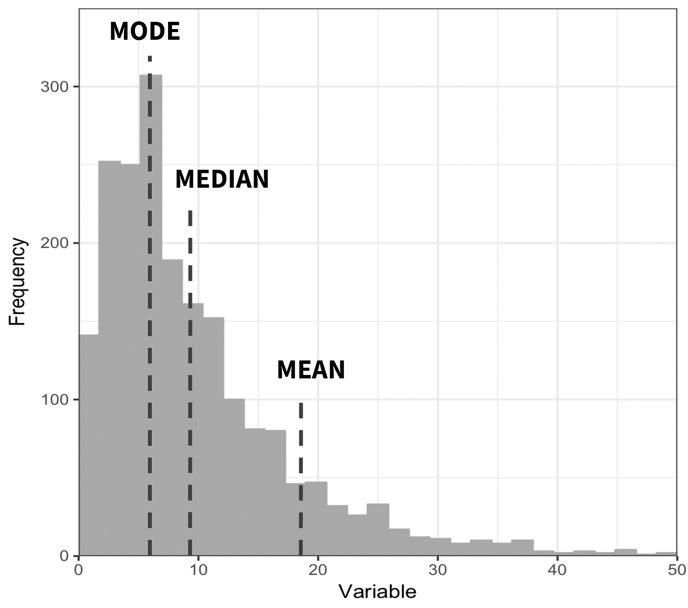
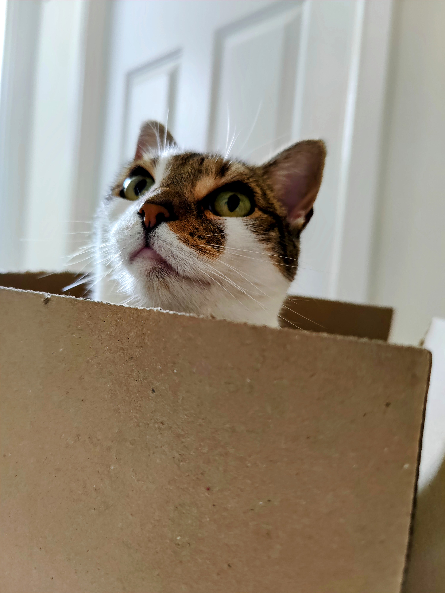
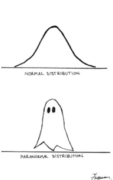
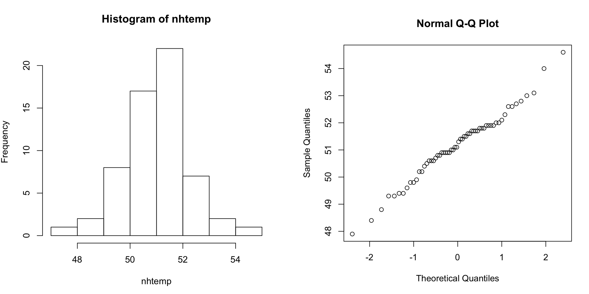
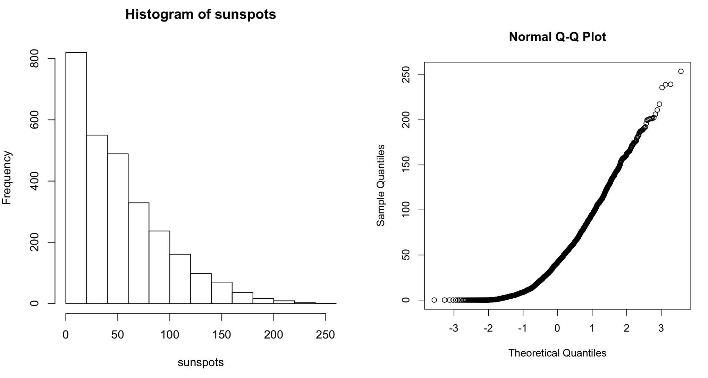
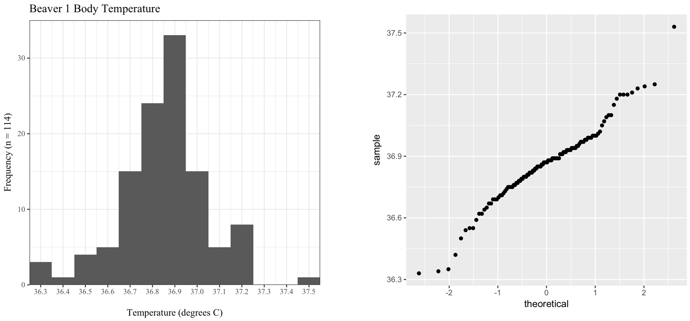
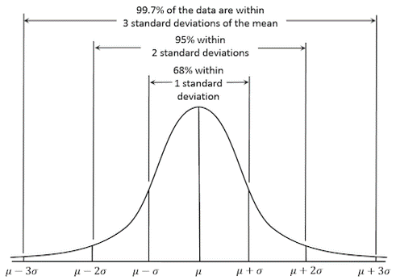
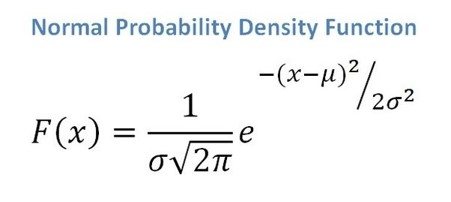

```{r setup, include=FALSE}
options(htmltools.dir.version = FALSE,
        eval = TRUE, warning = FALSE, message = FALSE)
knitr::opts_chunk$set(warning = FALSE, message = FALSE, fig.retina = 3, fig.asp = 0.8, fig.width = 7, out.width = "120%")

library(tidyverse)
library(gt)
library(gtExtras)
library(rstatix)
library(palmerpenguins)

```


class: title-slide, left, top

# `r rmarkdown::metadata$title`

## `r rmarkdown::metadata$subtitle`

### `r rmarkdown::metadata$author`

<br>


<span style='color:white;'>Slides released under</span> [CC-BY 2.0](https://creativecommons.org/licenses/by/2.0/)&nbsp;&nbsp;`r fontawesome::fa("creative-commons", "white")``r fontawesome::fa("creative-commons-by", "white")` ]   

<span style='color:white;'>Slido.com #4257577</span>  

<div style = "position: absolute;top: 0px;right: 0px;"></img></div>

---

layout: true

<div class="my-footer"><span>Philip Leftwich - 5023Y - Slido.com #4257577</span></div>


---
class: center, middle

# Central tendency & spread


---

class: center, middle

| Mean        | Median      | Mode       |
| ----------- | ----------- |----------- |
| The average value     | The middle value      |The most frequent value      |
| Sum of the total divided by *n*   | The middle value (if *n* is odd). The average of the two central values (if *n* is even)      |The most frequent value      |
| Most common reported measure, affected by outliers | Less influenced by outliers, improves as *n* increases | Less common


---

## Why is data distribution important?

Understanding the shape of our data informs the summary statistics we can use

```{r, echo = FALSE, out.width="50%", fig.alt = "Frequency distribution with central tendencies"}

```


---


## Standard Deviation

- Square root of sample variance

- A measure of dispersion of the sample

- Smaller SD = more values closer to mean, larger SD = greater data spread from mean

* *variance*:

$$
s = \sqrt{\sum(x - \overline x)^2\over n - 1}
$$

---

## Calculating variance

.pull-left[

```{r, echo = FALSE, out.width="100%", fig.alt = "Symmetrical sides"}
knitr::include_graphics("images/normal-distribution.jpg")
```

]

.pull-right[

```
# A tibble: 100 x 3
   value residuals sq_residuals
   <dbl>     <dbl>        <dbl>
 1 12.7      2.88         8.27 
 2 14.2      4.32        18.7  
 3 11.3      1.41         1.99 
 4  7.43    -2.44         5.93 
 5  8.27    -1.60         2.57 
 6 12.7      2.81         7.90 
 7  5.34    -4.53        20.5  
 8 13.9      4.00        16.0  

```

```
# A tibble: 1 x 3
  sum_residuals sum_squares  mean
          <dbl>       <dbl> <dbl>
1       -0.0577        359.  9.87

```

]


---

## Standard Deviation

* *variance*:

$$
s^2 = {\sum(x - \overline x)^2\over n - 1}
$$

$$
s^2 = {sum~of~squares\over n - 1}
$$


* Square root of sample *variance*

* A measure of *dispersion* of the sample

$$
s = \sqrt{\sum(x - \overline x)^2\over n - 1}
$$
* Smaller SD σ = more values close to the mean, larger SD = greater data spread away from the mean.

---

Small $s$ = taller, narrower
Large $s$ = squatter, wider

```{r, eval = FALSE}
rnorm(n = 1000,mean = 0,sd = 1)
rnorm(n = 1000,mean = 0,sd = 2)
rnorm(n = 1000,mean = 0,sd = 3)
```

```{r, echo = FALSE, message = FALSE, warning = FALSE, out.width = "60%"}

library(patchwork)

`SD = 1` <- rnorm(n = 1000, mean = 0, sd = 1)
`SD = 2` <- rnorm(n = 1000, mean = 0, sd = 2)
`SD = 3` <- rnorm(n = 1000, mean = 0, sd = 3)

tibble(`SD = 1`, `SD = 2`, `SD = 3`) %>% 
pivot_longer(cols = everything(), names_to = "Standard Deviation", values_to = "values") %>% 
  ggplot(aes(x = values, fill = `Standard Deviation`))+
  geom_histogram()+
  facet_wrap(~ `Standard Deviation`)+
  theme_classic()+
  theme(legend.position = "none")+
  labs(x = " ",
       y = "Frequency")


```

---

## Another method

* Box bounded by 25th and 75th percentile. This is called the interquartile range (IQR)

* Line in box is usually the median

* Whiskers extend to last OBSERVATION within 1 step (usually 1.5*IQR) from end of the box

* Any observations beyond whisker are plotted as individual points

.pull-left[


```{r, echo = FALSE, out.width="80%", fig.alt = "Boxplot"}
knitr::include_graphics("images/boxplot.png")
```

]

.pull-right[

```{r, echo = FALSE, out.width="50%", fig.alt = "Box and whiskers"}

```

]

---

## The Normal Distribution

.pull-left[
```{r, echo = F, message = F, warning = F}
tibble(`SD = 1`, `SD = 2`, `SD = 3`) %>% 
pivot_longer(cols = everything(), names_to = "Standard Deviation", values_to = "values") %>% 
  filter(`Standard Deviation` == "SD = 2") %>% 
  ggplot(aes(x = values), fill = "grey")+
  geom_histogram()+
  theme_minimal()+
  theme(legend.position = "none")+
  labs(x = bquote(bar(x)),
       y = " ")

```
]

.pull-right[
```{r, echo = FALSE, out.width="70%", fig.alt = "Normal distribution, paranormal distribution"}

```
]

---
## There are infinite normal distributions
### Different means and sd change the shape

.pull-left[

```{r, echo = FALSE, out.width = "100%"}

`SD = 1` <- rnorm(n = 1000, mean = 2, sd = 1)
`SD = 2` <- rnorm(n = 1000, mean = 6, sd = 4)
`SD = 3` <- rnorm(n = 1000, mean = 9, sd = 2)

tibble(`SD = 1`, `SD = 2`, `SD = 3`) %>% 
pivot_longer(cols = everything(), names_to = "Standard Deviation", values_to = "values") %>% 
  ggplot(aes(x = values, fill = `Standard Deviation`))+
  geom_density(alpha = 0.6, colour = "black")+
  theme_classic()+
  labs(x = " ",
       y = "Frequency")
```

]

.pull-right[

The normal distribution is common. But **NEVER** assume your data are normally distributed without looking at it and thinking really hard first

]


---


## Visualising a Distribution

.pull-left[
**Histograms** plot frequency/density of observations within bins

```{r, echo = FALSE, message = FALSE, out.width="80%"}
tibble(`SD = 1`, `SD = 2`, `SD = 3`) %>% 
pivot_longer(cols = everything(), names_to = "Standard Deviation", values_to = "values") %>% 
  filter(`Standard Deviation` == "SD = 2") %>% 
  ggplot(aes(x = values), fill = "grey")+
  geom_histogram()+
  theme_minimal()+
  theme(legend.position = "none")+
  labs(x = bquote(bar(x)),
       y = " ")
```
]

.pull-right[
**Quantile-Quantile plots** plot quantiles of a dataset vs. quantiles of a *theoretical* (usually normal) distribution

```{r, echo = FALSE, warning = F, message  = F, out.width="80%"}

tibble(`SD = 1`,`SD = 2`, `SD = 3`) %>% 
pivot_longer(cols = everything(), names_to = "Standard Deviation", values_to = "values") %>% 
  filter(`Standard Deviation` == "SD = 2") %>% 
  ggplot(aes(sample = values))+
  geom_qq()+
  geom_qq_line()+
  theme(legend.position = "none")+
  labs(x = " ",
       y = " ")
```
]

---

## QQ plots

.left-code[
If data is normally distributed, then if we plot the [*quantiles*](https://www.youtube.com/watch?v=okjYjClSjOg) vs. theoretical normal quantiles (with same *n*), then we find a linear relationship

]

.right-plot[


```{r, echo = FALSE, out.width="100%", fig.alt = "QQ plot examples"}
knitr::include_graphics("images/qq_example.png")
```

]

---

# Normal distribution

```{r, echo = FALSE, out.width="100%", fig.alt = "QQ plot examples"}

```
---

# Skewed distribution

```{r, echo = FALSE, out.width="100%", fig.alt = "QQ plot examples"}

```

---

# Peaky distribution

```{r, echo = FALSE, out.width="100%", fig.alt = "QQ plot examples"}

```
---
class: center

## Using the standard normal distribution

.pull-left[


```{r, echo = FALSE, out.width="100%", fig.alt = "Normal distribution"}

```

]

.pull-right[

```{r, echo = FALSE, out.width="100%", fig.alt = "Normal prob distribution"}

```

]

---

## Z scores: How many standard deviations from the mean?

$$
z = {x_i - \mu \over \sigma}
$$
The *Z* score can be looked up in [*Z*-table](https://www.simplypsychology.org/z-table.html) to find the "probability of observing that value in a normal distribution." 

---
class: center, middle

## If we know the mean and SD for a normally distributed population, we can then use that to start calculating *probabilities*

---

## Standard Error

We have seen that the standard deviation tells us about how well the mean represents the sample data. 

--

When we take samples we often hope to make inferences about the entire population. 

--

If you take several samples, each one will *differ slightly*. 

--

How can we know how well our sample represents the population? 

---
class: center, middle

```{r, echo = FALSE, warning = FALSE, out.width = "110%"}

library(DiagrammeR)

grViz("digraph {
  
graph[layout = dot]

a[label = 'Population mean = 3']
b[label = 'Sample mean = 3']
c[label = 'Sample mean = 4']
d[label = 'Sample mean = 5']
e[label = 'Sample mean = 1']
f[label = 'Sample mean = 2']
g[label = 'Sample mean = 4']

a -> b
a -> c
a -> d
a -> e
a -> f
a -> g


}")


```

---
## Sampling distribution

If we took a bunch of samples, and found the probability distribution of a statistic found for each sample (e.g. mean, sd, etc.), then we’d find the **sampling distribution.**

The **standard deviation of the sampling distribution of means** is the standard error, and is calculated by dividing the standard deviation by the square root of the sample size: 

$$
SE = {s\over \sqrt n}
$$
---

### Standard Error:
How much does your sample statistic differ from the population parameter *or* how accurate is your sample mean?

Of course *in reality* we have not calculated hundreds of sample means to calculate the standard deviation of sample means. We have relied on approximation.

---

## Central limit theorem

If you take sufficiently large random samples (at least 30), then the distribution of the sample means will be approximately normally distributed. 

Allowing us to use Standard Error as an estimation of accuracy in our sample mean.

This is true *even if the population distribution does not follow a normal distribution*.

---

## Central limit theorem

### Here the width of turtle shells follow a "uniform distribution"

```{r, echo = F, out.width = "60%"}
#make this example reproducible
set.seed(0)

#create random variable with sample size of 1000 that is uniformally distributed
data <- runif(n=1000, min=2, max=6)

#create histogram to visualize distribution of turtle shell widths
hist(data, col='steelblue', main='Histogram of Turtle Shell Widths')

```

---

## Central limit theorem


```{r, echo = F, out.width = "60%"}
set.seed(0)
#create empty vector to hold sample means
sample30 <- c()

#take 1,000 random samples of size n=30
n = 10
for (i in 1:n){
sample30[i] = mean(sample(data, 30, replace=TRUE))
}

#create histogram to visualize sampling distribution of sample means
hist(sample30, col ='steelblue', xlab='Turtle Shell Width', main='10 experiments')
```

---

## Central limit theorem


```{r, echo = F, out.width = "60%"}
set.seed(0)
#create empty vector to hold sample means
sample30 <- c()

#take 1,000 random samples of size n=30
n = 200
for (i in 1:n){
sample30[i] = mean(sample(data, 30, replace=TRUE))
}

#create histogram to visualize sampling distribution of sample means
hist(sample30, col ='steelblue', xlab='Turtle Shell Width', main='200 experiments')
```

---

## Central limit theorem


```{r, echo = F, out.width = "60%"}
set.seed(0)
#create empty vector to hold sample means
sample30 <- c()

#take 1,000 random samples of size n=30
n = 1000
for (i in 1:n){
sample30[i] = mean(sample(data, 30, replace=TRUE))
}

#create histogram to visualize sampling distribution of sample means
hist(sample30, col ='steelblue', xlab='Turtle Shell Width', main='1000 experiments')
```

---

class: center, middle, inverse

# Calculating boundaries for the true mean: 
# Confidence Intervals

