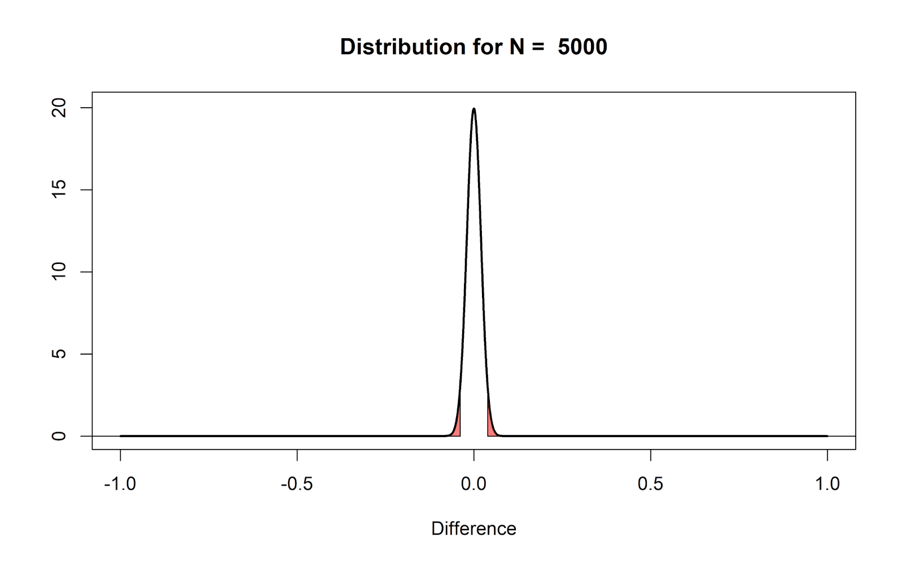
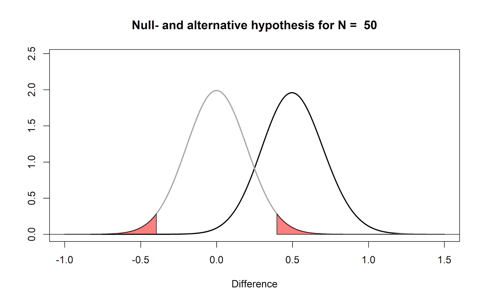
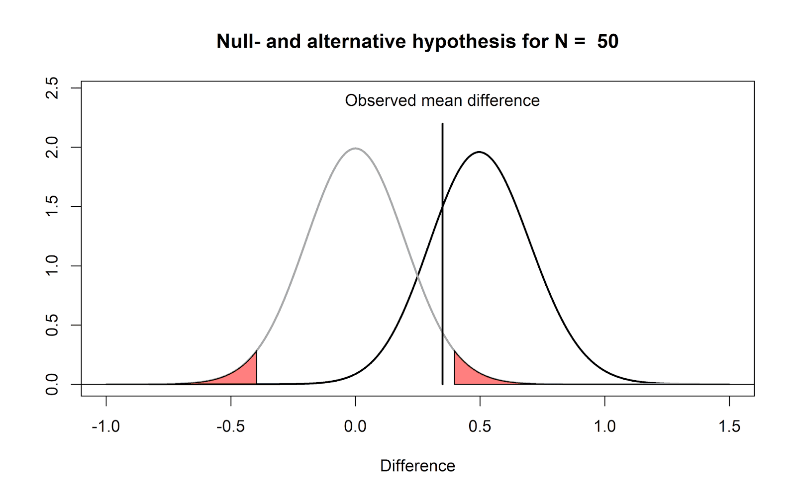
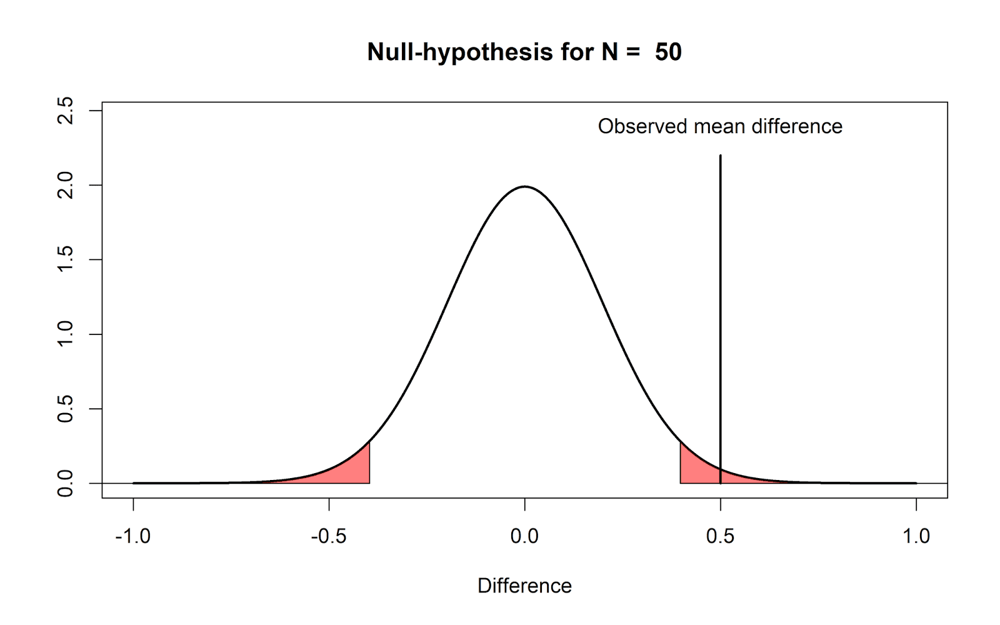
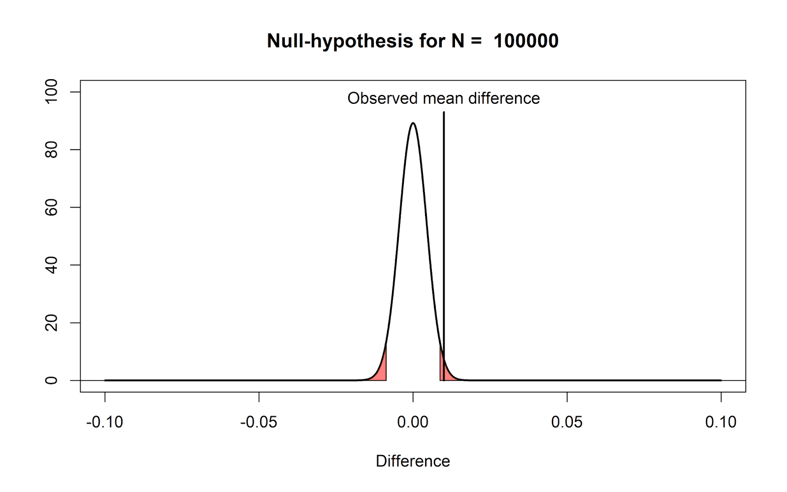
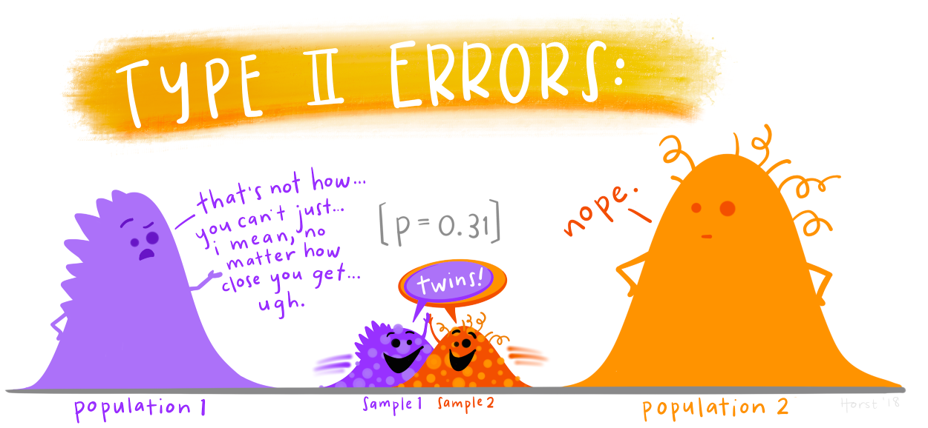

```{r setup, include=FALSE}
options(htmltools.dir.version = FALSE,
        eval = TRUE, warning = FALSE, message = FALSE)
knitr::opts_chunk$set(warning = FALSE, message = FALSE, fig.retina = 3, fig.asp = 0.8, fig.width = 7, out.width = "120%")

library(tidyverse)
library(gt)
library(gtExtras)
library(rstatix)
library(palmerpenguins)
library(DiagrammeR)


```


class: title-slide, left, top

# `r rmarkdown::metadata$title`

## `r rmarkdown::metadata$subtitle`

### `r rmarkdown::metadata$author`

<br>


<span style='color:white;'>Slides released under</span> [CC-BY 2.0](https://creativecommons.org/licenses/by/2.0/)&nbsp;&nbsp;`r fontawesome::fa("creative-commons", "white")``r fontawesome::fa("creative-commons-by", "white")` ]

<span style='color:white;'>Slido #4326367</span>

<div style = "position: absolute;top: 0px;right: 0px;"></img></div>

---

layout: true

<div class="my-footer"><span>Philip Leftwich - 5023Y Courses Slido.com #4326367/span></div>


---
class: center, middle

### What is a P-value

--

## The probability of getting results at least as extreme as the ones we observed. Assuming the Null Hypothesis is true

---

## Hypothesis formation

--

**Null hypothesis:** there is **no** difference in longevity between the two groups.

--

**Alternative hypothesis:** there *is* a difference in longevity between the two groups.


---

# Null hypothesis probability distribution

```{r, echo = FALSE, out.width="60%"}

knitr::include_graphics("images/null_hypothesis.png")

```

These areas represent 2.5% of the values in the left tail of the distribution, and 2.5% of the values in the right tail of the distribution. 

Together, they make up 5% of the most extreme mean differences we would expect to observe, given our number of observations, 

when the true mean difference is exactly 0 – this represents the use of an $\alpha$ level of 5%


---

## Sample size can affect distributions

```{r, echo = FALSE, out.width="60%"}



```

A probability distribution can be affected by variance and sample size. 


---

## Hypothesis testing

The **null hypothesis** is that there is no relationship between your variables of interest or that there is no difference among groups

e.g you want to know whether there is a difference in longevity between two groups of mice fed on different diets, diet A and diet B. 

--

**Null hypothesis:** there is **no** difference in longevity between the two groups.

--

**Alternative hypothesis:** there *is* a difference in longevity between the two groups.

--


We can use a linear model to perform a t-test on the data


```
lm(longevity ~ diet, data = mice)
```


```{r, echo = F}
data_sim <- function(mean1, mean2, sd){
set.seed(123)
mice_a <- rnorm(n = 12, mean = mean1, sd = sd)
mice_b <- rnorm(n = 12, mean = mean2, sd = sd)
mice <- data.frame(cbind(mice_a,mice_b)) %>% 
  pivot_longer(cols = everything(),
               names_to = "diet",
               values_to = "longevity")

model <- lm(longevity ~ diet, data = mice)

tidy_model <- model %>% 
  broom::tidy(., conf.int =T)

tidy_model
}

tidy_model <- data_sim(mean1 = 4, mean2 = 3, sd =1)

```

---

## Visualising the t distribution of the difference

```{r, fig.show="hold", out.width="50%", echo = F}

tidy_model

x <- seq(-5, 5, by = 0.1)
y1 <- dt(x, df = 22)

estimate <- tidy_model[[2,2]]
std.error <- tidy_model[[2,3]]

conf.low <- tidy_model[[2,6]]
conf.high <- tidy_model[[2,7]]

x1 <- (x*std.error)+estimate


plot(x1, y1, type = "l", col = "darkgrey", lty=1,
     xlab = "Mean difference", 
     ylab = "Density", 
     main = "T Distribution",
     ylim = c(0,0.4),
     xlim = c(min(x1), max(x1)))
polygon(c(x1[x1>=conf.high], max(x1), conf.high), c(y1[x1>=conf.high], 0, 0), col="red")


legend("topright", legend = "95% CI", lty = 1, col = "red")

#GGally::ggcoef_model(model)
```

---

### Compare these write-ups

“Diets can change the longevity of mice (*p* = 0.0016).”

--

“Mice on diet B lived significantly shorter lives than mice on diet A (*t*<sub>22</sub> = -3.6, *p* = 0.006).”

--

"Mice on diet B had a reduced mean lifespan of 1.41 years[95% CI; -0.595:-2.22] from the mice on diet A (mean 4.19 years (95% CI, 3.62-4.77). While statistically significant (*t*<sub>22</sub> = -3.6, *p* = 0.006), this is a relatively small sample size, and further testing is recommended to confirm this effect."

--

Which has the greatest level of useful detail?

---

class: center, middle, inverse

## Common misundertandings\n about P values

https://daniellakens.blogspot.com/2017/12/understanding-common-misconceptions.html?m=1

https://www.ncbi.nlm.nih.gov/pmc/articles/PMC4359000/#:~:text=Evidence%20for%20p%2Dhacking%20from,test%20function%20in%20R).


---

## Comparing hypothetical distributions

In the real world we will never know whether there is a true mean difference, but let's assume that we could. 

The figure below shows the expected data pattern when the null hypothesis is true (grey line) and the expected data pattern when an alternative hypothesis is true (black line). 

```{r, echo = FALSE, out.width="60%"}



```

---

## A non-significant p-value DOES NOT mean the null hypothesis is true

.pull-left[


Here we can illustrate why a non-significant result does not always mean that the null hypothesis is true.

We *know* that the true mean difference is 0.5, but we only *observe* a mean difference of 0.35.  *p* > $\alpha$. 

BUT - we can see that the observed mean difference is much more likely under the alternative hypothesis than the null. All the *p*-value tells us is that seeing an observed difference of 0.35 is not that surprising under the null hypothesis.

]

.pull-right[


```{r, echo = FALSE, out.width="90%"}



```

]

---

## Why a significant p-value does not mean the null hypothesis is false


What we can conclude, based on our data, is that we have observed an extreme outcome, that should be considered surprising. But such an outcome is not *impossible* when the null-hypothesis is true.

```{r, echo = FALSE, out.width="60%"}



```

---

## Why a significant p-value is not the same as an important effect

.pull-left[

If we plot the null model for a very large sample size, we can see that even very small mean differences will be considered 'surprising'. 

However, just because data is surprising, does not mean we need to care about it. It is mainly the verbal label ‘significant’ that causes confusion here – it is perhaps less confusing to think of a ‘significant’ effect as a ‘surprising’ effect.

]

.pull-right[

```{r, echo = FALSE, out.width="90%"}



```

]

---

class: center, middle

## Type 1 and Type 2 Errors:

We have now seen that it is possible to make incorrect decisions about rejecting or keeping the null hypothesis.


|             | H0 True   | H0 False     
| ----------- | ----------- |----------- |
| Reject H0 | Type 1 Error $$\alpha$$ | Correct rejection $$1-\beta$$
| Fail to reject H0    | Correct decision $$1-\alpha$$ | Type 2 Error  $$\beta$$   

---
class: center, middle

```{r, echo = FALSE, out.width="60%", fig.alt = "P > 0.05."}

knitr::include_graphics("images/type_1_errors.png")

```

Type 1 error = Rejecting the null hypothesis (because *p* < $\alpha$), but actually this was a random sampling effect, not a *true difference*

---
class: center, middle

```{r, echo = FALSE, out.width="60%", fig.alt = "P < 0.05."}



```

Type 2 error = Keeping the null hypothesis (because *p* > $\alpha$) the random sampling effect made it look like they come from the *same* parent distribution, but in reality the populations are distinct. 

---

## Type 2 error

* Probability of a Type 2 error is known as $\beta$ 

--

* Power is the inverse of a Type 2 error $\beta=1-Power$ 

--

* A Type 2 error is the scenario where you fail to detect a *true* difference/effect

--

* Power is the probability you **will** detect a *true* difference/effect 
    *if the alternative hypothesis is true*

---

## Power

There are four primary factors affecting power:

--

* Effect size: The magnitude of a result present in a population

* Sample size: The number of observations per sample

* Alpha: the threshold at which you would accept statistical significance (often 0.05)

* Power: the probability of accepting the alternate hypothesis (if it is true)

--

Raising the value of any of effect size, sample size or $\alpha$ all increase Power $1-\beta$


---

## Am I right?

Reporting effect sizes, levels of uncertainty and understanding the statistical power of your experiment are all important. 

--

But a single experiment is **never** enough to know which hypothesis is correct. 

--

Only multiple experiments will allow true statistical trends to emerge

```{r, figures-side, fig.show="hold", echo = F, out.width = "40%"}

#### write function 
simT <- function(n, mean2 = 0){
  x1 <- rnorm(n,0,1)
  x2 <- rnorm(n,mean2,1)
  t.test(x1, x2)$p.value 
}


#### repeat function for n = 10 and for different nrep and plot

simTRep <- replicate(1000, simT(20))
hist(simTRep, breaks = 21, col = c('red',rep('grey',20)), 
     main = "Null hypothesis true", sub = "nrep = 1000, n = 20", xlab = "pvalue")

simTRep <- replicate(1000, simT(20, 0.5))
hist(simTRep, breaks = 21, col = c('red',rep('grey',20)), 
     main = "Alternate hypothesis true", sub = "nrep = 1000, n = 20", xlab = "pvalue")
```


---

## Are most published results wrong?

class: center, middle

```{r, echo = FALSE, warning = FALSE, out.width = "100%", fig.cap = "9/(16+9) = 36% of significant p values would be false positives"}


grViz("
digraph boxes_and_circles {
  rankdir = LR

  # a 'graph' statement
  graph [overlap = true, fontsize = 8]


  # several 'node' statements
  node [shape = box,
        fontname = Helvetica]

  
# label names

A[label = '200\n experiments']
B[label = '20 \n real effect ']
C[label = '180 \n no real effect']

F[label = '171 \n true null \n rejection']
G[label = '9 \n false null \n rejection',
color = blue]

E[label = '4 \n real effect \nnot found',

color = red]
D[label = '16 \n real effect \n found']

  # several 'edge' statements
  A->B 
  A->C
  C->F[label = 0.95]
  C->G[label = 0.05]
  B->D[label = 0.8]
  B->E[label = 0.2]
}
")


```

.pull-left[

[Smaldino & McElreath 2016](https://royalsocietypublishing.org/doi/full/10.1098/rsos.160384?wm=3049_a111)

]


---


## Irreproducible science

* Publication bias

* Low statistical power

* P-hacking

* P-HARKing (*H*ypothesis *A*fter *R*esults *K*nown)

[Bishop 2019](https://www.nature.com/articles/d41586-019-01307-2)


---

## What can be done?

- Open, reproducible analyses can disclose analysis choices and sample sizes

- Pre-registered studies can detect P-hacking and HARKing

---


class: center, middle, inverse

# Next time: Regression

### Reading 

 Chapter 2: Discovering Statistics using R/SPSS - Andy Field

 [20% Statistician (Lakens)](https://daniellakens.blogspot.com/2017/12/understanding-common-misconceptions.html?m=1)
 
 [Pain 2017](https://www.ncbi.nlm.nih.gov/pmc/articles/PMC5665734/)


