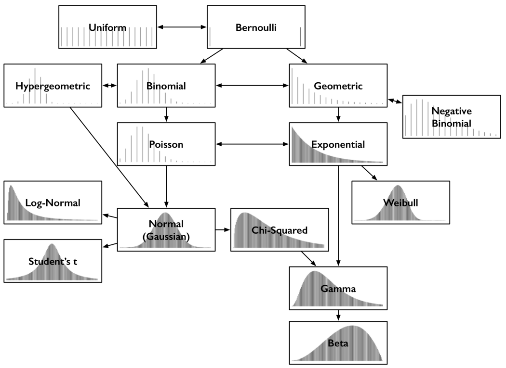
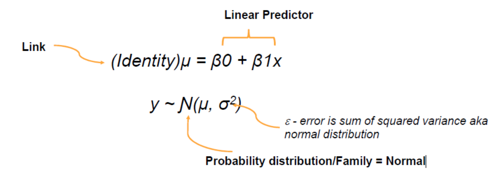
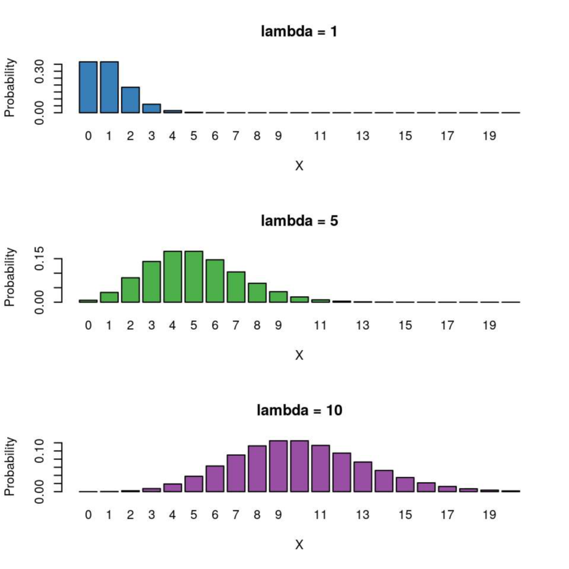
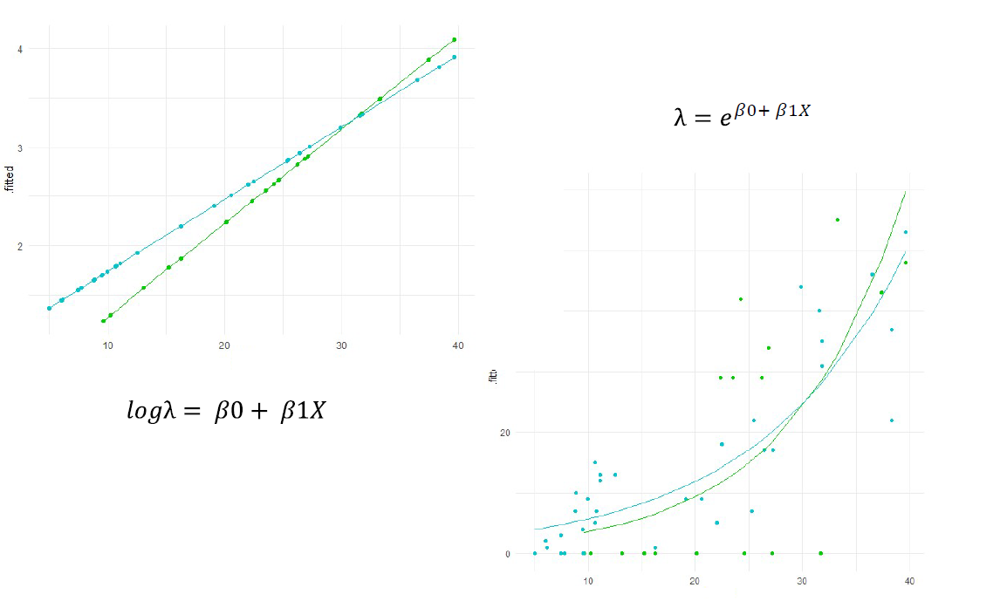
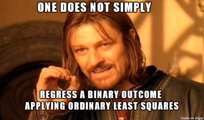
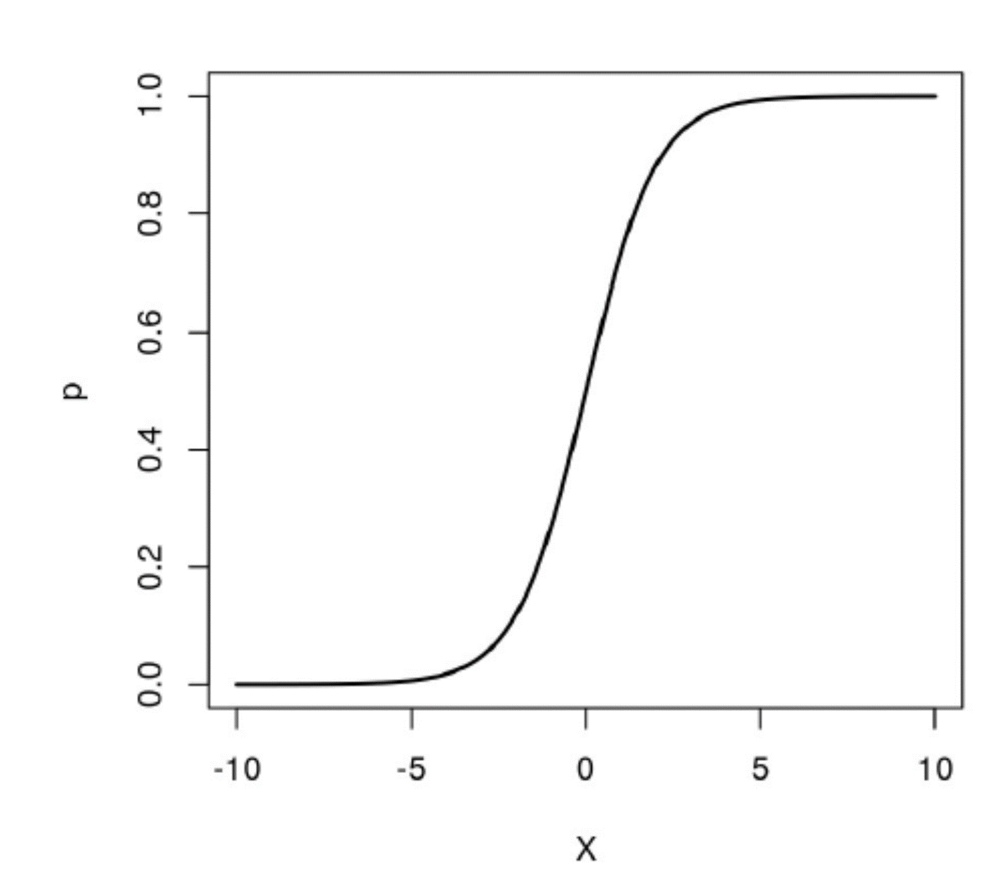
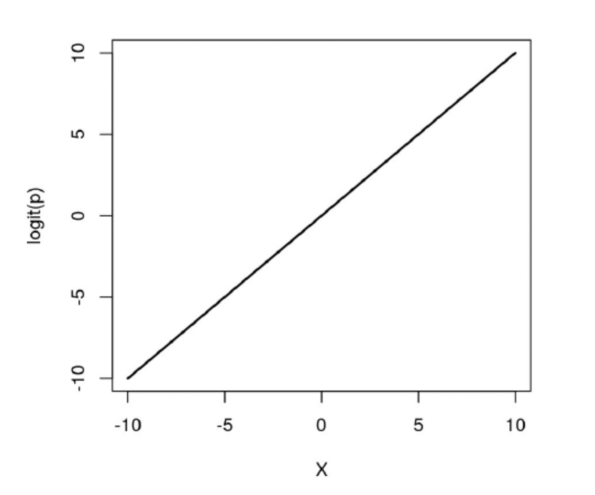
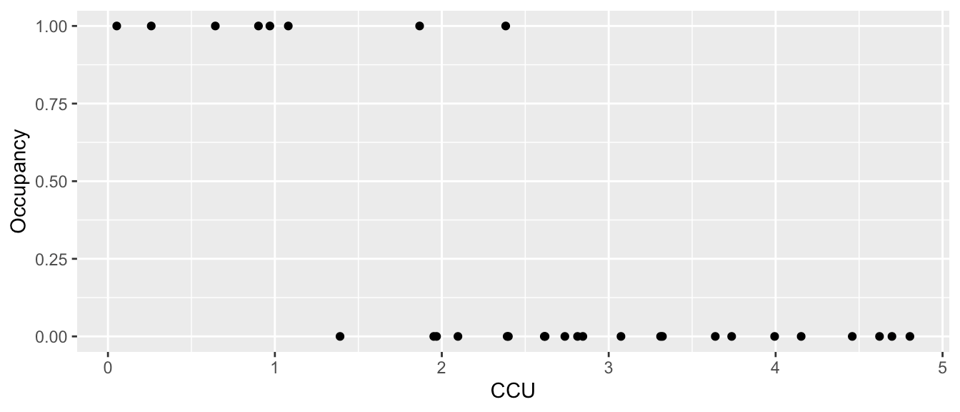
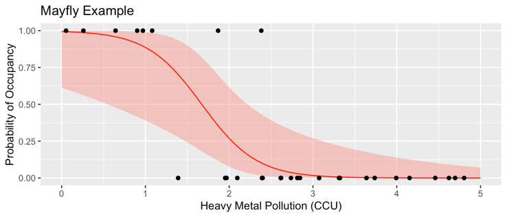

```{r setup, include=FALSE}
options(htmltools.dir.version = FALSE,
        eval = TRUE, warning = FALSE, message = FALSE)
knitr::opts_chunk$set(warning = FALSE, message = FALSE, fig.retina = 3, fig.asp = 0.8, fig.width = 7, out.width = "120%")

library(tidyverse)
library(gt)
library(gtExtras)
library(rstatix)
library(palmerpenguins)
library(here)
library(performance)

```


class: title-slide, left, top

# `r rmarkdown::metadata$title`

## `r rmarkdown::metadata$subtitle`

### `r rmarkdown::metadata$author`

<br>


<span style='color:white;'>Slides released under</span> [CC-BY 2.0](https://creativecommons.org/licenses/by/2.0/)&nbsp;&nbsp;`r fontawesome::fa("creative-commons", "white")``r fontawesome::fa("creative-commons-by", "white")` ]   

<div style = "position: absolute;top: 0px;right: 0px;"></img></div>

---

layout: true

<div class="my-footer"><span>Philip Leftwich - Physalia Courses</span></div>

---
class: center

## GLM error distributions


```{r, echo = FALSE, out.width="80%", fig.alt = "There are many other types of probability distributions beyond the Normal (Gaussian), these are related to each other - and for example a sampling distribution may follow a Poisson error distribution, but become a normal distribution if sample sizes are large enough"}

```


---

## GLM error distributions

```{r, echo = FALSE, out.width="80%", fig.cap = "GLM models the estimate of the mean as a separate equation to estimates of the error distribution"}



```

---

## GLM error distributions

|Family|Canonical link|Other links|Common uses|
|-----|-----|-----|-----|
|gaussian|identity| sqrt, log| Continuous data with a normal distribution|
|binomial|logit|probit, cloglog| Binary/Bernoulli data(0,1), proportional/binomial data|
|poisson|log|identity, sqrt| Count/rate data (integers)|
|Gamma|inverse|identity, log|Continuous data where variance increases with the value of the mean|
|quasibinomial|logit| | overdispersed binomial|
|quasipoisson|log| | overdispersed poisson|


---

## GLM workflow

**1.** Exploratory data analysis

**2.** Choose a suitable error term that fits your data type

**3.** Choose a suitable link function - or stick with the canonical link

**4.** Fit the model: check assumptions

**5.** Simplify and refine model if necessary

**6.** Check the final model fit


---

## Count/rate data

.pull-left[

* Integer values (whole numbers) 

* We do not expect count/rate data to follow a gaussian distribution.

* Zero-bounded

Instead this is is often better resembles a Poisson distribution:

* Poisson distributions can be modeled with a single parameter $\lambda$

* When mean and variance both equal $\lambda$ we expect variance to rise at the same rate as mean

]

.pull-right[

```{r, echo = FALSE, out.width="80%"}



```

]

---

## Visualisation

Imagine a road that is often very busy - it has a mean count/rate of through traffic of 200 cars/hour

  - The variance is likely to be high here : compare rush hour traffic to the middle of the night

Imagine another road that is usually very quiet - it has a mean count/rate of only 2 cars per hour. 

  - variance here is low, often 0 cars, sometimes perhaps as high as 4/5 per hour. 

  
    
**Q. Can you think of any other types of data that might fit a Poisson distribution?**


---
class: center, middle

## Poisson distribution

$$
(log)\lambda=\beta0+\beta1x
$$

$$
Y\text{~}~Pois(\lambda)
$$

```
glm(outcome ~ predictors, data = df, family = poisson(link = "log"))

```
---

### Why log-link?


```{r, echo = FALSE, out.width="90%"}



```


---

## Examples

.pull-left[

```{r}
library(datasets)

head(warpbreaks)

```

]

.pull-right[

```{r}
hist(warpbreaks$breaks)

```

]

---

## Interpret the Poisson GLM

```{r}


poisson_model <- glm(breaks ~ wool + tension, data = warpbreaks, family = poisson(link = "log"))

summary(poisson_model)

```

---

```{r, out.width = "70%"}

check_model(poisson_model)

```

---

```{r}
int_poisson_model <- glm(breaks ~ wool * tension, data = warpbreaks, family = poisson(link = "log"))

summary(int_poisson_model)

```

---

```{r, out.width = "70%"}
check_model(int_poisson_model)
```

---

## Use deviance for hypothesis testing

```{r}

drop1(int_poisson_model, 
      test = "Chi")

```

---

## Overdispersion

```{r, echo = F}
summary(int_poisson_model)

```

---

```{r, echo = FALSE}
quasi_poisson_model <- glm(breaks ~ wool * tension, data = warpbreaks, family = quasipoisson(link = "log"))
```

```{r}
broom::tidy(quasi_poisson_model)

```


```{r}
broom::tidy(int_poisson_model)

```


---

```{r}
library(emmeans)

means_summary<- 
  emmeans(quasi_poisson_model, 
        specs = "tension", "wool",
        type = "response")#<<

means_summary
```

---

.left-code[

```{r, eval = F}
means_summary %>% 
  as_tibble() %>% 
  ggplot(aes(x = tension,
             y = rate,
             colour = wool))+
  geom_pointrange(aes(ymin = asymp.LCL,
                      ymax = asymp.UCL),
                  position = position_dodge(
                    width = 0.2))


```

]

.right-plot[

```{r, echo = F}
means_summary %>% 
  as_tibble() %>% 
  ggplot(aes(x = tension,
             y = rate,
             colour = wool))+
  geom_pointrange(aes(ymin = asymp.LCL,
                      ymax = asymp.UCL),
                  position = position_dodge(
                    width = 0.2))
```

]

---

## Logistic regression

* Binary repsonse variable

* Explanatory variables - continuous or categorical

* Link: log-odds

**Why**

An OLS allows for unconstrained outcomes

But we know our predictions *should* be constrained to between 0 and 1

---

## Examples

* Data with a Binomial/Bernoulli distribution

* Anything with a two-level categorical *response*

    - Dead/alive
    - Pass/fail

.pull-right[

```{r, echo = FALSE, out.width="100%"}



```  

]
---
class:center, middle

## The logit (logistic) model

$$
logit(p)=log({p\over1-p})=\beta0+\beta1x
$$

Exponentiated:

$$
p={e^{\beta0+\beta1x}\over{1+e^{\beta0+\beta1x}}}
$$

---

## Why work with log-odds?

.pull-left[

```{r, echo = FALSE, out.width="90%"}



```  


$$
p={e^{\beta0+\beta1x}\over{1+e^{\beta0+\beta1x}}}
$$


]


.pull-right[

```{r, echo = FALSE, out.width="90%"}



``` 

$$
logit(p)=log({p\over1-p})=\beta0+\beta1x
$$

]

---

## Presence/absence data

```{r, echo = FALSE, out.width="70%"}



``` 

We are interested in the abundance of mayflies in a stream. Because mayflies are sensitive to metal pollution, I might be interested in looking at the presence/absence of mayflies in a stream relative to a pollution gradient. Here the pollution gradient is measured in **Cumulative Criterion Units** 

```
glm(occupancy ~ CCU, data = mayfly, family = binomial, link = "logit")

```


---


## Summary

```
Call:
glm(formula = occupancy ~ CCU, data = mayfly, 
family = binomial(link=“logit”))


Coefficients:
##             Estimate Std. Error z value Pr(>|z|)  
## (Intercept)    5.102      2.369   2.154   0.0313 *
## CCU           -3.051      1.211  -2.520   0.0117 *

##     Null deviance: 34.795  on 29  degrees of freedom
## Residual deviance: 12.649  on 28  degrees of freedom
## AIC: 16.649

```

Negative coefficients: log-odds of higher ranks less than log-odds of lower ranks (cumulatively)

Positive coefficients: log odds of higher ranks greater than odds of lower ranks

No matter how you slice it, interpreting coefficients w.r.t. log-odds or odds is challenging. It’s much easier to interpret estimated probabilities.

---

## Probabilities

```
broom::augment(binary_model, type.predict="response")

```

```{r, echo = FALSE, out.width="80%"}



``` 


