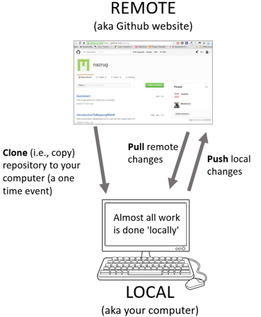

```{r setup, include=FALSE}
options(htmltools.dir.version = FALSE,
        eval = TRUE)
library(tidyverse)
library(gt)
library(gtExtras)
```


class: title-slide, left, top

# `r rmarkdown::metadata$title`

## `r rmarkdown::metadata$subtitle`

### `r rmarkdown::metadata$author`

<br>


<span style='color:white;'>Slides released under</span> [CC-BY 2.0](https://creativecommons.org/licenses/by/2.0/)&nbsp;&nbsp;`r fontawesome::fa("creative-commons", "white")``r fontawesome::fa("creative-commons-by", "white")` ]   

<div style = "position: absolute;top: 0px;right: 0px;"></img></div>

---

layout: true

<div class="my-footer"><span>Philip Leftwich - 5023Y Courses Slido.com #3565088</span></div>


---
class: center, middle

# Git and Github

## Tools for sharing analyses and version control


---

# Open Science

* A survey in 2015 estimated the % of published papers in STEM subjects that included accompanying raw data

--

* Only 13% of research articles included raw data

.footnote[[Refs] 10.1371/journal.pone.0143460]


---

# Version control

.pull-left[

If you use Office 365 or Google Docs, you may already be using version control

It is a more efficient, cleaner and safer way of keeping track of file development

]

.pull-right[

```{r, echo=FALSE, out.width="80%"}

```
]


---

## It is always a good idea to safely save and share your analysis changes in incremental steps

- If you (or a collaborator) make updates that break your code, you can always revert back to the last working version

- It is stored safely as a back-up off your computer

- A great collaboration tool, what changes made and when


---

# GitHub

* Git a free and open-source version control system

* GitHub a hosting system for Git that we can easily interact with using R and RStudio

* Set up a connection and your RStudio project can be Pushed to a repository on GitHub

* Fully collaborative, open, reproducible analyses

* Can be *archived* when ready to publish with a doi

---

.pull-left[

Need to set up a connection between RStudio and Github account so that they talk to each other. 

As part of the next workshop you will connect Github and RStudio

]

.pull-right[

```{r, echo=FALSE, out.width="100%"}

```
]

---

# Worked example

I will:

1) fork a copy of an existing repository

2) Clone this to RStudio Cloud

3) Make a change to a file

4) **Stage, commit and push** changes back to Github

5) Check my repo is updated


---

# Tips when working with Github

**Fork:** Make your own copy of someone else’s repo in GitHub. If you fork someone’s repo, that means you can’t mess with their code (which would require them adding you as a collaborator to do directly, so don’t worry...you won’t destroy the tidyverse no matter how hard you try)

**Clone:** Download an existing repo to your local machine so you can work with it in RStudio

**Stage/commit:** Stage changes, then Commit (with a useful, descriptive message to remind you what is changed in that version) to store that version

**Push:** Send the committed changes back to GitHub


---

# Tips for getting the most out of Github

- Github is public, and an opportunity to build a portfolio of data science projects

- Fill out your profile page

- When assignments are completed, fork them to your page.

- Make sure projects are well organised with clear descriptions

- Follow other data scientists, star useful/favourite projects, fork projects to work on them (even if not planning to actively submit pull requests)

---

class: center, middle, inverse 

## Keep learning

[Happy Git and GitHub for the useR](https://happygitwithr.com/)