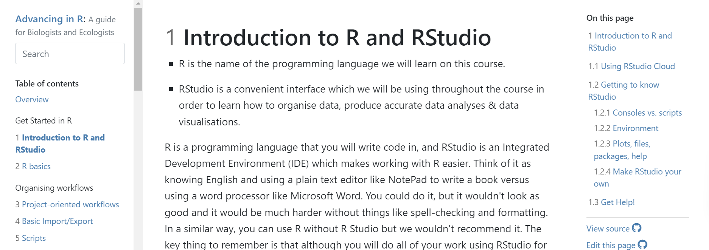
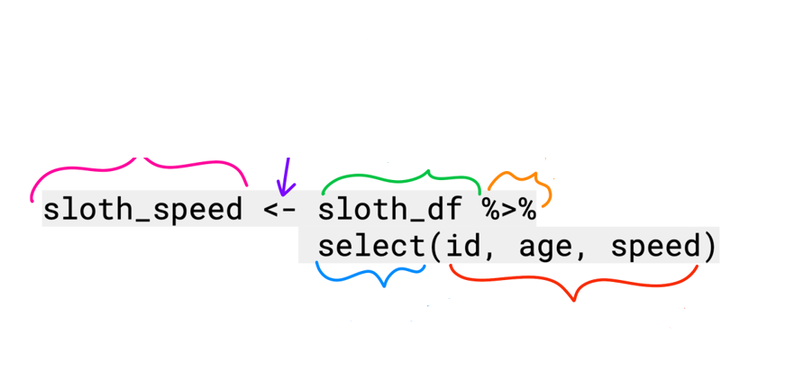
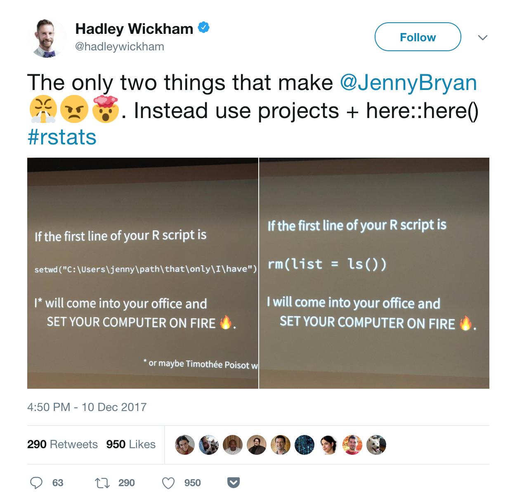
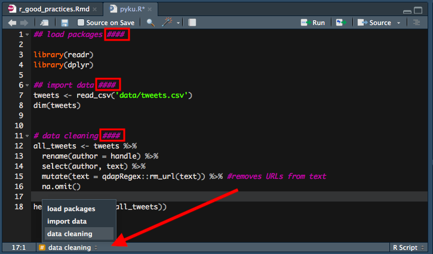

```{r setup, include=FALSE}
options(htmltools.dir.version = FALSE,
        eval = TRUE)
library(tidyverse)
library(gt)
library(gtExtras)
```


class: title-slide, left, top

# `r rmarkdown::metadata$title`

## `r rmarkdown::metadata$subtitle`

### `r rmarkdown::metadata$author`

<br>


<span style='color:white;'>Slides released under</span> [CC-BY 2.0](https://creativecommons.org/licenses/by/2.0/)&nbsp;&nbsp;`r fontawesome::fa("creative-commons", "white")``r fontawesome::fa("creative-commons-by", "white")` ]   


<div style = "position: absolute;top: 0px;right: 0px;"></img></div>

---

layout: true

<div class="my-footer"><span>Philip Leftwich - Advancing in R</span></div>


---

class: center, inverse, middle

# Welcome

---

# Introductions

.pull-left[

```{r, echo = FALSE, out.width="50%", fig.alt = "Philip Leftwich"}
knitr::include_graphics("images/Me.jpg")
```

* Associate Professor 

* Genetics & Data Science 

* University of East Anglia

]

.pull-right[

```{r, echo = FALSE, out.width="50%", fig.alt = "University of East Anglia and Norwich"}
knitr::include_graphics("images/UEA1.png")
knitr::include_graphics("images/800px-Norwichcollage2019.png")
```

]

---

# Course Outline

Over the next four days we are going to cover: 

.pull-left[

- Intro to R and R basics
  
- Organizing workflows
  
- Learning tidyverse
  
- Writing functions

]

.pull-right[

- Learning iterations
  
- Getting the most out of tidyverse and functional programming
  
- Data presentation with ggplot and gt tables
  
- Shiny dashboards
  
- RMarkdown and GitHub

]


---

class: center, inverse, middle

# Tell me about you 🫵


---

class: center, inverse, middle

# Day One

---

# Day One

- R basics - what did they forget to teach you?

- Project Oriented Workflows

- Basic Import/Export

- Scripts and Naming Things

- Data wrangling with dplyr & exploratory data analysis

---

# What you will need

.right-plot[

```{r, echo = FALSE, out.width="130%", fig.alt = "coursebook"}

```

]

.left-code[

- Practical materials available through the [coursebook](https://ueabio.github.io/physalia-R-course-2023/index.html)

- Each sessions will last around 2-2.5 hours

- (Lunch)break in the middle

- Questions via Zoom chat/Slack/Wooclap

- Posit cloud workspace is available for everyone to use

- Are you set up with everything you need?

- One-to-one chats available throughout
]

---


## R is for Open Reproducible Research

.left-code[


* Reproducible

* Robust

* Transparent

* Reusable

* Shareable research materials

]

.right-plot[

```{r, echo = FALSE, out.width="100%", fig.alt = "Is data and stats reporting enough?"}
knitr::include_graphics("images/reproducible-data-analysis-02.png")
```

]


---
class: center

## What is RStudio/Posit?

```{r, echo = FALSE, out.width="70%"}
knitr::include_graphics("images/engine.png")
```

---
class: center

## What is Posit Cloud?

```{r, echo = FALSE, out.width="60%"}
knitr::include_graphics("images/cloud.png")
```

Posit Cloud(https://posit.cloud/)

---
class: center, middle

## Workflow

```{r, echo = FALSE, out.width="65%"}
knitr::include_graphics("images/annotated.png")
```

---
class: center, middle

## Motivations

 [File not Found](https://www.theverge.com/22684730/students-file-folder-directory-structure-education-gen-z)

 [Data is not available upon request](https://osf.io/preprints/psyarxiv/jbu9r/)

 [Code review in the scientific workflow](https://onlinelibrary.wiley.com/doi/10.1111/jeb.14230)

 [SORTEE](https://www.sortee.org/)

---

## Directories and projects

.pull-left[

```{r, echo = FALSE, out.width="60%"}
knitr::include_graphics("images/Project.png")
```

]

.pull-right[


Save files in specific locations, with intentional and useful names: 

- Short and informative names

- Easy to sort and cooperate with partial searches

- Be careful with special characters and spaces

- Use relative filepaths

]


---
## Data wrangling

* Naming things

* Coding basics & tidyverse wrangling/viz

* Good coding habits

* Code annotation & organization

* Data visualization

* Troubleshooting 

* Relative file paths

* Literate programming


---


## First some terms

```{r, echo = FALSE, out.width="85%"}

```

---


## First some terms

```{r, echo = FALSE, out.width="85%"}
knitr::include_graphics("images/terms.png")
```

---

class: center, middle, inverse


# **1. Naming things and entering data**


---

## When naming variables, observations, dataframes or files make them:

.pull-left[
* Meaningful

* Consistent

* Concise

* Readable
]

---

## When naming variables, observations, dataframes or files make them:

.left-code[
* **Meaningful**


* Consistent


* Concise


* Readable
]

.right-plot[
* Names of variables, data frames, and files should not be so generic/vague that a user must need a glossary to know what they contain

* Names should be specific to the data/experiment/project, and the more intuitive their interpretation the better

* **Bad examples:** File-1.xlsx, file-2.csv, indicator1, indicator2, ExperimentA.R, ExperimentB.R

* **Better examples:** 01_import_mice_assay_data.R, 20231109_dros_behav.csv, 20231004_ms_culex_biting.docx

]

---

## When naming variables, observations, dataframes or files make them:

.left-code[
* Meaningful


* **Consistent**


* Concise


* Readable
]

.right-plot[
* Keep names **identical** for identical entries (e.g. “burrito-32” and “Burrito 32” are *different things* to R)

* Be consistent **across data frames** - your life will be easier if you have year called ‘year’ in both sets.

* Use logical suffixes (if necessary), consistently formatted. Like: temp_water_surface.csv, temp_water_sub.csv, temp_water_bottom.csv


]

---

## When naming variables, observations, dataframes or files make them:

.left-code[
* Meaningful


* Consistent


* **Concise**


* Readable
]

.right-plot[
* Balance meaningfulness w/conciseness

* Better to be descriptive than not know what a variable is

* Longer names = tedious coding, but less effort to look through metadata for column/identifier names


]

---

## When naming variables, observations, dataframes or files make them:

.left-code[
* Meaningful


* Consistent


* Concise


* **Readable**
]

.right-plot[
* Avoid punctuation (%, !, ~, ( ), #) in names - more challenging to type & can break code.

* Avoid spaces (makes coding much more difficult)

* Avoid starting object names with numbers (but could be useful for file names in sequence)
]
---


## When naming variables, observations, dataframes or files make them:

.left-code[
* Meaningful


* Consistent


* Concise


* **Readable**
]

.right-plot[

* Avoid naming objects that are also commonly used functions (like filter or select)

* Pick (and be consistent with) a choice of case, like:
    * **lowercase_snake_case** (my favorite)
    * camelCase
    * UpperCamelCase
    * kebab-case
    * SCREAMING_SNAKE_CASE

]

---

## Project organisation


### Project

Have one directory than contains all of the relevant files for a project or analysis

- [Project Oriented Workflow](https://www.tidyverse.org/blog/2017/12/workflow-vs-script/)

### Contains

📁 Data

📁 Scripts

📁 Outputs

---

## R projects

.pull-left[

Basically, they create the environment where

- all code and outputs are stored in one set location (no more `setwd()`!)

- relative file paths are created - this guarantees better reproducibility

- clean R environment is created every time you open it (no more `rm(list = ls()`)!)

]

.pull-right[

```{r, echo = FALSE, out.width="100%"}

```

]

---

## Save the source

.pull-left[

- Keep scripts as the analysis pathway

- Export figures and results to files

- Keep your session as a "Blank Slate" - restart R

- **Do not** save or load workspace between sessions

]

.pull-right[

```{r, echo = FALSE, out.width="85%"}
knitr::include_graphics("images/session.jpg")
```

]

---


## Resources for good coding practice


* [How to organise your spreadsheets](https://www.tandfonline.com/doi/full/10.1080/00031305.2017.1375989)

* [R coding basics](https://rstudio.cloud/learn/primers/1.2)

* [tidyverse style guide](https://style.tidyverse.org/)

---

## Why?

* Consistency and project organisation will help you: work with collaborators, get feedback on code, publish your analyses.

* Consistency also helps with troubleshooting

## Collaborators
### Who is a collaborator?

* Your current and future coworkers

* Your future self

---

## Important things: 


* Organisation

--

* Clear annotation

--

* Consistent formatting


--

👎 BAD READABILITY

```
object_name <- df %>% filter(col_a == “yes”, col_b == “burritos”, col_c != “eggplant”) %>% select(col_b:col_e) %>% mutate(new_col = col_f + col_g) %>% group_by(col_b, col_d) %>% summarize(new_col_2 = mean(new_col))

```

👍 GOOD READABILITY

```
object_name <- df %>% 
filter(col_a == “yes”, 
 col_b == “burritos”, 
 col_c != “eggplant”) %>% 
select(col_b:col_e) %>% 
mutate(new_col = col_f + col_g) %>% 
group_by(col_b, col_d) %>% 
summarize(new_col_2 = mean(new_col))
```

---

class: center, middle

# Coding considerations

*Good coding style is like correct punctuation: you can get by without it* 

*butitsuremakesthingseasiertoread*

<br>

[the tidyverse style guide](https://style.tidyverse.org/syntax.html) by Hadley Wickham

---

## Writing your code well from day one

.pull-left[
- Generous and clear commments

- logical and efficient code

- code that is tested (and timed!)
]

.pull-right[

```{r, echo = FALSE, out.width="200%"}

```
]

---

## Break up your analysis

.pull-left[

```{r, echo = FALSE, out.width="85%"}
knitr::include_graphics("images/Project.png")
```
]

.pull-right[

-  Sometimes running a full project from one script even with clearest and informatively named code sections is simply difficult

- Write specific scripts for particular jobs

- Use .RDS files to save the outputs between sections (and time)

]

---

class: center, middle, inverse

# Questions?


