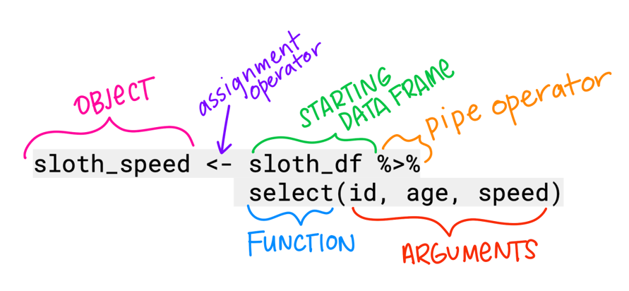
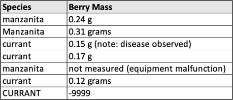
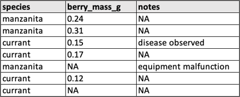
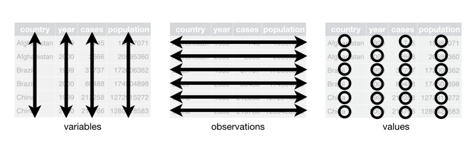
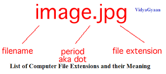
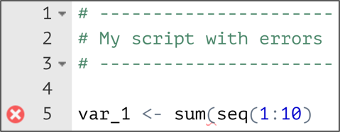
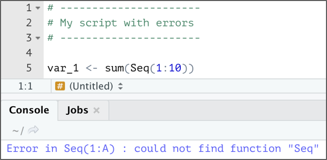
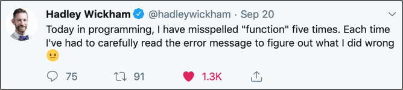
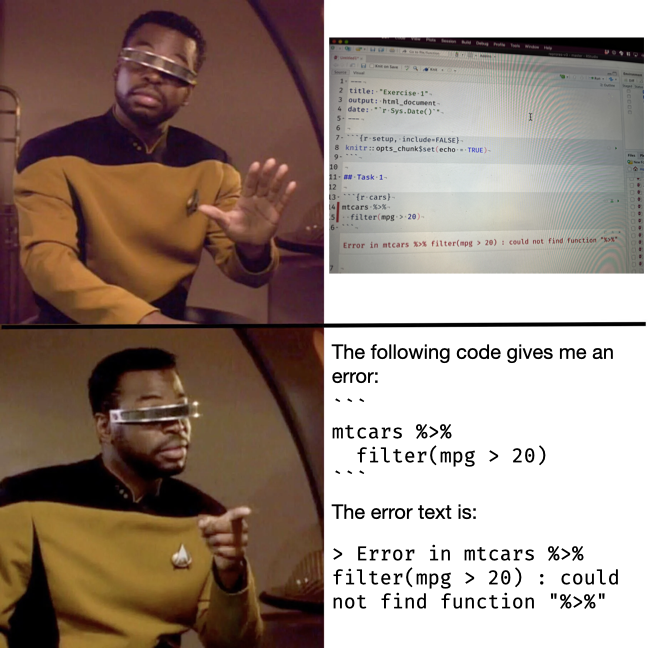

```{r setup, include=FALSE}
options(htmltools.dir.version = FALSE,
        eval = TRUE)
library(tidyverse)
library(gt)
library(gtExtras)
```


class: title-slide, left, top

# `r rmarkdown::metadata$title`

## `r rmarkdown::metadata$subtitle`

### `r rmarkdown::metadata$author`

<br>


<span style='color:white;'>Slides released under</span> [CC-BY 2.0](https://creativecommons.org/licenses/by/2.0/)&nbsp;&nbsp;`r fontawesome::fa("creative-commons", "white")``r fontawesome::fa("creative-commons-by", "white")` ]   

<span style='color:white;'>Slido.com #3715469</span>  

<div style = "position: absolute;top: 0px;right: 0px;"></img></div>

---

layout: true

<div class="my-footer"><span>Philip Leftwich - 5023Y - Slido.com #3715469</span></div>

---

## First some terms

```{r, echo = FALSE, out.width="85%", fig.alt = "An R object saved by using the assignment operator <- a dataframe called sloth_df is piped into the function select with arguments id, age and speed"}

```

---

class: center, middle, inverse


# **1. Naming things and entering data**


---

## When naming variables, observations, dataframes or files make them:

.pull-left[
* Meaningful

* Consistent

* Concise

* Readable
]

---

## When naming variables, observations, dataframes or files make them:

.left-code[
* **Meaningful**


* Consistent


* Concise


* Readable
]

.right-plot[
* Names of variables, data frames, and files should not be so generic/vague that a user must need a glossary to know what they contain

* Names should be specific to the data/experiment/project, and the more intuitive their interpretation the better

* **Bad examples:** File-1.xlsx, file-2.csv, indicator1, indicator2, ExperimentA.R, ExperimentB.R

* **Better examples:** taco_nutrients.csv, ca-demographics, mice_1a_mass, sb_channel_spatial.shp

]

---

## When naming variables, observations, dataframes or files make them:

.left-code[
* Meaningful


* **Consistent**


* Concise


* Readable
]

.right-plot[
* Keep names **identical** for identical entries (e.g. “burrito-32” and “Burrito 32” are *different things* to R)

* Be consistent **across data frames** - your life will be easier if you have year called ‘year’ in both sets.

* Use logical suffixes (if necessary), consistently formatted. Like: temp_water_surface, temp_water_sub, temp_water_bottom


]

---

## When naming variables, observations, dataframes or files make them:

.left-code[
* Meaningful


* Consistent


* **Concise**


* Readable
]

.right-plot[
* Balance meaningfulness w/conciseness

* Better to be descriptive than not know what a variable is

* Longer names = tedious coding, but less effort to look through metadata for column/identifier names


]

---

## When naming variables, observations, dataframes or files make them:

.left-code[
* Meaningful


* Consistent


* Concise


* **Readable**
]

.right-plot[
* Avoid punctuation (%, !, ~, ( ), #) in names - more challenging to type & can break code.

* Avoid spaces (makes coding much more difficult)

* Avoid starting object names with numbers (but could be useful for file names in sequence)

]
---


## When naming variables, observations, dataframes or files make them:

.left-code[
* Meaningful


* Consistent


* Concise


* **Readable**
]

.right-plot[

* Avoid naming objects that are also commonly used functions (like filter or select)

* Pick (and be consistent with) a choice of case, like:
    * **lowercase_snake_case** (my favorite)
    * camelCase
    * UpperCamelCase
    * kebab-case
    * SCREAMING_SNAKE_CASE

]

---

## Entering data

* The outcomes for a variable (whether values or descriptions) should exist alone in a column

* Be very consistent when entering descriptions (e.g. “Purple” v. “purple” v. “purple_”)

* Avoid formatting and symbols (if it’s hard to type, then it’s hard to type...and might cause issues beyond that)

* Put any additional information (units, notes, etc.) in columns separate from the value/description

* If there are missings, enter the **same exact thing** for each missing value (common: NA, -- or -)


---

## Data entry

.pull-left[
### Bad:
```{r, echo = FALSE, out.width="95%", fig.alt = "Inconsistent data entry, units in the column of berry mass, observations mixed in with units"}

```

]

--

.pull-right[
### Better:
```{r, echo = FALSE, out.width="95%", fig.alt = "Units included in title, consistent use of snake case, each column is a unique variable, each row is an observation. Notes in separate column"}

```

]

---


class: center, middle, inverse


# Tidy data


---

```{r, echo = FALSE, out.width="90%", fig.alt = "In tidy data:Every column is a variable, every row is an observation, every cell is a single value."}

```


---
class: middle

* A variable is a characteristic that is being measured, counted or described with data. Like: car type, salinity, year, population, or whale mass.

* An observation is a single “data point” for which the measure, count or description of one or more variables is recorded. For example, if you are recording variables height, mass, and flipper length of penguins, then each penguin is an observation.

* A value is the recorded measure, count or description of a variable.

---

## Example of Tidy data

```{r, echo = FALSE}
id <- c(1,2,3,4,5,6)

species <- c("wookie", "wookie", "ewok", "wookie", "ewok", "ewok")

size_kg <- c(110, 121, 36, 107, 38, 30)

height_m <- c(2.1, 2.2, 1, 2.2, 1.1, 0.9)

starwars <- tibble(id, species, size_kg, height_m)

starwars %>% 
  gt()

```

---

## Why isn't this tidy?

```{r, echo = FALSE}

country <- rep(c("Afghanistan", "Brazil", "China"), each = 4)

year <- rep(c(1999,1999,2000,2000), 3)

key <- rep(c("cases", "population"), 6)

value <- c(745, 19987071, 2666, 20595360, 37737, 172006362, 80488, 174504898, 212258, 127915272, 213766, 1280428583)


data <- tibble(country, year, key, value)

data %>% 
  gt()
```


---

## Make it tidy

```{r}

data %>% 
  tidyr::pivot_wider( names_from = key,
                      values_from = value) %>% 
  gt()
```

---

## Why isn't this tidy?

```{r, echo = FALSE}

country <- rep(c("Afghanistan", "Brazil", "China"), each = 2)

year <- rep(c(1999,2000), 3)

`cases/population` <- c("745/19987071", "2666/20595360", "37737/172006362", "80488/174504898", "212258/ 127915272", "213766/1280428583")


data <- tibble(country, year, `cases/population`)

data %>% 
  gt()
```


---

## Make it tidy

```{r}

data %>% 
  separate(`cases/population`,
           c("cases", "population")) %>% 
  gt()
```
---

## Pivot

```{r, echo = FALSE, out.width="60%", fig.alt = "Pivot to reshape dataframes"}
knitr::include_graphics("images/pivot.gif")
```

---

## Data file formats

Understanding file formats is important! 

* Human readable filename (use naming conventions)

* One period only 

* the extension is important!

```{r, echo = FALSE, out.width="60%", fig.alt = "Filenames consists of a human readable filename, period, and file extension "}

```


---

| File types| Meaning|
|-----|-----|
|.csv| comma-separated values|
|.tsv| tab-separated values|
|.xls| Excel spreadsheet|
|.xlsx| Excel 2007|
|.json| String data storage|

```{r, eval = FALSE}

read_csv("data/penguins_raw.csv")

```


---
class: center, middle, inverse

# **2. Help yourself in R:**

## Finding resources and tips for troubleshooting


---

## What package or function should I use?

### **Google it:**

  * Search with the keywords and package/function name if known, and include .R in the search keywords (e.g. “dplyr::mutate add column in .R” instead of “mutate variable”).
    
  * “R” is generic - so consider using “R software” or “.R”
    
  * Start learning and using language common in R communities & publications (e.g. [R4DS](https://r4ds.had.co.nz/)), like data frame instead of spreadsheet
    
  * For now, anything reading, wrangling, ggplot2 related: considering navigating to documentation from [tidyverse.org](https://www.tidyverse.org/), [rdocumentation](https://www.rdocumentation.org/), or [RStudio community](https://community.rstudio.com/). 

---

## How do I know there’s an error, and where to look for it? 

* When you save a script, lines of code with some errors (e.g. unmatched parentheses) will have a red circle with an x in it next to the line number

```{r, echo = FALSE, out.width="50%", fig.alt = "Syntax error"}

```

* You might also see a red squiggly line under part of your code, indicating a syntax issue. You can hover over the squiggly to see a pop-up hint about what’s going on. 

---

## Error messages will show up* in the Console when you try to run the broken code: 


```{r, echo = FALSE, out.width="50%", fig.alt = "Console error"}

```

---
class: center

## Fact
### Sometimes walking away is the most productive

```{r, echo = FALSE, out.width="50%", fig.alt = "Things will look better in the morning"}
knitr::include_graphics("images/Error.jpg")
```

---

## There are multiple types of messages that R will print. Read the message to figure out what it’s trying to tell you. 

* **Error:** There’s a fatal error in your code that prevented it from being run through successfully. You need to fix it for the code to run. 

* **Warning:** Non-fatal errors (don’t stop the code from running, but this is a potential problem that you should know about).

* **Message:** Here’s some helpful information about the code you just ran (you can hide these if you want to)

---
class: center

### Read the error message
--

## Read the error message
--

# Read the error message

Sometimes it will be infuriatingly vague, but often it will tell you exactly how to fix it (e.g. “do you need ==?”). 

```{r, echo = FALSE, out.width="60%", fig.alt = "Always read the error message"}

```

---

## Troubleshooting

* Symptom: `Error in _________: could not find function “_________”`


* Diagnosis: 
    * The `library()` containing the function hasn't been called
    * The function has been misspelled

---

## Troubleshooting

* Symptom: `Error in ____ : object ‘_____’ not found’`

* Diagnosis: 
    * The object hasn’t been created or stored
    * You’ve mistyped the object name

---

## Troubleshooting
  
### If R…tells you it’s ignoring an argument within a function

* Symptom: `Warning: Ignoring unknown parameters: ____`

* Diagnosis: 
    * You’ve included an argument that doesn’t exist for that function
    * You’ve mistyped an argument that does exist for that function
---

## Troubleshooting

* Look over code very carefully - character-by-character and space-by-space. Run line-by-line to see where it breaks. 

--

* Google the copied & pasted error message. **Someone else has encountered and solved it before**.

--

* Take a break and come back to it later. ☕ 

---

### Get Help

.pull-left[

```{r, echo = FALSE, out.width="100%", fig.alt = "Ask for help in a smart way"}

```

]

.pull-right[

There will be a discussion board on Blackboard to ask all of your coding questions. 

Make your questions as clear as possible

* What are you trying to do?

* What is the exact error message or output

* What code did you run to produce this

]


---

class: center, middle, inverse


# dplyr


