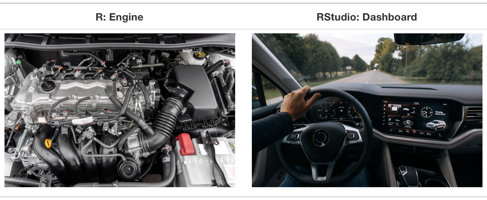
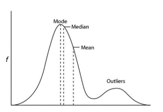
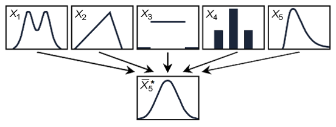
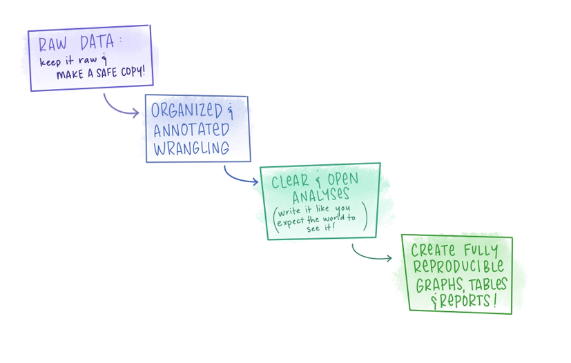

```{r setup, include=FALSE}
options(htmltools.dir.version = FALSE,
        eval = TRUE, warning = FALSE, message = FALSE)
knitr::opts_chunk$set(warning = FALSE, message = FALSE, fig.retina = 3, fig.asp = 0.8, fig.width = 7, out.width = "120%")

library(tidyverse)
library(gt)
library(gtExtras)
library(rstatix)
library(palmerpenguins)


```


class: title-slide, left, top

# `r rmarkdown::metadata$title`

## `r rmarkdown::metadata$subtitle`

### `r rmarkdown::metadata$author`

<br>


<span style='color:white;'>Slides released under</span> [CC-BY 2.0](https://creativecommons.org/licenses/by/2.0/)&nbsp;&nbsp;`r fontawesome::fa("creative-commons", "white")``r fontawesome::fa("creative-commons-by", "white")` ]   

<div style = "position: absolute;top: 0px;right: 0px;"></img></div>

---

layout: true

<div class="my-footer"><span>Philip Leftwich - 5023Y</span></div>

---

# Introductions

.pull-left[

```{r, echo = FALSE, out.width="30%", fig.alt = "Philip Leftwich"}

```

* Associate Professor 

* Genetics & Data Science 

* University of East Anglia

]

.pull-right[

Go to Wooclap

https://app.wooclap.com/TKBILR

Ask questions and answer quizzes

]

---

class: center, inverse

# Introductions

```{r, echo = FALSE, out.width="70%", fig.alt = "Import, tidy, explore and communicate"}
knitr::include_graphics("images/data-science-explore.png")
```

---

### Learning outcomes

* Program in R

* Data wrangling

* Data visualisation

* Data analysis

* Reproducible Research

---

## R is for Open Reproducible Research

.left-code[


* Reproducible

* Robust

* Transparent

* Reusable

* Shareable research materials

]

.right-plot[

```{r, echo = FALSE, out.width="100%", fig.alt = "Is data and stats reporting enough?"}
knitr::include_graphics("images/reproducible-data-analysis-02.png")
```

]

---

## What is R?


* R is a full programming language

* R is a calculator

* R simulates & generates data

* R reads, processes and manipulates data

* R analyses data

* R makes plots, graphics, reports and presentations


---
class: center

## What is RStudio/Posit?

```{r, echo = FALSE, out.width="70%"}

```

---
class: center

## What is Posit Cloud?

```{r, echo = FALSE, out.width="60%"}

```

Posit Cloud(https://posit.cloud/)

---
class: center, middle

## Workflow

We will do everything in **well-annotated, organized scripts** that contain streamlined and easy-to-follow records of our entire analyses from **raw data** through **final reports**, with **unbreakable** file paths and with a **complete history** of changes made.   

---
class: center, middle

## Workflow

```{r, echo = FALSE, out.width="65%"}
knitr::include_graphics("images/annotated.png")
```

---
## Data wrangling

* Naming things

* Coding basics & tidyverse wrangling/viz

* Good coding habits

* Code annotation & organization

* Data visualization

* Troubleshooting 

* Relative file paths

* Literate programming

---
class: center, middle, inverse

## Once we get, wrangle, explore, and visualize data reproducibly, we star building stats skills...

---

## Descriptive statistics

Central Tendency (mean, median, mode)
	`mean()`, `median()`, `mode()`

Data Spread (range, variance, standard deviation)
	`range()`, `var()`, `sd()`


```{r, echo = FALSE, out.width="50%"}

```

---

## Probability distributions

* Probability distributions come in many types

* They underpin our ability to make inferences from our data

* Deviations from expected distributions underping statistical significance

```{r, echo = FALSE, out.width="70%"}

```

---

## Hypothesis testing

* Ask a question about some data or a claim. Collect sample(s).

* Define the null and alternative hypotheses 

* Select your criteria (significance level)

* Calculate the test statistic

* Compare the test statistic to the critical statistic (or  convert it to a p-value)

* Make a decision to reject or retain the null

---
class: center, middle, inverse

# Statistics is more than p-values and hypothesis testing

---
class: middle

## Data analysis needs:

.pull-left[

* Data tidying and cleaning

* Data Exploration

* Data visualization

* Defining research questions

]

.pull-right[

* Produce statistical models

* Interpret outcomes

* Express uncertainty

* Communicate

]

---

### The p-value is meaningful and can be useful in decision making, but it has dominated stats discussions for too long.

* It’s rarely the most interesting/important part of the story

* At high enough n, everything becomes significant – but does the difference actually matter?

* There is nothing magical about 0.05

* “Wanting” to find p < 0.05 leads to biased science (p-harking, publication bias etc.)


---

```{r, echo = FALSE, out.width="100%", fig.cap = "Make your analysis easy to understad, easy to follow, easy to reproduce!"}

```

---
class: center, middle, inverse

# These tools are not R-specific

## Practice them in whatever tools you use

---
## We will start

* Learning to  work comfortably in R/RStudio projects 

* Understanding R and R programming

* Data wrangling tools


---

## Course Outline

* 1 x weekly lecture

* 1 x weekly computer lab

* Weekly quizzes/small tasks (10%)

* 2 x coursework assignments (30% and 50%)

* 1 x second term stats theory test (10%)

**Ask lots of questions.**

---

### Get Help

.pull-left[

```{r, echo = FALSE, out.width="100%", fig.alt = "Ask for help in a smart way"}
knitr::include_graphics("images/geordi_help.png")
```

]

.pull-right[
There will be a discussion board on Blackboard to ask all of your coding questions. 

Make your questions as clear as possible

* What are you trying to do?

* What is the exact error message or output

* What code did you run to produce this

]


---

class: center, middle, inverse

# Lets' start!


