```{r setup, include=FALSE}
options(htmltools.dir.version = FALSE,
        eval = TRUE, warning = FALSE, message = FALSE)
knitr::opts_chunk$set(warning = FALSE, message = FALSE, fig.retina = 3, fig.asp = 0.8, fig.width = 7, out.width = "120%")

library(tidyverse)
library(gt)
library(gtExtras)
library(rstatix)
library(palmerpenguins)

```


class: title-slide, left, top

# `r rmarkdown::metadata$title`

## `r rmarkdown::metadata$subtitle`

### `r rmarkdown::metadata$author`

<br>


<span style='color:white;'>Slides released under</span> [CC-BY 2.0](https://creativecommons.org/licenses/by/2.0/)&nbsp;&nbsp;`r fontawesome::fa("creative-commons", "white")``r fontawesome::fa("creative-commons-by", "white")` ]   

<div style = "position: absolute;top: 0px;right: 0px;"></img></div>

---

layout: true

<div class="my-footer"><span>Philip Leftwich - Physalia Courses</span></div>

---


## Linear models


.left-code[

* Difference tests: t-test, ANOVA, ANCOVA

* Association tests: Regressions

]

.right-plot[
```{r, echo = FALSE, out.width="60%", fig.alt = "Introduction to linear models"}
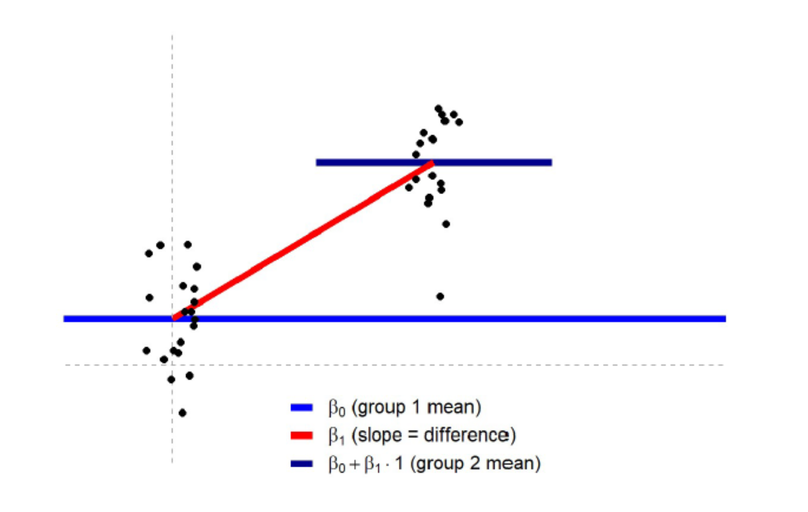
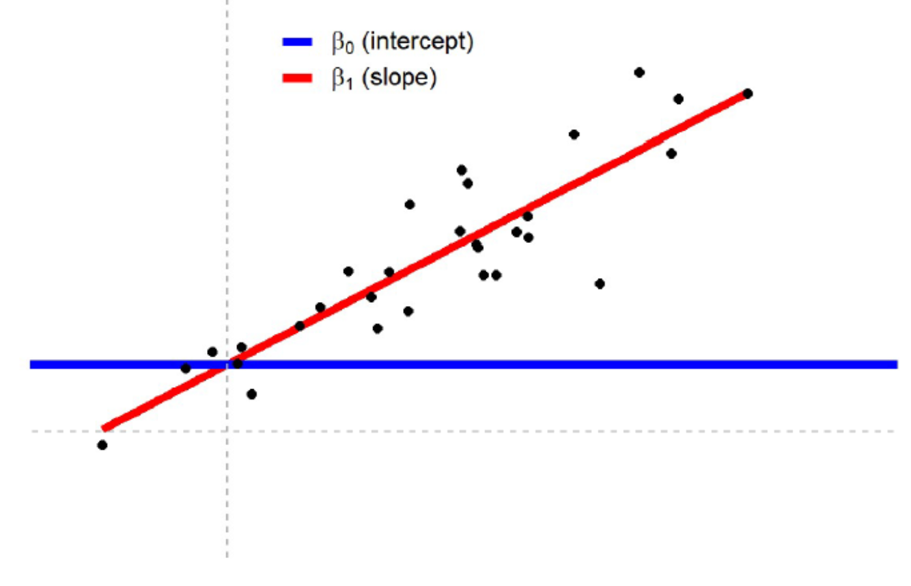
```
]

---

https://lindeloev.github.io/tests-as-linear/

```{r, echo = FALSE, out.width="100%", fig.alt = "Common statistical tests are linear models"}
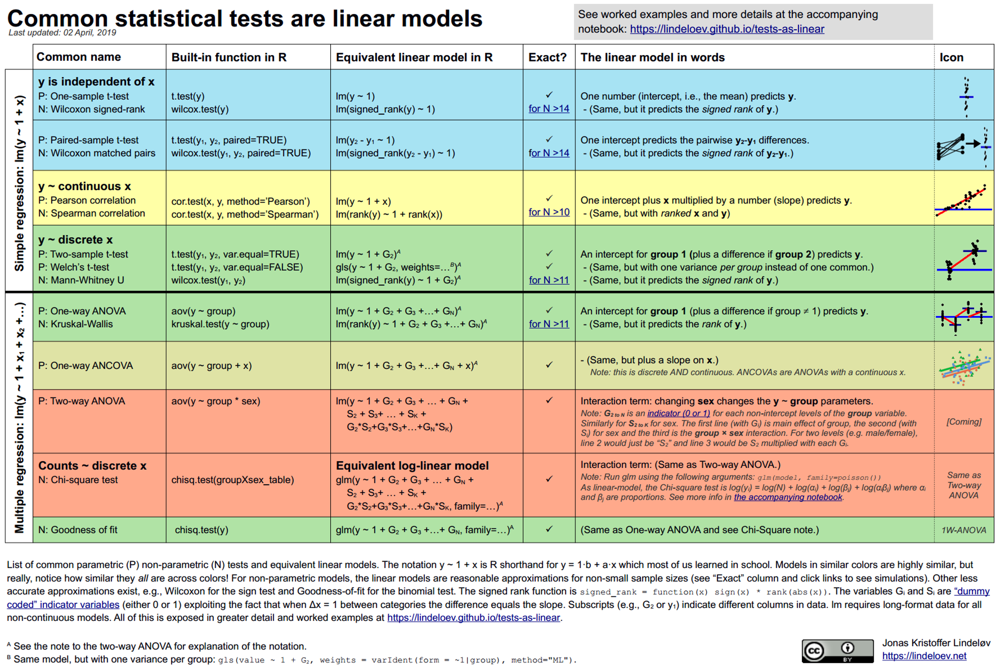

```
---

## Basic linear models

```{r, echo = FALSE, out.width="60%", fig.cap = "Basic linear models aim to describe a linear relationship between a response (outcome) variable and a predictor (input) variable, usually by the method of ordinary least squares"}

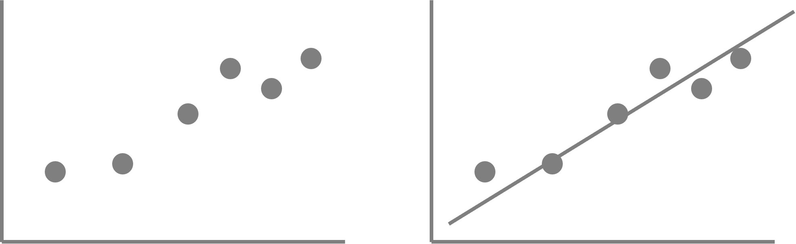

```

---

## Straight line equation

$$
\LARGE{y = a + bx}
$$

### Where:

$y$ is the predicted value of the response variable

$a$ is the intercept (value of y when x = 0)

$b$ is the slope of the regression line

$x$ is the value of the explanatory variable

---
## Line of best fit

```{r, echo = FALSE, out.width="60%", fig.alt = "Line fitting"}

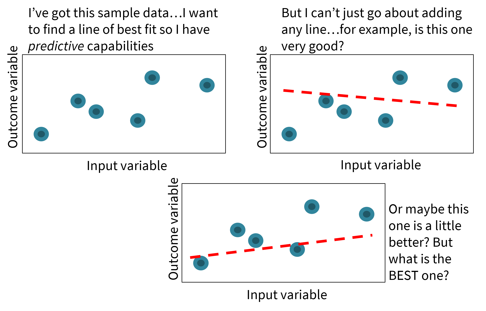

```

---
class: center, middle

The line of best fit minimises the sum of the **squared distance** that *each* sample point is from the value predicted by the model

This is called the method of 

##Ordinary Least Squares

---

## Residuals

The difference between the ACTUAL value of the observation $y_i$ and the value that the model predicts $\hat{y_i}$ at that $x$ value are the residuals (residual error).


```{r, echo = FALSE, out.width="50%", fig.alt = "residuals"}

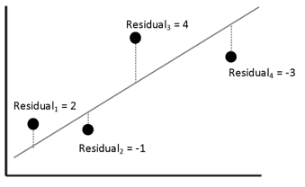

```

The regression model fitted by Ordinary Least Squares (OLS) will produce the equation for the line that **MINIMIZES** the sum of squares of the residuals

---

.pull-left[

```{r, echo = FALSE, out.width="120%", fig.alt = "sum of squares error"}

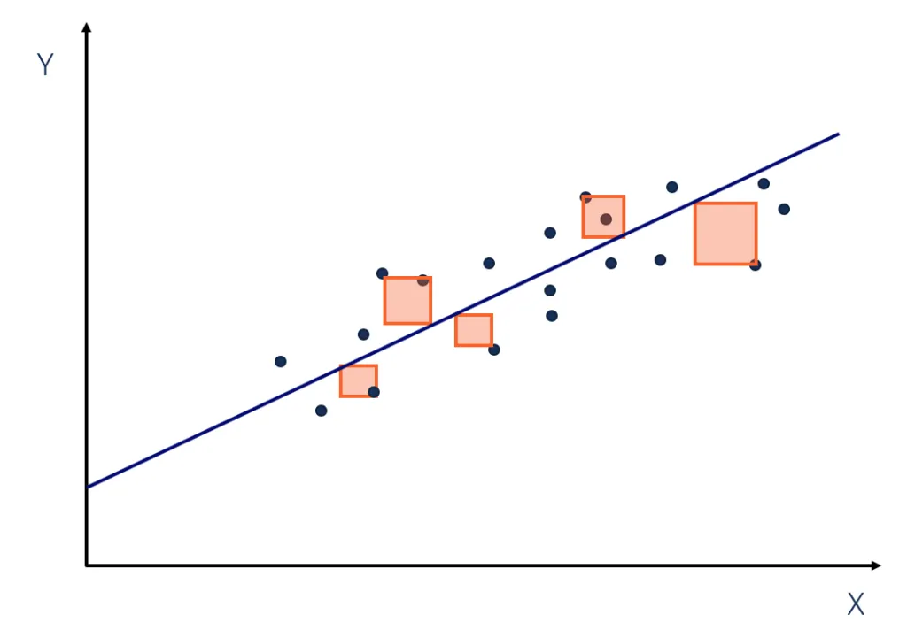

```

]

.pull-right[


This produces the line with the *smallest* total area size for the squares. 

$$
SSE = \underset{i=1}{n \atop{\sum}}(y_i - \hat{y_i})^2
$$

SUM OF RESIDUAL ERROR = $(2)+(-1)+(4)+(-3)+(-2)=0$


SUM OF SQUARES OF RESIDUAL ERROR = $(2^2)+(-1^2)+(4^2)+(-3^2)+(-2^2)=34$

]

---
class: center, middle

### Linear models describe differences or regressions

.pull-left[

```{r, echo = FALSE, out.width="100%", fig.alt = "difference"}

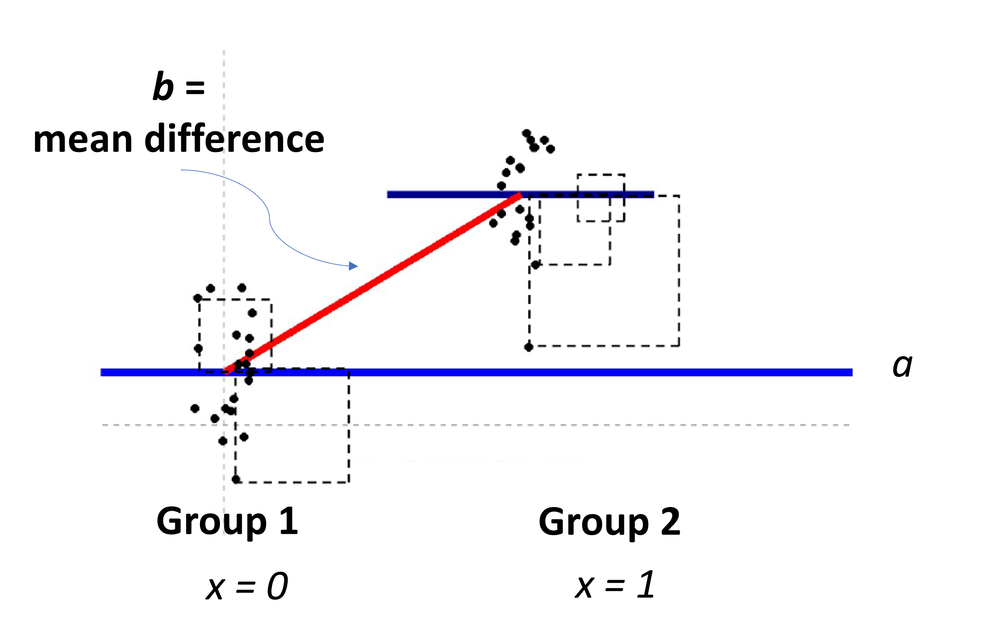

```
]

.pull-right[

```{r, echo = FALSE, out.width="100%", fig.alt = "regression"}

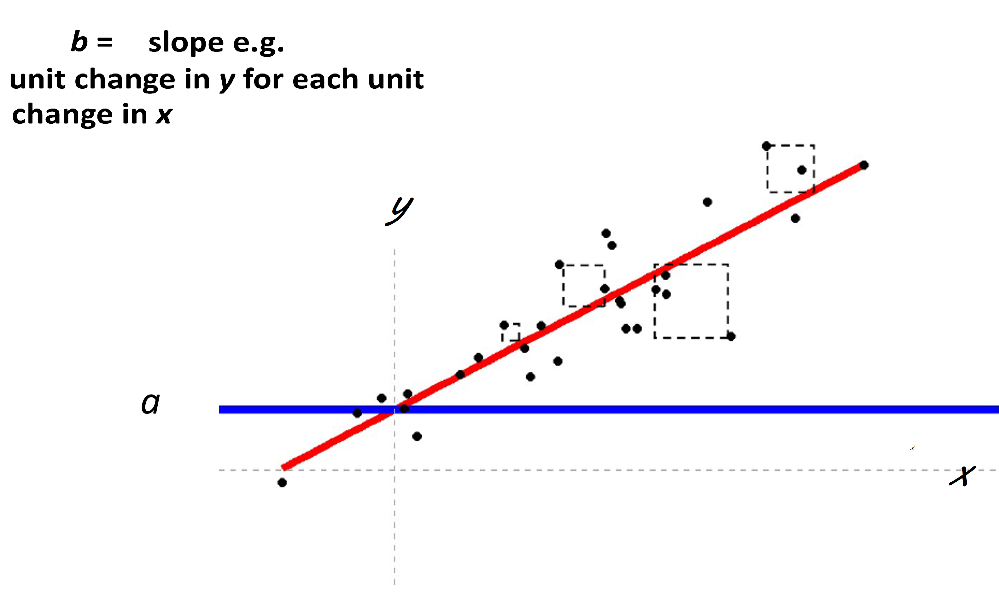

```

]


---

```{r, echo = FALSE, out.width="80%", fig.alt = "difference"}


```

---

```{r, echo = FALSE, out.width="90%", fig.alt = "difference"}


```

---

```{r, echo = FALSE, out.width="80%", fig.alt = "OLS fits a line to produce the smallest amount of SSE"}

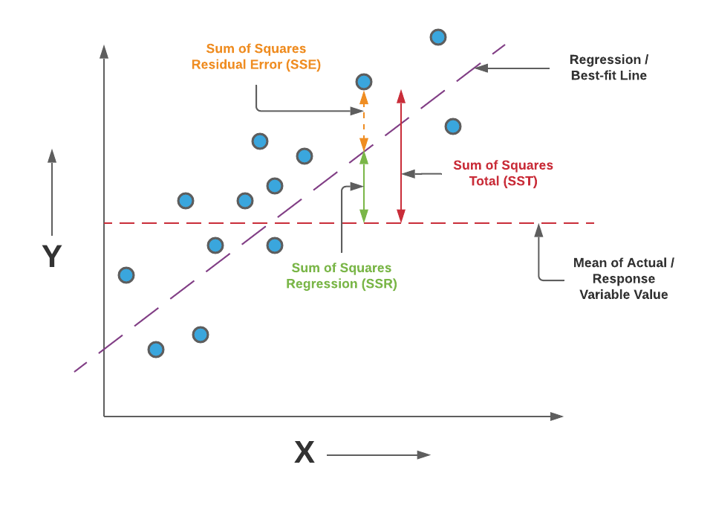

```

---

## Straight line equation

$$
\LARGE{y_i = a + bx+\epsilon}
$$

### Where:

$y_i$ is the predicted value of the response variable

$a$ is the intercept (value of y when x = 0)

$b$ is the slope of the regression line

$x$ is the value of the explanatory variable

**$\epsilon$ is the value of the residual error**

---

## Coefficient of determination


$\LARGE{R^2}$ : The proportion of variation in the dependent variable that can be predicted from the independent variable

$$
R^2=1-{Sum~of~Squared~Distances~between~y_i~and~\hat{y_i}\over{Sum~of~Squared~Distances~between~y_i~and~\overline{y}}} 
$$


$$
R^2=1-{SSE\over{SST}}
$$

---

## Adjusted $\huge{R^2}$

Adjusted $R^2$ is a corrected goodness-of-fit measure for linear models.

$R^2$ always increases as the number of effects are included in the model. Good for overall prediction, but does not check efficiency. 

Adjusted $R^2$ can fall if a model term does not *improve* the fit of the model


$$
Adjusted~R^2=1-{{SSE/(N-k)}\over{SST(N-1)}}
$$
$N$ = numerator degrees of freedom = Total number of observations across all groups

$k$ = Total number of groups

$N-k$ = denominator degrees of freedom

---

```{r, eval = F}

lsmodel0 <- lm(height ~ type, data = darwin)

summary(lsmodel0)

```

```{r, echo = FALSE, out.width="90%", fig.alt = "R model summary provides, the formula of the regression, the estimate of the intercept and standard error, estimated differences and uncertainity for each slope, the degrees of freedom for the whole model, F value and R squared"}
knitr::include_graphics("images/model_summary.png")
```


---

```{r, echo = FALSE, out.width="70%", fig.alt = "Here, R squared = 0.92. Does that mean this linear model is appropriate?"}
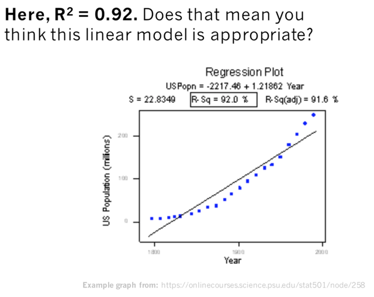
```

---

```{r, echo = FALSE, out.width="70%", fig.alt = "Here, R squared = 0. Does that mean there is no relationship between x and y?"}
knitr::include_graphics("images/cup.png")
```


---
class: middle, center, inverse

# Linear models for more than 2 groups:
#ANOVA
