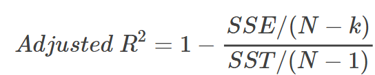

```{r setup, include=FALSE}
options(htmltools.dir.version = FALSE,
        eval = TRUE, warning = FALSE, message = FALSE)
knitr::opts_chunk$set(warning = FALSE, message = FALSE, fig.retina = 3, fig.asp = 0.8, fig.width = 7, out.width = "120%")

library(tidyverse)
library(here)
library(gt)
library(gtExtras)
library(rstatix)
library(palmerpenguins)
library(DiagrammeR)


```


class: title-slide, left, top

# `r rmarkdown::metadata$title`

## `r rmarkdown::metadata$subtitle`

### `r rmarkdown::metadata$author`

<br>


<span style='color:white;'>Slides released under</span> [CC-BY 2.0](https://creativecommons.org/licenses/by/2.0/)&nbsp;&nbsp;`r fontawesome::fa("creative-commons", "white")``r fontawesome::fa("creative-commons-by", "white")` ]

<span style='color:white;'>Slido #2143827</span>

<div style = "position: absolute;top: 0px;right: 0px;"></img></div>

---

layout: true

<div class="my-footer"><span>Philip Leftwich - 5023Y Courses Slido.com #2143827</span></div>


---


## Linear models


.pull-left[

Difference tests: t-test, ANOVA, ANCOVA

```{r, echo = FALSE, out.width="100%", fig.alt = "Difference model"}
knitr::include_graphics("images/linear_model_difference.png")

```


]

--

.pull-right[

Association tests: Regressions

```{r, echo = FALSE, out.width="100%", fig.alt = "Regression model"}
knitr::include_graphics("images/linear_model_regression.png")
```
]

---

## [Common stats tests as linear models](https://lindeloev.github.io/tests-as-linear/)

```{r, echo = FALSE, out.width="80%", fig.alt = "Common statistical tests are linear models"}
knitr::include_graphics("images/commmon_statistical_tests_linear_models.png")

```
---

## Basic linear models

```{r, echo = FALSE, out.width="100%", fig.alt = "Basic linear models aim to describe a linear relationship between a response (outcome) variable and a predictor (input) variable, usually by the method of ordinary least squares"}

knitr::include_graphics("images/basic_linear.png")

```

Basic linear models aim to describe a linear relationship between a:

- response (dependent) variable and a predictor (independent) variable. 

--

- usually by the method of ordinary least squares.

---

## Straight line equation

$$
\LARGE{y = a + bx}
$$

.left-code[

### Where:

$y$ is the predicted value of the response variable


$a$ is the intercept (value of y when x = 0)


$b$ is the slope of the regression line


$x$ is the value of the explanatory variable

]

--

.right-plot[

```{r, echo = FALSE, out.width="100%", fig.alt = "regression"}

knitr::include_graphics("images/reg.png")

```

]

---
## Line of best fit

```{r, echo = FALSE, out.width="70%", fig.alt = "Line fitting"}

knitr::include_graphics("images/fit-linear.png")

```

---
class: center, middle

The line of best fit minimises the sum of the **squared distance** that *each* sample point is from the value predicted by the model

This is called the method of 

--

##Ordinary Least Squares

---

## Residuals

--

The difference between the ACTUAL value of the observation $y_i$ and the value that the model predicts $\hat{y_i}$ at that $x$ value are the residuals (residual error).

--

```{r, echo = FALSE, out.width="50%", fig.alt = "residuals"}

knitr::include_graphics("images/ols.png")

```

The regression model fitted by **O**rdinary **L**east **S**quares (OLS) will produce the equation for the line that **MINIMIZES** the sum of squares of the residuals

---


```{r, echo = FALSE, out.width="40%", fig.alt = "sum of squares error"}

knitr::include_graphics("images/ols-2.png")

```


This produces the line with the *smallest* total area size for the squares. 

$$
SSE = \underset{i=1}{n \atop{\sum}}(y_i - \hat{y_i})^2
$$
--

SUM OF RESIDUAL ERROR = $(2)+(-1)+(4)+(-3)+(-2)=0$

--

SUM OF SQUARES OF RESIDUAL ERROR = $(2^2)+(-1^2)+(4^2)+(-3^2)+(-2^2)=34$


---

## Sums of Squares

.right-plot[


```{r, echo = FALSE, out.width="100%", fig.alt = "OLS fits a line to produce the smallest amount of SSE"}

knitr::include_graphics("images/Sum of squares.png")

```
]

.left-code[

**SST** The squared differences between the observed dependent variable ($y_i$) and its overall mean ($\overline{y}$).

**SSR** The sum of the differences between the predicted value ($\hat{y_i}$) of the dependent variable and its overall mean ($\overline{y}$).

**SSE** The error is the difference between the observed dependent value ($y_i$)  and the predicted value ($\hat{y_i}$).

]

---

## Linear model equation

$$
\LARGE{y_i = a + bx+\epsilon}
$$

.left-code[


$y_i$ is the predicted value of the response variable

$a$ is the intercept (value of y when x = 0)

$b$ is the slope of the regression line

$x$ is the value of the explanatory variable

$\epsilon$ is the value of the residual error

]

.right-plot[

```{r, echo = F}
janka <- read_csv(here("data", "janka.csv"))

```

```{r}
janka_ls1 <- lm(hardness ~ dens, data = janka) 
summary(janka_ls1)
```

]

---
class: center, middle

### Linear models describe differences or regressions

.pull-left[

```{r, echo = FALSE, out.width="100%", fig.alt = "difference"}

knitr::include_graphics("images/diff.png")

```
]

.pull-right[

```{r, echo = FALSE, out.width="100%", fig.alt = "regression"}

knitr::include_graphics("images/reg.png")

```

]


---

## Differences

```{r, echo = FALSE, out.width="80%", fig.alt = "difference"}

knitr::include_graphics("images/diff.png")

```

---

## Regressions

```{r, echo = FALSE, out.width="90%", fig.alt = "difference"}

knitr::include_graphics("images/reg.png")

```

---

## Coefficient of determination


$\LARGE{R^2}$ : The proportion of variation in the dependent variable that can be predicted from the independent variable

--

$$
\LARGE{R^2=1-{Sum~of~Squared~Distances~between~y_i~and~\hat{y_i}\over{Sum~of~Squared~Distances~between~y_i~and~\overline{y}}} }
$$

--

$$
\LARGE{R^2=1-{SSE\over{SST}}}
$$

---

## Adjusted $\LARGE{R^2}$

Adjusted $R^2$ is a corrected goodness-of-fit measure for linear models.

--

$R^2$ always increases as the number of effects are included in the model. Good for overall prediction, but does not check efficiency. 

--

Adjusted $R^2$ can fall if a model term does not *improve* the fit of the model

--

```{r, echo = FALSE, out.width="30%"}



```

--

$N$ = numerator degrees of freedom = Total number of observations across all groups

--

$k$ = Total number of groups

--

$N-k$ = denominator degrees of freedom

---

## Summary

```{r}
summary(janka_ls1)
```

---

.tiny[

```{r, echo = F, eval = T}

broom::tidy(janka_ls1)

```


```{r}
report::report(janka_ls1)
```

]

---

## Interpretation - automate with extreme caution


.tiny[

```{r}
report::report(janka_ls1)
```

]

 **I** fitted a linear model (estimated using OLS) to predict **timber hardness from wood density**. The model explains a statistically significant and substantial proportion of variance (R^2 = 0.95, F~1~34~) = 636.98, p < .001, adj. R2 = 0.95). The model shows that for each unit increase in wood density (kg/m^3) there is an **increase** of 57.51 (lbf) on the Janka wood hardness scale (Beta = 57.51, 95% CI [52.88, 62.14], t(34) = 25.24, p < .001). Model residuals were checked against the assumptions of a standard linear model.
 
---

class: center, middle, inverse

## Assumptions of the Linear Model

---
class: center, middle, inverse

## Assumptions of the Linear Model

 *Errors* should be normally distributed

 Homoscedasticity of the errors

 Independent observations

--

 A Linear relationship

---

```{r, out.width="70%"}
performance::check_model(janka_ls1, check = "normality") 
```

---

```{r, out.width="70%"}
performance::check_model(janka_ls1, check = "outliers") 
```
---

```{r, out.width="70%"}
performance::check_model(janka_ls1, check = "homogeneity") 
```

---

```{r, out.width="70%"}
performance::check_model(janka_ls1, check = "outliers") 
```

---
```{r, out.width="70%"}
performance::check_model(janka_ls1, check = "linearity") 
```

---

## Linearity

```{r, echo = FALSE, out.width="70%", fig.alt = "Here, R squared = 0.92. Does that mean this linear model is appropriate?"}
knitr::include_graphics("images/banana.png")
```

---

```{r, echo = FALSE, out.width="70%", fig.alt = "Here, R squared = 0. Does that mean there is no relationship between x and y?"}
knitr::include_graphics("images/cup.png")
```


---
class: middle, center, inverse

# Next time: ANOVA


### Reading 

 Chapters Correlation & Regression: Discovering Statistics using R/SPSS - Andy Field

 Chapter Linear Regression: The New Statistics - Andy Hector
