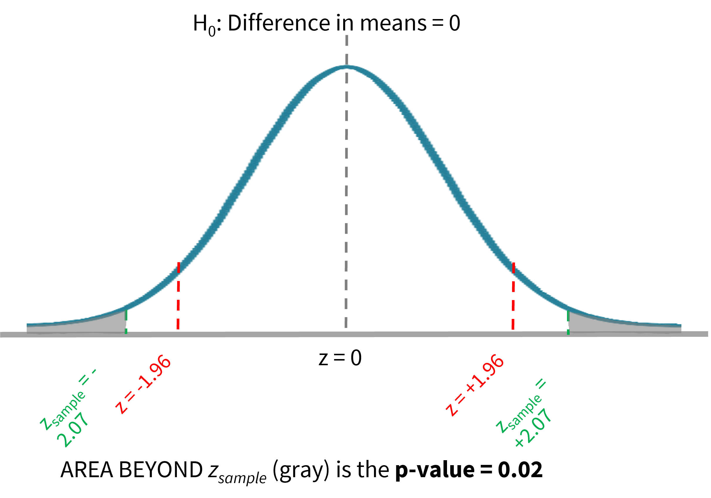
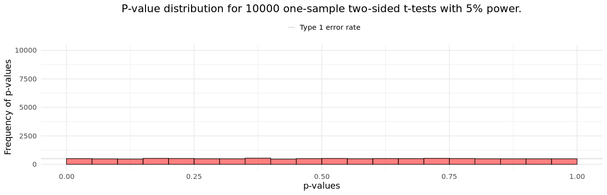
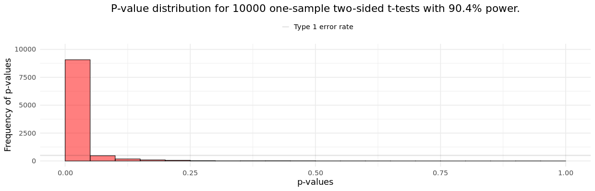
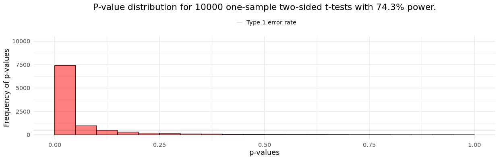

```{r setup, include=FALSE}
options(htmltools.dir.version = FALSE,
        eval = TRUE, warning = FALSE, message = FALSE)
library(tidyverse)
library(gt)
library(gtExtras)


```


class: title-slide, left, top

# `r rmarkdown::metadata$title`

## `r rmarkdown::metadata$subtitle`

### `r rmarkdown::metadata$author`

<br>


<span style='color:white;'>Slides released under</span> [CC-BY 2.0](https://creativecommons.org/licenses/by/2.0/)&nbsp;&nbsp;`r fontawesome::fa("creative-commons", "white")``r fontawesome::fa("creative-commons-by", "white")` ]   

<div style = "position: absolute;top: 0px;right: 0px;"></img></div>

---

layout: true

<div class="my-footer"><span>Philip Leftwich - Physalia Courses</span></div>

---
class: center, middle

# Hypothesis testing


---

## Hypothesis formation

The **null hypothesis** is that there is no relationship between your variables of interest or that there is no difference among groups

You want to know whether there is a difference in longevity between two groups of mice fed on different diets, diet A and diet B. 

* Null hypothesis: there is **no** difference in longevity between the two groups.

* Alternative hypothesis: there *is* a difference in longevity between the two groups.

---

## Significance level 

Significance Level (alpha, 𝝰): the probability of rejecting a true null hypothesis. 

Most common:  𝝰 = 0.05 (but you’ll also see 0.01, 0.001)

What does this mean? Why should we be careful/wary of a higher significance level? Do we PROVE the null hypothesis is wrong?

And…what the heck is the p-value?

---
class: center

## What is a p-value?

IF the null hypothesis is true, it is the probability that we could have taken a random sample from the population described by the null hypothesis and find a sample mean (or means difference) *at least as different from the null* by random chance. 

```{r, echo = FALSE, out.width="60%", fig.alt = "P is the probability of making a type 1 error."}
knitr::include_graphics("images/type_1_errors.png")
```

---
class: center
##Difference in means

```{r, echo = FALSE, out.width="60%", fig.alt = "Critical z values."}



```
---
class: center

##P = 0.02, what does this mean?

**IF** the null hypothesis is true (samples are taken from populations with the same mean), the probability that we would have taken two samples that are at least this different by random chance (means, taking into account data spread, etc.) is 2%.

--

THEN YOU HAVE TO DECIDE: Is this so unlikely to have happened by random chance IF the means are equal, that instead I think that they were probably drawn from populations with different means?

--


The cut-off that you choose is your significance level, alpha (𝛼). 

---
class: center, middle

###The cut-off that you choose is your significance level, alpha (𝛼). 

###If p < 𝛼, we reject the null hypothesis.
###If p > 𝛼, we retain the null hypothesis. 

---
class: center, middle, inverse

#P-value misconceptions

(https://shiny.ieis.tue.nl/MOOC/assignment_1/)

---

###Misconception #1: If P = 0.05, the null hypothesis has only a 5% chance of being true

One of the most common misconceptions. 

The *P* value is calculated *under the assumption that the null hypothesis is true*. 

It cannot therefore also be a probability for *whether* the null hypothesis is true

```{r, echo = FALSE, out.width="70%", fig.alt = "A range of P values under when the Null hypothesis is true."}

```

---

###Misconception #1: If P = 0.05, the null hypothesis has only a 5% chance of being true

One of the most common misconceptions. 

The *P* value is calculated *under the assumption that the null hypothesis is true*. 

It cannot therefore also be a probability for *whether* the null hypothesis is true

```{r, echo = FALSE, out.width="70%", fig.alt = "A range of P values under when the Alternate hypothesis is true."}

```

---

###Misconception #2: A non-significant difference, means there is no difference between groups

A non-significant difference merely means that the null is statistically consistent with the observed results - *at this sample size and measured effect size*.

---

###Misconception #3: A statistically significant difference is an important difference

See previous point - the differences may be too small to be of importance, P values are a product of sample size and effect size.


---

###Misconception #4: Studies that fall either side of the P = 0.05 are in conflict. 

Again this can be a product of sample size, or expected variation in sample means. Only when confidence intervals show no overlap would we describe conflict. 

```{r, echo = FALSE, warning = FALSE, message = FALSE}

set.seed(1234)

myList <- vector("list", 20)
y <- tibble()

for (i in 1:length(myList)) { 

x <-  rnorm(n=12, mean=2.6, sd=2.83)
data <- tibble(x)
temp <- lm(x~1, data=data) %>% 
  broom::tidy(conf.int=T) 
y <- rbind(y,temp)  

}

y$`experiment number` <- rep(1:20)

y %>% 
  mutate(significant = if_else(conf.low > 0.05, "significant", "non-significant")) %>% 
  ggplot(aes(x=`experiment number`, y=estimate))+
  geom_pointrange(aes(ymin = conf.low, ymax=conf.high, colour = significant), size = 1.2)+
  labs(y = " ")+
  geom_hline(linetype="dashed", yintercept=0.05)+
  scale_colour_manual(values = c("darkorange", "purple"))+
  theme_minimal()+
  theme(legend.position = "none")
```

---

###Misconception #5: Studies with the same P value provide the same support

.left-code[

* Mean difference of 8, S.D. = 15, sample size = 30

* Mean difference of 3, S.D. = 15, sample size = 180


]

.right-plot[

```{r, echo = FALSE, out.width="125%", fig.alt = "A range of P values under when the Alternate hypothesis is true with a mean of 108."}

```


```{r, echo = FALSE, out.width="125%", fig.alt = "A range of P values under when the Alternate hypothesis is true with a mean of 108."}

```

]

---

class: center, middle, inverse

###P values can indicate how incompatible the data are with a specified statistical model

###P values do not measure the probability that the studied hypothesis is true, or the probability that the data were produced by random chance alone

---
class: center, middle, inverse

### By itself, a p value does not provide a good measure of evidence regarding a model or hypothesis.

---

Sullivan, GM and R Feinn (2012). [Using effect size - or why the p-value is not enough.](https://www.ncbi.nlm.nih.gov/pmc/articles/PMC3444174/#i1949-8357-4-3-279-Kline1) 
Journal of Graduate Medical Education 4(3): 279–282

###“Statistical significance is the least interesting thing about the results. You should describe the results in terms of measures of magnitude – not just does a treatment affect people, but how much does it affect them.” 

### -Gene V. Glass

