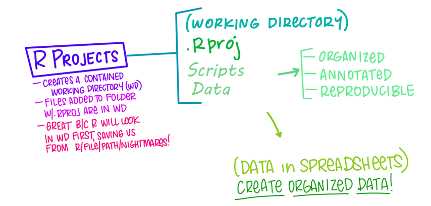
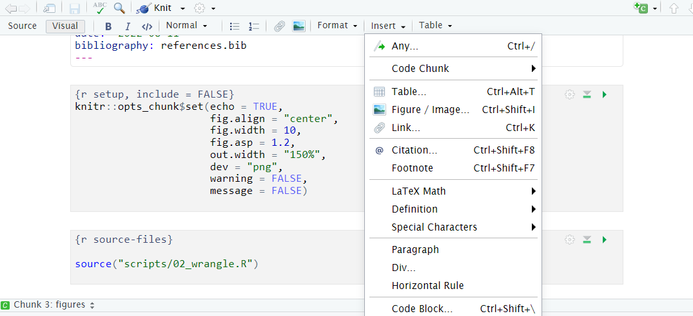
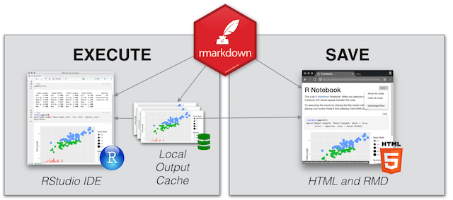

```{r setup, include=FALSE}
options(htmltools.dir.version = FALSE,
        eval = TRUE)
library(tidyverse)
library(gt)
library(gtExtras)
```


class: title-slide, left, top

# `r rmarkdown::metadata$title`

## `r rmarkdown::metadata$subtitle`

### `r rmarkdown::metadata$author`

<br>


<span style='color:white;'>Slides released under</span> [CC-BY 2.0](https://creativecommons.org/licenses/by/2.0/)&nbsp;&nbsp;`r fontawesome::fa("creative-commons", "white")``r fontawesome::fa("creative-commons-by", "white")` ]   

<div style = "position: absolute;top: 0px;right: 0px;"></img></div>

---

layout: true

<div class="my-footer"><span>Philip Leftwich - 5023Y Courses Slido.com #3598190</span></div>


---
class: center, middle

# Rmarkdown

```{r, echo = FALSE, out.width="70%", fig.cap = "Figure courtesy of Allison Horst"}
knitr::include_graphics("images/wizard.png")
```

---

## Workflow so far

```{r, echo = FALSE, out.width="90%", fig.alt = "Workflow so far"}

```

---

## Why is this good?

- Relative filepaths

- Self-contained, *moveable* project

- Complete, organised, reproducible

### Next steps

- Documents for sharing

---

## Calls for reproducibility

**Reproducibility** has the potential to serve as a minimum standard for judging scientific claims when full independent replication of a study is not possible.

```{r, echo = FALSE, out.width="90%", fig.alt = "Reproducible Research in Computational Science ROGER D. PENG, SCIENCE 02 DEC 2011 : 1226-1227"}
knitr::include_graphics("images/repro-spectrum.jpg")
```

---

### Scripts are great for:

- Doing small bits of code as part of a bigger project

- When short comments are needed

- You're creating a function or application

- Scripts are *short, focused, and named for their purpose*

### Scripts are less good for:

- You want text, code & outputs together

- You need formatted text and/or tables or equations

- Extensive explanations are needed

- For publishing 

---

## Rmarkdown

Rmarkdown (`.Rmd`) integrates:

* a documentantion language (`.md`)

* a programming language (`R`)

* functionality to "knit" them together through 📦 `knitr`

### Features

✅ provides a framework for writing narratives around code and data

✅ Code re-run in a clean environment every time the document is "knit"

---

## Rmarkdown uses

1. Communicating to decision makers, with a focus on conclusions, not the code behind an analysis

2. For collaborating with other data scientists (including future you), who are interested in *both* your conclusions, and how you reached them (i.e. the code).

3. As an environment *to do* the data science. A modern day lab notebook where you capture *what* you did, and *what* you were thinking. 

---
class: center

## Rmarkdown outputs


```{r, echo = FALSE, out.width="45%", fig.cap = "Pandoc output formats"}
knitr::include_graphics("images/rmarkdownoutputformats.png")
```

---

## What is Markdown?

Markdown is a tool to add formatting to plain text so that when you convert it (to say HTML), it get's formatted as requested. 

**Basically** instead of highlighting and clicking, we add symbols and syntax to the text. 

---


## Markdown text

.pull-left[

```
- bullet list
- bullet list
- bullet list

1. numbered list
2. numbered list
3. numbered list

__bold__, **bold**, _italic_, *italic*

> quote of something profound 
```
]

.pull-right[
- bullet list
- bullet list
- bullet list

1. numbered list
2. numbered list
3. numbered list

__bold__, **bold**, _italic_, *italic*

> quote of something profound 

]

---
class: center

## How does an Rmarkdown file work? 

**Rmd > (knitr) >.md > (pandoc) >.html**

```{r, echo = FALSE, out.width="50%", fig.cap = "Visual editor "}
knitr::include_graphics("images/visual-edit.png")
```

---

## [Visual editor in RStudio](https://www.rstudio.com/blog/rstudio-v1-4-preview-visual-markdown-editing/)

```{r, echo = FALSE, out.width="70%", fig.alt = "RStudio visual editor view"}


```

✅ Easy insertion and compilation of citations

✅  Easy insertion of tables, footnotes, equations, code and LaTex

✅  Spellcheck! 


---


## Rmarkdown to HTML


**File > New File > RMarkdown > Document**

```{r, echo = FALSE, out.width="90%", fig.cap = "Rmarkdown template left, output on the right"}
knitr::include_graphics("images/quicktourexample.png")
```
---

## Rmarkdown to pdf

```{r, echo = FALSE, out.width="90%", fig.cap = "Rmarkdown template left, output on the right"}
knitr::include_graphics("images/pdf.png")
```


---

## Rmarkdown to pdf

* Rmarkdown documents can be compiled to PDF, which is a great feature. 

* In order to convert the documents to PDF, they use a software called LaTeX (pronounced *la-tek* or *lay-tek*).

* Installing LaTeX can be a pain, but thankfully there is an easier way to install it - `tinytex`. 

* `tinytex` is an R package that installs a sane, lightweight (<200Mb) version of LaTeX.

* RStudio Cloud has `tinytex` pre-installed. 

---
class: center, middle, inverse

## Using Rmarkdown

### With Rmarkdown you can have your code, text and outputs in one place.


---
##YAML

```
---
title: "An example document"
author: "Philip Leftwich"
output: html_document
---

```

* The metadata of the file

* YAML Ain't Markup Language

* Provides title, author, document output type

---

## Rcode

* Code chunks are marked by three backticks and curly braces with r (and an optional chunk name) inside them: 

.pull-left[


````r
`r ''````{r chunk-name}
# computer code goes in three back ticks
1 + 1
2 + 2

```
````


]

.pull-right[

```{r, echo = FALSE}
# computer code goes in three back ticks
1 + 1
2 + 2
```

]

---

## Rmarkdown to Word

📦 `redoc`

Enables a two-way R Markdown-Microsoft Word workflow. It generates Word documents that can be de-rendered back into R Markdown, retaining edits on the Word document, including tracked changes.

```{r, echo = FALSE, out.width="90%", fig.cap = "Rmarkdown to word"}
knitr::include_graphics("images/redoc.png")
```

---

## Publish to the web


* RPubs: Publish rendered Rmarkdown documents on the web with the click of a button http://rpubs.com/

* GitHub: Host your site through gh-pages on GitHub. Enable in GitHub repo ⚙️Settings


```{r, echo = FALSE, out.width="90%", fig.cap = "Github pages"}
knitr::include_graphics("images/gh-pages.png")
```

---

## Data analysis notebooks

* Simple templates for hosting your [literate programming analysis online](https://github.com/lmullen/rmd-notebook)

* Rnotebook files run in the same way as an Rmd file

* Has 'preview' button not 'knit'

* Produces an html "snapshot" of the file everytime it is saved

```{r, echo = FALSE, out.width="50%", fig.alt = "R notebooks snapshot"}

```

---

## Presentations

```{r, echo = FALSE, out.width="20%", fig.alt = "xaringan logo"}
knitr::include_graphics("images/xaringan.png")
```

A number of existing frameworks:

* `xaringan` 📦 Presentation Ninja (https://github.com/yihui/xaringan)

---
class: center, middle, inverse 

## Keep learning

[The Rmarkdown cookbook](https://bookdown.org/yihui/rmarkdown-cookbook/)

[Cut the tyranny of copy-and-paste with these coding tools](https://www.nature.com/articles/d41586-022-00563-z)


 


