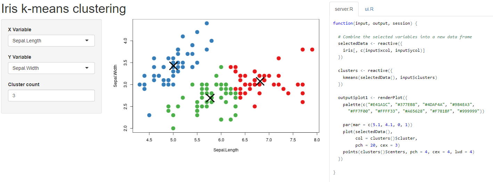
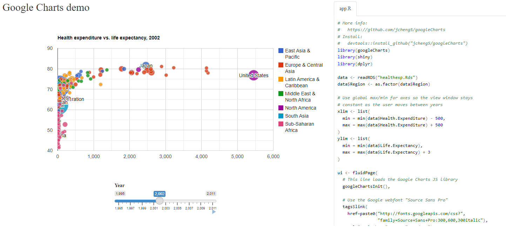
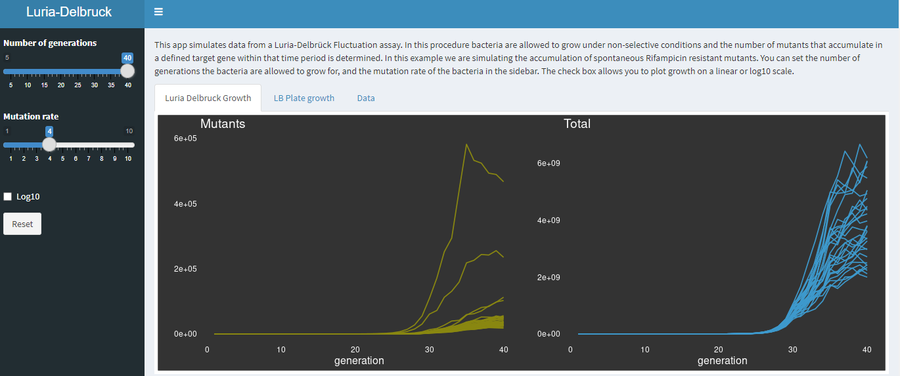
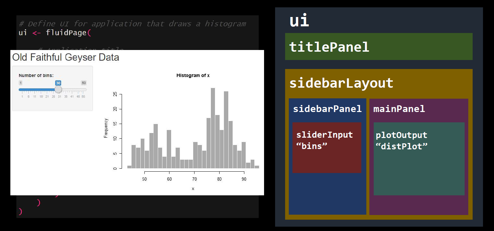
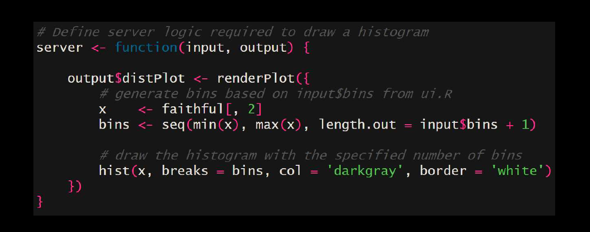
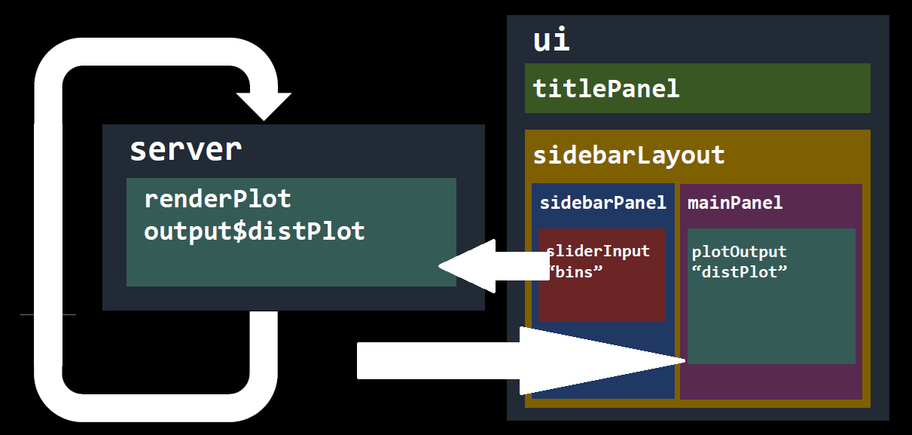

```{r setup, include=FALSE}
options(htmltools.dir.version = FALSE,
        eval = TRUE, warning = FALSE, message = FALSE)
knitr::opts_chunk$set(warning = FALSE, message = FALSE, fig.retina = 3, fig.asp = 0.8, fig.width = 7, out.width = "120%")

library(tidyverse)
library(gt)
library(gtExtras)
library(rstatix)
library(palmerpenguins)

```


class: title-slide, left, top

# `r rmarkdown::metadata$title`

## `r rmarkdown::metadata$subtitle`

### `r rmarkdown::metadata$author`

<br>


<span style='color:white;'>Slides released under</span> [CC-BY 2.0](https://creativecommons.org/licenses/by/2.0/)&nbsp;&nbsp;`r fontawesome::fa("creative-commons", "white")``r fontawesome::fa("creative-commons-by", "white")` ]   

<div style = "position: absolute;top: 0px;right: 0px;"></img></div>


---
class: center, middle inverse

# Introduction to Shiny


---

## What is Shiny?

- An R package that allows you to create interactive GUIs in R

--

- Highly customisable

--

- Uses: 
    - Scientific tools
    - Presenting results
    - Collecting data
    - Teaching
--

https://shiny.posit.co/r/gallery/
    
---


```{r, echo = FALSE, out.width="100%"}

```

---


```{r, echo = FALSE, out.width="100%"}


```
---


```{r, echo = FALSE, out.width="100%"}

```

---

## How does shiny work

.pull-left[

**UI**

- Runs once

- Specifies user interface

- Defined as an object

- Stable

]

.pull-right[

**server**

- Runs continually

- Specifies logic

- Defined as functions

- Changes in response to input

]


---


```{r, echo = FALSE, out.width="80%"}

```

---

```{r, echo = FALSE, out.width="80%"}

```
---


```{r, echo = FALSE, out.width="80%"}

```

---

## Sharing

**Run locally**

- Your app can be run locally - the code to produce it can be shared to other R users

**Deploy**

- Your app can be hosted on a web server. 

- Shinyapps.io provides an integrated platform to deploy apps - with limited free runtime
