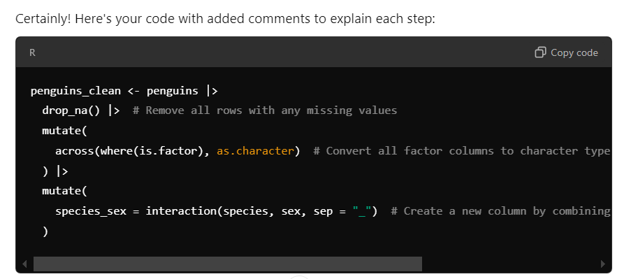

---
title: "Advancing in R"
subtitle: ""
author: "Philip Leftwich"
date: "2024-09-15"
output:
  xaringan::moon_reader:
    css: ["default", "css/my-theme.css", "css/my-fonts.css"]
    seal: false
    lib_dir: libs
    nature:
      ratio: '16:9'
      highlightStyle: dracula
      highlightLines: true
      countIncrementalSlides: false
---

```{r setup, include=FALSE}
options(htmltools.dir.version = FALSE,
        eval = TRUE)
library(tidyverse)
library(gt)
library(gtExtras)
```


class: title-slide, left, top

# `r rmarkdown::metadata$title`

## `r rmarkdown::metadata$subtitle`

### `r rmarkdown::metadata$author`

<br>

<span style='color:white;'>Slides released under</span> [CC-BY 2.0](https://creativecommons.org/licenses/by/2.0/)&nbsp;&nbsp;`r fontawesome::fa("creative-commons", "white")``r fontawesome::fa("creative-commons-by", "white")` ]   

<div style = "position: absolute;top: 0px;right: 0px;"></img></div>

---

layout: true

<div class="my-footer"><span>Philip Leftwich - Advancing in R</span></div>

---

class: center, inverse, middle

# Introduction

In this chapter, you'll learn how to use AI to help you identify and fix coding errors. AI's attention to detail can spot missing commas and other common mistakes in code.

AI is generally good at this task, although the more complicated your code, the more likely it is that it will run into trouble. This chapter will give a few examples to help you with your prompt engineering.

---

# Activity 1: Set-up

To reproduce the same errors, let's create a reproducible example by loading some packages and a dataset. 

```{r warning=FALSE, message=FALSE}
library(tidyverse)
library(palmerpenguins)
data("penguins")
```

---

# Activity 2: Simple Errors

Often, you can just copy and paste the code and error into an AI tool, and it will figure out that you want it to fix the issue.

Here's a simple error where the wrong function name is used:

```{r error=TRUE}
ggplot(penguins, aes(x = species)) +
   geom_barchart()
```
---

Provide both the code and the error to your AI tool for better results.

```{r img-simple, echo=FALSE, fig.cap="Fixing a simple error"}

```

---

# Activity 3: Contextual Errors

Sometimes, the error is caused by code further up your script rather than the line where the error occurs.

For example, if you want to create a dataset of penguins from Biscoe Island and calculate their mean body mass, the following code will run but produces `NaN`:

```{r}
biscoe_penguins <- penguins |> 
  filter(island == "biscoe")

biscoe_penguins %>%
  summarise(mean_mass = mean(body_mass_g))
```
---

```{r img-context1, echo=FALSE, fig.cap = "ChatGPT giving its best guess"}

```


---


# Continue with Contextual Errors

Provide more information about the dataset or preceding code to the AI for better assistance.

There’s a couple of things you can do at this point:

- Give the AI all the code you’ve used so far

- Give the AI more information about the dataset.


---

# Continue with Contextual Errors

Use `summary()`, `str()`, and `ls()` to provide dataset details to the AI.

Run `summary(biscoe_penguins)` and give the AI the output for better context.

If the error persists, check if case sensitivity or other minor mistakes could be the issue.


---

I provided the `summary(penguins)` 

```
      species          island    bill_length_mm  bill_depth_mm   flipper_length_mm  body_mass_g       sex           year     
 Adelie   :152   Biscoe   :168   Min.   :32.10   Min.   :13.10   Min.   :172.0     Min.   :2700   female:165   Min.   :2007  
 Chinstrap: 68   Dream    :124   1st Qu.:39.23   1st Qu.:15.60   1st Qu.:190.0     1st Qu.:3550   male  :168   1st Qu.:2007  
 Gentoo   :124   Torgersen: 52   Median :44.45   Median :17.30   Median :197.0     Median :4050   NA's  : 11   Median :2008  
                                 Mean   :43.92   Mean   :17.15   Mean   :200.9     Mean   :4202                Mean   :2008  
                                 3rd Qu.:48.50   3rd Qu.:18.70   3rd Qu.:213.0     3rd Qu.:4750                3rd Qu.:2009  
                                 Max.   :59.60   Max.   :21.50   Max.   :231.0     Max.   :6300                Max.   :2009  
                                 NA's   :2       NA's   :2       NA's   :2         NA's   :2           
```

```
Summary
Issue: The presence of missing values (NAs) in body_mass_g causes mean() to return NaN.
Solution: Use na.rm = TRUE in the mean() function to exclude missing values from the calculation.
Alternative: Remove rows with missing body_mass_g before calculation if appropriate for your analysis.
```

---

# Activity 4: Incorrect (but Functional) Code

Sometimes, code runs but doesn't perform the intended action.

For example, calculating the average body mass by species and sex:

```{r message=FALSE}
penguins |> 
  group_by(sex, species) |> 
  summarise(mean_body_mass = sd(body_mass_g, na.rm = TRUE))
```

---

You can ask the AI to help you but you can’t just give it the code and output, you also need to tell it what you intended to do. 
This is a good example of why there is no AI tool that allows you to skip understanding the data you’re working with and knowing what it is you’re trying to do.


```{r img-functional, echo=FALSE, fig.cap="Fixing a functional error"}

```

---

class: center, middle, inverse

# Questions?


---

# Code Review

- **Does it run?** Can a researcher run it easily? Are complex procedures explained?
- **Is it reproducible?** Do you get the same outputs? Is it straightforward to verify them?
- **Is it auditable?** Is the code organized enough to allow understanding and error detection?
- **Does it follow best practices?** Are there modularizations, meaningful variable names, and appropriate error handling?
- **Is it correct and appropriate?** Does the code do what is intended? Is what is intended correct?

Some steps cannot (and should not) be performed by AI, especially those involving sensitive data or domain knowledge.

---

# Code Comments

Code comments are lines of text within the code that are ignored by the computer but help human readers. In R, comments are added using `#`:

```{r}
# This is a comment
# Compute the mean of three numbers
mean(c(1,2,3))
```

Comments are useful for:

- **Clarification:** Explain what code does.
- **Documentation:** Provide information on how and why certain decisions were made.
- **Debugging:** Help isolate code that may be causing errors.
- **Collaboration:** Communicate with other developers.

For transparency, the above text was written by AI.

---

# Activity 1: Add Comments with AI

Let's start by loading the `palmerpenguins` dataset.

```{r warning=FALSE, message=FALSE}
library(tidyverse)
library(palmerpenguins)
data("penguins")
```

You can use AI tools to help add comments to your code. Start with this simple prompt:

> Add comments to this code

```{r eval = FALSE}
penguins_clean <- penguins |> 
  drop_na() |> 
  mutate(across(where(is.factor), as.character)) |> 
  mutate(species_sex = interaction(species, sex, sep = "_"))
```

---

The AI can only tell you what the code is doing, it can’t say why you chose to do that. In this example, we’ve created a new column that combines species and sex but the comment gives us no idea what the rationale was for this. The more complex your analysis, the more crucial it becomes to explain the rationale.

```{r , echo=FALSE, fig.cap="Adding comments"}

```

---

# Activity 2: Comment Prompt Engineering


In addition to asking AI to comment your code, you can also ask it to review comments you’ve made yourself. To see how this works with a more complex example, and as an act of masochism, I gave the AI some code I wrote for a publication. The full project repository is [here](https://github.com/Philip-Leftwich/AePUb-promoter-length-/blob/main/scripts/01_import.R) 


```{r , echo=FALSE, fig.cap="Adding comments"}

```


---

```{r, echo=FALSE, fig.cap="Adding comments"}

```


---

# Writing Code

The best AI platform for writing code is arguably Github Copilot, but we'll use generic platforms for this chapter. If you have access to LinkedIn Learning, the short course [Pair Programming with AI](https://www.linkedin.com/learning/pair-programming-with-ai/) by Morten Rand-Hendriksen is highly recommended.

The key takeaway is that AI is useful but not intelligent. AI doesn't think, reason, or have knowledge; it simply outputs based on patterns.

---

# Activity 1: Set-up

We'll use the `palmerpenguins` dataset again for this exercise:

```{r warning=FALSE, message=FALSE}
library(tidyverse)
library(palmerpenguins)
data("penguins")
```

We'll also set up an initial prompt for the AI:

> Act like an expert programmer in R. I want you to help me write code. The code should be commented and use tidyverse. Ask questions about the code before you write it if necessary.

---

# Activity 2: Knowledge is Power

When working with AI, it's helpful to provide as much information as possible about your dataset:

`summary()` provides descriptive statistics:

```{r}
summary(penguins)
```

`str()` lists variables, their data type, and initial values:

```{r}
str(penguins)
```

`ls()` provides a list of variables in an object without data types or samples, making it more secure:

```{r}
ls(penguins)
```

In your AI of choice, input:

> here are the variables in my data set

> ls(penguins)
[1] "bill_depth_mm" "bill_length_mm" "body_mass_g" "flipper_length_mm" "island" "sex" "species" "year"

Copilot may provide analysis suggestions using R:

```{r}
# Load the tidyverse package
library(tidyverse)

# Assuming your data is in a dataframe called 'penguins'
# Get a summary of each numerical variable
penguins %>%
  summarise(
    Average_Bill_Depth = mean(bill_depth_mm, na.rm = TRUE),
    Average_Bill_Length = mean(bill_length_mm, na.rm = TRUE),
    Average_Body_Mass = mean(body_mass_g, na.rm = TRUE),
    Average_Flipper_Length = mean(flipper_length_mm, na.rm = TRUE)
  )

# Distribution of species across islands
penguins %>%
  count(island, species) %>%
  ggplot(aes(x = island, y = n, fill = species)) +
  geom_bar(stat = "identity", position = "dodge") +
  labs(title = "Distribution of Penguin Species Across Islands",
       x = "Island",
       y = "Count")

# Explore the relationship between flipper length and body mass
penguins %>%
  ggplot(aes(x = flipper_length_mm, y = body_mass_g)) +
  geom_point(aes(color = species)) +
  geom_smooth(method = "lm") +
  labs(title = "Relationship Between Flipper Length and Body Mass",
       x = "Flipper Length (mm)",
       y = "Body Mass (g)")

```

---

# Activity 3: Writing Code

Let's create a table of descriptive statistics for `body_mass_g` and a histogram:

> Create a table of descriptive statistics for body mass and a histogram of that variable

ChatGPT output:

```{r}
# Load the tidyverse package
library(tidyverse)

# Load the penguins dataset
data("penguins")

# Summary statistics for body mass
body_mass_summary <- penguins %>%
  summarise(
    Mean = mean(body_mass_g, na.rm = TRUE),
    Median = median(body_mass_g, na.rm = TRUE),
    SD = sd(body_mass_g, na.rm = TRUE),
    Min = min(body_mass_g, na.rm = TRUE),
    Max = max(body_mass_g, na.rm = TRUE)
  )

# Print the summary statistics
print(body_mass_summary)

# Create a histogram of body mass
ggplot(penguins, aes(x = body_mass_g)) +
  geom_histogram(fill = "skyblue", color = "black", bins = 20) +
  labs(
    title = "Distribution of Body Mass",
    x = "Body Mass (g)",
    y = "Frequency"
  ) +
  theme_minimal()

```

---

# Conclusions and Musings

Using AI to write code can speed up routine tasks, but it's essential to check AI output for accuracy and ensure that it aligns with your goals. 

**Remember:** AI doesn't replace expertise—it complements it. Always review and understand the code you use.

- Provide context
- Tell it to assume an identity or profession
- Keep it on track
- Tell it to re-read and explain prompts
- Tell it style preferences (e.g. tidyverse)


---

class: center, middle, inverse

# Questions?


---

# Code Review

```{r, echo=FALSE, fig.cap="Adding comments"}

```


# Code Review

Making coding errors is normal and regular review could help correct many of these mistakes

In [this paper](https://academic.oup.com/jeb/article/36/10/1347/7577476?login=false) the process of code review is laid out

```{r, echo=FALSE, fig.cap="Adding comments"}

```
