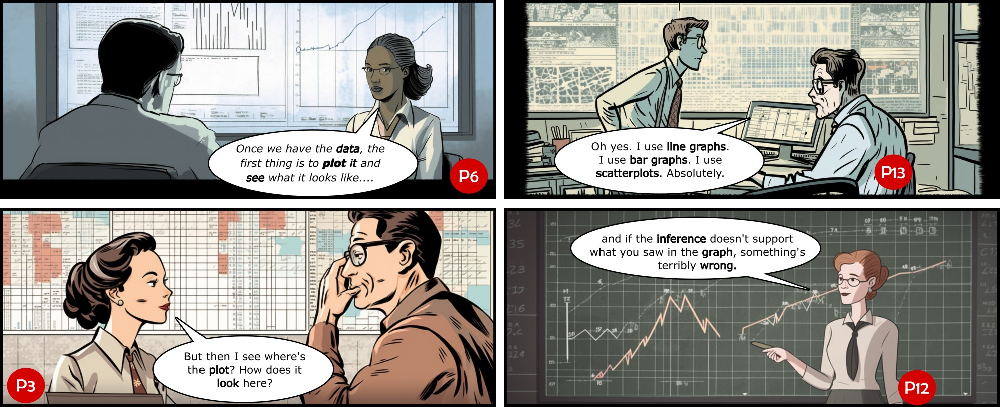

```{r setup, include=FALSE}
options(htmltools.dir.version = FALSE,
        eval = TRUE)
knitr::opts_chunk$set(warning = FALSE, message = FALSE, fig.retina = 3, fig.asp = 0.8, fig.width = 7, out.width = "120%")
library(tidyverse)
library(gt)
library(gtExtras)
library(palmerpenguins)
```


class: title-slide, left, top

# `r rmarkdown::metadata$title`

## `r rmarkdown::metadata$subtitle`

### `r rmarkdown::metadata$author`

<br>


<span style='color:white;'>Slides released under</span> [CC-BY 2.0](https://creativecommons.org/licenses/by/2.0/)&nbsp;&nbsp;`r fontawesome::fa("creative-commons", "white")``r fontawesome::fa("creative-commons-by", "white")` ]   

<div style = "position: absolute;top: 0px;right: 0px;"></img></div>

---

layout: true

<div class="my-footer"><span>Philip Leftwich - 5023Y Courses Slido.com #4042823</span></div>


---

class: middle

### Why can't we just use summaries (e.g. the mean)?

```{r, echo = FALSE, out.width = "60%"}
library(datasauRus)
  datasaurus_dozen %>% 
    group_by(dataset) %>% 
    summarize(
      mean_x    = mean(x),
      std_dev_x = sd(x),
    ) %>% 
    gt()
```
---

class: middle

```{r, echo = FALSE, out.width = "70%"}

datasaurus_dozen %>% 
    group_by(dataset) %>% 
    summarize(
      mean_x  = mean(x),
      std_dev_x = sd(x),
    ) %>% 
  ggplot(aes(x = dataset,
         y = mean_x,
         colour = dataset,
         fill = dataset)) +
geom_errorbar(aes(ymin = mean_x-std_dev_x, 
              ymax = mean_x+std_dev_x),
              width = .8)+
  geom_col(width = .8, size = .8, colour = "black") +
  scale_y_continuous(limits = c(0,75), expand = expansion(mult = c(0, .1)))+
   theme_classic()+
   theme(legend.position = "none")


```

---

class: middle

```{r, echo = FALSE, out.width="60%", fig.alt = "data points make the shape of a dinosaur", fig.cap = "When we visualise the data we can see trends or patterns we might otherwise miss"}
  ggplot(datasaurus_dozen, aes(x = x, y = y, colour = dataset))+
    geom_point()+
    theme_void()+
    theme(legend.position = "none")+
    facet_wrap(~dataset, ncol = 3)

```


Originally created by Alberto Cairo in [Download the Datasaurus: Never trust summary statistics alone; always visualize your data](http://www.thefunctionalart.com/2016/08/download-datasaurus-never-trust-summary.html)


---

class: center, middle

## The problem with dynamite plots

```{r, echo = FALSE, out.width="60%", fig.alt = "A multitude of different patterns appear when visualising the data", fig.cap = "These datasets all have the same mean and standard deviation"}
knitr::include_graphics("images/dynamite-plots.png")
```

Weissgerber TL, Milic NM, Winham SJ, Garovic VD (2015) [Beyond Bar and Line Graphs: Time for a New Data Presentation Paradigm. PLoS Biol 13(4): e1002128.](https://doi.org/10.1371/journal.pbio.1002128) 

---

class: middle

## Exploring data


```{r, echo = FALSE, out.width="70%"}

penguins %>% ggplot(aes(y = species, x = flipper_length_mm))+
  geom_boxplot()+
  theme_classic()

```

---

class: middle

```{r, include = FALSE}
library(patchwork)
```

```{r, include = FALSE}
plot_a <- penguins %>% ggplot(aes(y = species, x = flipper_length_mm))+
  geom_boxplot(outlier.shape  =NA)+
  geom_jitter(height = 0.2,
              alpha = 0.6)+
  theme_classic()

```

```{r, include = FALSE}
plot_b <- penguins %>% ggplot(aes(y = species, x = flipper_length_mm))+
  ggridges::geom_density_ridges(aes())+ 
  geom_point(
    shape = "|",
    size = 3,
    position = position_nudge( y = -0.1)
    )+
    theme_classic()

```

```{r, echo = FALSE, out.width="70%"}
plot_a/
  plot_b

```

---

### Visualisation according to statisticians


```{r, echo = FALSE, out.width="85%", fig.alt = "Visualization According to Statisticians: An Interview Study on the Role of Visualization for Inferential Statistics: https://arxiv.org/pdf/2309.12684.pdf"}


```

---

### A **grammar** of graphics

* `ggplot2` is an application of the **grammar of graphics** for R  

--

* A default dataset and set of mappings from variables to aesthetics  
* One or more layers of geometric objects    
* One scale for each aesthetic mapping used  
* A coordinate system  
* The facet specification  

---

### A **grammar** of graphics, from [**ggplot2 as a creativity engine**](https://johnburnmurdoch.github.io/slides/r-ggplot/#/)  

.pull-left[
Easy enough to [*rapidly prototype*](https://johnburnmurdoch.github.io/slides/r-ggplot/#/14) graphics at the "speed of thought"  
```{r, echo = FALSE, out.width="85%", fig.alt = "A screenshot of a scatterplot with team rank on the x-axis and team rating on the y-axis. The teams are all trending down from rank 1 to rank 20."}
knitr::include_graphics("https://johnburnmurdoch.github.io/slides/r-ggplot/football-tide-2.png")
```

]

--

.pull-right[
Powerful enough for [*final "publication"*](https://johnburnmurdoch.github.io/slides/r-ggplot/#/34)  
```{r, echo = FALSE, out.width = "70%", fig.alt = "A facetted scattergraph by year for the premier league. Team rating is on the Y-axis and rank is on the x-axis. The teams overall are declining."}
knitr::include_graphics("http://blogs.ft.com/ftdata/files/2016/03/eng.png")
```


]


---

.left-code[
```{r, eval = FALSE}
ggplot(data = penguins, 
       aes(x = bill_depth_mm,#<<
           y = body_mass_g))#<<


```
]

.right-plot[
```{r, echo = FALSE}

ggplot(data = penguins, 
       aes(x = bill_depth_mm,
           y = body_mass_g))


```
]

---

.left-code[
```{r, eval = FALSE}
ggplot(data = penguins, 
       aes(x = bill_depth_mm,
           y = body_mass_g))+
         geom_point()#<<


```
]

.right-plot[
```{r, echo = FALSE}

ggplot(data = penguins, 
       aes(x = bill_depth_mm,
           y = body_mass_g))+
         geom_point()


```
]
---

.left-code[
```{r, eval = FALSE}
ggplot(data = penguins, 
       aes(x = bill_depth_mm,
           y = body_mass_g))+
         geom_point(colour = "red")#<<


```
]

.right-plot[
```{r, echo = FALSE}

ggplot(data = penguins, 
       aes(x = bill_depth_mm,
           y = body_mass_g))+
         geom_point(colour = "red")


```
]
---


.left-code[
```{r, eval = FALSE}
ggplot(data = penguins, 
       aes(x = bill_depth_mm,
           y = body_mass_g))+
         geom_point(aes(#<<
           colour = species))#<<


```
]

.right-plot[
```{r, echo = FALSE}

ggplot(data = penguins, 
       aes(x = bill_depth_mm,
           y = body_mass_g))+
       geom_point(aes(colour = species))


```
]


---

.left-code[
```{r, eval = FALSE}
ggplot(data = penguins, 
       aes(x = bill_depth_mm,
           y = body_mass_g,
           colour = species))+#<<
         geom_point()+
  geom_smooth(method = "lm", #<<
              se = FALSE)#<<


```
]

.right-plot[
```{r, echo = FALSE}

ggplot(data = penguins, 
       aes(x = bill_depth_mm,
           y = body_mass_g,
           colour = species))+#<<
         geom_point()+
  geom_smooth(method = "lm", se = FALSE)#<<


```
]

---

.left-code[
```{r, eval = FALSE}
ggplot(data = penguins, 
       aes(x = bill_depth_mm,
           y = body_mass_g,
           colour = species))+
         geom_point()+
  geom_smooth(method = "lm", 
              se = FALSE)+
  labs(x = "Body mass (g)",#<<
       y = "Flipper length (mm)")#<<


```
]

.right-plot[
```{r, echo = FALSE}

ggplot(data = penguins, 
       aes(x = bill_depth_mm,
           y = body_mass_g,
           colour = species))+
         geom_point()+
  geom_smooth(method = "lm", 
              se = FALSE)+
  labs(x = "Body mass (g)",#<<
       y = "Flipper length (mm)")#<<
  


```
]

---

.left-code[
```{r, eval = FALSE}
ggplot(data = penguins, 
       aes(x = bill_depth_mm,
           y = body_mass_g,
           colour = species))+
         geom_point()+
  geom_smooth(method = "lm", 
              se = FALSE)+
  labs(x = "Body mass (g)",
       y = "Flipper length (mm)")+
  scale_color_manual(
    values = c("darkolivegreen4", #<<
               "darkorchid3", #<<
               "goldenrod1"))#<<

```
]

.right-plot[
```{r, echo = FALSE}

ggplot(data = penguins, 
       aes(x = bill_depth_mm,
           y = body_mass_g,
           colour = species))+
         geom_point()+
  geom_smooth(method = "lm", se = FALSE)+
  labs(x = "Body mass (g)",
       y = "Flipper length (mm)")+
  scale_color_manual(
    values = c("darkolivegreen4", 
               "darkorchid3", 
               "goldenrod1"))#<<


```
]
---


.left-code[
```{r, eval = FALSE}
ggplot(data = penguins, 
       aes(x = bill_depth_mm,
           y = body_mass_g,
           colour = species))+
         geom_point()+
  geom_smooth(method = "lm", 
              se = FALSE)+
  labs(x = "Body mass (g)",
       y = "Flipper length (mm)")+
  scale_color_manual(
    values = c("darkolivegreen4", 
               "darkorchid3", 
               "goldenrod1"))+
  theme_classic()#<<

```
]

.right-plot[
```{r, echo = FALSE}

ggplot(data = penguins, 
       aes(x = bill_depth_mm,
           y = body_mass_g,
           colour = species))+
         geom_point()+
  geom_smooth(method = "lm", 
              se = FALSE)+
  labs(x = "Body mass (g)",
       y = "Flipper length (mm)")+
  scale_color_manual(
    values = c("darkolivegreen4", 
               "darkorchid3", 
               "goldenrod1"))+
  theme_classic()


```
]
---


class: center, middle, inverse 

## Essential Data Visualisation Tips

---
class: center 

## Know your ABC's

--

### **A**ccurate

--

### **B**eautiful

--

### **C**lear

---

## Jitter

.left-code[
```{r, eval = FALSE}
ggplot(data = penguins, 
       aes(x = species,
           y = body_mass_g,
           colour = species))+
         geom_point()+#<<
  labs(x = "Species",
       y = "Body mass (g)")+
  scale_color_manual(
    values = c("darkolivegreen4", 
               "darkorchid3", 
               "goldenrod1"))+
  theme_classic()+
  +
  theme(legend.position = "none")

```
]

.right-plot[
```{r, echo = FALSE}

ggplot(data = penguins, 
       aes(x = species,
           y = body_mass_g,
           colour = species))+
        geom_point()+
  labs(x = "Species",
       y = "Body mass (g)")+
  scale_color_manual(
    values = c("darkolivegreen4", 
               "darkorchid3", 
               "goldenrod1"))+
  theme_classic()+
  theme(legend.position = "none")


```
]

---

## Jitter

.left-code[
```{r, eval = FALSE}
ggplot(data = penguins, 
       aes(x = species,
           y = body_mass_g,
           colour = species))+
         geom_jitter(#<<
           width = 0.2)+#<<
  labs(x = "Species",
       y = "Body mass (g)")+
  scale_color_manual(
    values = c("darkolivegreen4", 
               "darkorchid3", 
               "goldenrod1"))+
  theme_classic()+
  theme(legend.position = "none")

```
Also see [`ggbeeswarm`](https://github.com/eclarke/ggbeeswarm)

]

.right-plot[
```{r, echo = FALSE}

ggplot(data = penguins, 
       aes(x = species,
           y = body_mass_g,
           colour = species))+
        geom_jitter(width = 0.2)+
  labs(x = "Species",
       y = "Body mass (g)")+
  scale_color_manual(
    values = c("darkolivegreen4", 
               "darkorchid3", 
               "goldenrod1"))+
  theme_classic()+
  theme(legend.position = "none")


```
]

---

## Stacked bars


.left-code[
```{r, eval = FALSE}
penguins %>%     
  group_by(species) %>% #<<
    summarise(n=n()) %>% #<<
ggplot(aes(x = " ",
           y = n,
           fill = species))+
        geom_col()+ #<<
  labs(x = " ",
       y = "Count")+
  scale_fill_manual(
    values = c("darkolivegreen4", 
               "darkorchid3", 
               "goldenrod1"))+
  theme_classic()

```


]

.right-plot[
```{r, echo = FALSE}

penguins %>%     
  group_by(species) %>% 
    summarise(n=n()) %>% 
ggplot(aes(x = " ",
           y = n,
           fill = species))+
        geom_col()+
  labs(x = " ",
       y = "Count")+
  scale_fill_manual(
    values = c("darkolivegreen4", 
               "darkorchid3", 
               "goldenrod1"))+
  theme_classic()


```
]

---

## Dodged plots

.left-code[
```{r, eval = FALSE}
penguins %>%     
  group_by(species) %>% 
    summarise(n=n()) %>% 
ggplot(aes(x = species, #<<
           y = n,
           fill = species))+
        geom_col()+
  labs(x = "Species",#<<
       y = "Count")+
  scale_fill_manual(
    values = c("darkolivegreen4", 
               "darkorchid3", 
               "goldenrod1"))+
  theme_classic()+
  theme(legend.position = "none")#<<
  

```


]

.right-plot[
```{r, echo = FALSE}

penguins %>%     
  group_by(species) %>% 
    summarise(n=n()) %>% 
ggplot(aes(x = species, #<<
           y = n,
           fill = species))+
        geom_col()+
  labs(x = "Species",#<<
       y = "Count")+
  scale_fill_manual(
    values = c("darkolivegreen4", 
               "darkorchid3", 
               "goldenrod1"))+
  theme_classic()+
  theme(legend.position = "none")#<<


```
]

---

## Labels

```{r, echo = FALSE}
plot <- penguins %>%     
  group_by(species) %>% 
    summarise(n=n()) %>% 
ggplot(aes(x = species, #<<
           y = n,
           fill = species))+
        geom_col()+
  labs(x = "Species",#<<
       y = "Count")+
  scale_fill_manual(
    values = c("darkolivegreen4", 
               "darkorchid3", 
               "goldenrod1"))+
  theme_classic()+
  theme(legend.position = "none")#<<
```

.left-code[
```{r, eval = FALSE}

plot + 
  annotate("text",
           x = 1:3,
           y = c(156, 72, 128),
           label = c(152, 68, 124))
  

```


]

.right-plot[
```{r, echo = FALSE}

plot + 
  annotate("text",
           x = 1:3,
           y = c(156, 72, 128),
           label = c(152, 68, 124))


```
]


---

## Labels

.left-code[
```{r, eval = FALSE}

plot + 
 geom_label(aes(label = n),
            fill = "white",
            nudge_y = 1,
            colour = "black",
            fontface = "bold")
  

```


]

.right-plot[
```{r, echo = FALSE}


plot + 
 geom_label(aes(label = n),
            fill = "white",
            nudge_y = 1,
            colour = "black",
            fontface = "bold")


```
]

---

## Facets


.right-plot[
```{r, echo = FALSE}

ggplot(penguins,
       aes(x = body_mass_g,
           fill = species))+
        geom_density(
       alpha = 0.4)+
  labs(y = "Density")+
  scale_fill_manual(
    values = c("darkolivegreen4", 
               "darkorchid3", 
               "goldenrod1"))+
  theme_classic()+
  theme(legend.position = "none")+
  facet_wrap(~species)

  facet_wrap(~species)#<<
  

```


]

.left-code[
```{r, eval = FALSE}

ggplot(penguins,
       aes(x = body_mass_g,
           fill = species))+
        geom_density(
       alpha = 0.4)+
  labs(y = "Density")+
  scale_fill_manual(
    values = c("darkolivegreen4", 
               "darkorchid3", 
               "goldenrod1"))+
  theme_classic()+
  theme(legend.position = "none")+
  facet_wrap(~species)#<<


```
]


---

## Facets


.right-plot[
```{r, echo = FALSE}

peng_summary <- penguins %>% 
  group_by(species) %>% 
  summarise(mean = mean(body_mass_g, na.rm = T),
            sd = sd(body_mass_g, na.rm = T))

range_body_mass <- range(penguins$body_mass_g, na.rm = T)

computed <- peng_summary %>% 
  mutate(x = list(
    seq(range_body_mass[1], range_body_mass[2], 1)
  ),
  y = pmap(
    list(x = x, mean = mean,
         sd = sd),
    ~{
      l <- list(...)
      dnorm(l$x, mean = l$mean, sd =l$sd)
    }
  )) %>% 
  select(species, x, y) %>% 
  unnest(cols = c(x,y))

ggplot(penguins,
       aes(x = body_mass_g,
           fill = species))+
        geom_density(#<<
       alpha = 0.4)+#<<
  labs(y = "Density")+
  scale_fill_manual(
    values = c("darkolivegreen4", 
               "darkorchid3", 
               "goldenrod1"))+
  geom_line(
    data = computed,
    aes(x = x,
        y = y),
        linetype = 2)+
  theme_classic()+
  theme(legend.position = "none")+
  facet_wrap(~species)#<<
  

```


]

.left-code[
```{r, eval = FALSE}

ggplot(penguins,
       aes(x = body_mass_g,
           fill = species))+
        geom_density(
       alpha = 0.4)+
  labs(y = "Density")+
  scale_fill_manual(
    values = c("darkolivegreen4", 
               "darkorchid3", 
               "goldenrod1"))+
  theme_classic()+
  theme(legend.position = "none")+
  facet_wrap(~species)


```
]


---

## Highlights

.left-code[
```{r, eval = FALSE}

library(gghighlight)

ggplot(penguins,
       aes(x = body_mass_g,
           fill = species))+
        geom_density(
       alpha = 0.4)+
  gghighlight()+#<<
  labs(y = "Density")+
  scale_fill_manual(
    values = c("darkolivegreen4", 
               "darkorchid3", 
               "goldenrod1"))+
  theme_classic()+
  theme(legend.position = "none")+
  facet_wrap(~species)
  

```


]

.right-plot[
```{r, echo = FALSE}

library(gghighlight)

ggplot(penguins,
       aes(x = body_mass_g,
           fill = species))+
        geom_density(
       alpha = 0.4)+
  gghighlight()+#<<
  labs(y = "Density")+
  scale_fill_manual(
    values = c("darkolivegreen4", 
               "darkorchid3", 
               "goldenrod1"))+
  theme_classic()+
  theme(legend.position = "none")+
  facet_wrap(~species)


```
]

---

## Legend positions

```{r, echo = FALSE}
plot <- ggplot(data = penguins, 
       aes(x = bill_depth_mm,
           y = body_mass_g,
           colour = species))+
         geom_point()+
  geom_smooth(method = "lm", 
              se = FALSE)+
  labs(x = "Body mass (g)",
       y = "Flipper length (mm)")+
  scale_color_manual(
    values = c("darkolivegreen4", #<<
               "darkorchid3", #<<
               "goldenrod1"))+
  theme_classic()#<<

```


.left-code[
```{r, eval = FALSE}

plot +
  theme(legend.position = c(0.7,  #<<
                            0.8))  #<<

```
]

.right-plot[
```{r, echo = FALSE}

plot +
  theme(legend.position = c(0.7, 0.8)) #<<


```
]

---

class: center, middle, inverse 

## Keep learning

[R Cheat Sheets](https://www.rstudio.com/resources/cheatsheets/)

[Fundamentals of Data Visualisation](https://clauswilke.com/dataviz/)

[Beautiful plotting in R](https://www.cedricscherer.com/2019/08/05/a-ggplot2-tutorial-for-beautiful-plotting-in-r/)

[The ggplot2 book](https://ggplot2-book.org/)
