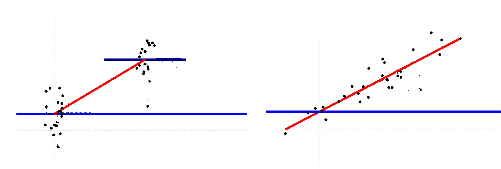
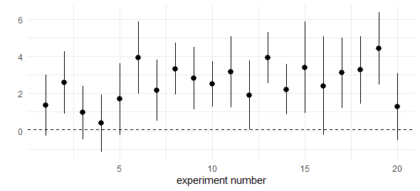
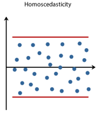
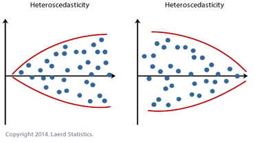

```{r setup, include=FALSE}
options(htmltools.dir.version = FALSE,
        eval = TRUE, warning = FALSE, message = FALSE)
knitr::opts_chunk$set(warning = FALSE, message = FALSE, fig.retina = 3, fig.asp = 0.8, fig.width = 7, out.width = "120%")

library(tidyverse)
library(gt)
library(gtExtras)
library(rstatix)
library(palmerpenguins)


```


class: title-slide, left, top

# `r rmarkdown::metadata$title`

## `r rmarkdown::metadata$subtitle`

### `r rmarkdown::metadata$author`

<br>


<span style='color:white;'>Slides released under</span> [CC-BY 2.0](https://creativecommons.org/licenses/by/2.0/)&nbsp;&nbsp;`r fontawesome::fa("creative-commons", "white")``r fontawesome::fa("creative-commons-by", "white")` ]   

<div style = "position: absolute;top: 0px;right: 0px;"></img></div>

---

layout: true

<div class="my-footer"><span>Philip Leftwich - 5023Y Courses Slido.com #2496824</span></div>


---
class: center, middle

## What is a linear model?

---

A linear model a statistical tool used to **model relationships** between variables and **make predictions** based on those relationships.


It describes the relationship between a dependent and (one or more) independent variables

    - The independent variable could be categorical or continuous

--

    - The dependent variable is always continuous
 
--

```{r, echo = FALSE, out.width="90%", fig.alt = "R model summary provides, the formula of the regression, the estimate of the intercept and standard error, estimated differences and uncertainity for each slope, the degrees of freedom for the whole model, F value and R squared"}

```

---

*For example*: 

If we have data on the height and weight of a group of people, we could use a linear model to model the relationship between height (the independent variable) and weight (the dependent variable). The resulting linear equation would allow us to make predictions about the weight of a person based on their height.

--

Or

--

If we have data on the height from two groups of maize plants (selfed and crossed), we could use a linear model to model the relationship between height (the independent variable) and group (the dependent variable). The resulting linear equation would allow us to make predictions about the height of a plant based on inbreeding or crossing.

--

```{r, echo = FALSE, out.width="80%", fig.alt = "R model summary provides, the formula of the regression, the estimate of the intercept and standard error, estimated differences and uncertainity for each slope, the degrees of freedom for the whole model, F value and R squared"}

```


---

# The `lm()` function in R

The linear model function in R is a convenient tool for fitting linear models and performing statistical analyses.

```
lm(y ~ x, data = data)

```

Where: 

--

- `lm()` : is the linear model function in R

--

- `y`: is the name of the dependent variable

--

- `x`: is the name of the indepdent variable

--

- `data`: is the name of the dataframe/tibble that contains both variables


---

# Calculations by hand

In the last lecture and workshop we worked out how to:

- Calculate means & mean differences

--

- Calculate standard error

--

- Calculate 95% confidence intervals

--

- Understand the assumptions


---

# Mean difference

Mean differences are the differences between the means of two groups

--

$Mean~difference = \overline x_1 - \overline x_2$

---

# Standard Error of the difference

The uncertainty of the difference between two means

where $s$ = standard deviation

--

.pull-left[ 

### Equal variance not assumed
$SED = \sqrt{s_1^2\over n_1}+{s_2^2\over n_2}$

]

--

.pull-right[


### Equal variance assumed

$s_{pooled}^2 = {{(n_1-1)s_1^2+(n_2-1)s_2^2} \over n_1 + n_2-2}$


$SED_{pooled} = s_{pooled}^2 {\sqrt{1\over n_1} + {1\over n_2}}$

]

---

# Confidence intervals

A 95% confidence interval for the mean difference is a range of values that is expected to contain the true mean difference with a probability of 95%.

--

If the same study were repeated many times and a 95% confidence interval were calculated each time, we would expect the true mean difference to fall within the interval 95% of the time.

--

```{r, echo = FALSE, out.width="60%", fig.alt = " Confidence Intervals"}


```

---

# Confidence intervals

The 95% confidence interval for a mean difference is calculated based on the standard error of the difference and the critical value from a probability distribution.


${95\%~CI} = {\overline x \pm 1.96*SE}$

--

So far we have used the *z* distribution where the critical value for the 95%CI is always 1.96

--

Later we will work with the *t* distribution, where the critical value changes with sample size


---

# Assumptions

- Samples are independent

--

- We have a normal distribution

--

- The sample size is big enough for the Central Limit Theorem

--

- At least 30 (per group)

---

# Linear models in R

- Faster

--

- More accurate

--

- Detailed Output

--

- Reproducible

---

# Model summary

```
model <- lm(height ~ type, data = darwin)

summary(model)
```
--

```{r, echo = FALSE, out.width="70%", fig.alt = "R model summary provides, the formula of the regression, the estimate of the intercept and standard error, estimated differences and uncertainity for each slope, the degrees of freedom for the whole model, F value and R squared"}
knitr::include_graphics("images/model_summary.png")
```


---

# Model summary

```{r, echo = FALSE, out.width="60%", fig.alt = "R model summary provides, the formula of the regression, the estimate of the intercept and standard error, estimated differences and uncertainity for each slope, the degrees of freedom for the whole model, F value and R squared"}
knitr::include_graphics("images/model_summary.png")
```


Coefficients: Estimates produced by the model. For example the Intercept estimates the height of the crossed plants. The typeSelf line represents the average decrease in height

---

# Model summary


```{r, echo = FALSE, out.width="60%", fig.alt = "R model summary provides, the formula of the regression, the estimate of the intercept and standard error, estimated differences and uncertainity for each slope, the degrees of freedom for the whole model, F value and R squared"}
knitr::include_graphics("images/model_summary.png")
```

Standard error: A measure of the variability or error. The difference betweent the observed values and those predicted by the model


---


# Assumptions of a linear model

- Linearity: The relationship between the dependent variable and the independent variable(s) should be linear

--

- Independence: The observations should be independent of each other, meaning that one observation should not have an effect on another observation

--

- Homoscedasticity: The variance of the error term should be constant for all values of the independent variable(s). 


---

# Homoscedasticity

.pull-left[

```{r, echo = FALSE, out.width="50%", fig.alt = ""}

```

]

.pull-right[

```{r, echo = FALSE, out.width="110%", fig.alt = ""}

```

]


---


# Assumptions of a linear model


- Linearity: The relationship between the dependent variable and the independent variable(s) should be linear


- Independence: The observations should be independent of each other, meaning that one observation should not have an effect on another observation


- Homoscedasticity: The variance of the error term should be constant for all values of the independent variable(s). 

--

- Normality: The *error* should be normally distributed. The residuals should be normally distributed around the estimated mean


---


# Final thoughts

- The linear model is a fast, accurate way of comparing mean differences.

--

- It is a fundamental part of statitics and machine learning

--

- We can build complexity to tackle different analysis problems

--

- It is important to apply the method responsibly and considering assumptions.

---

class: center, middle, inverse

# Next time: T-distributions

### Reading 

 Chapter 9: Discovering Statistics using R/SPSS - Andy Field

 Chapter 6: The New Statistics - Andy Hector

