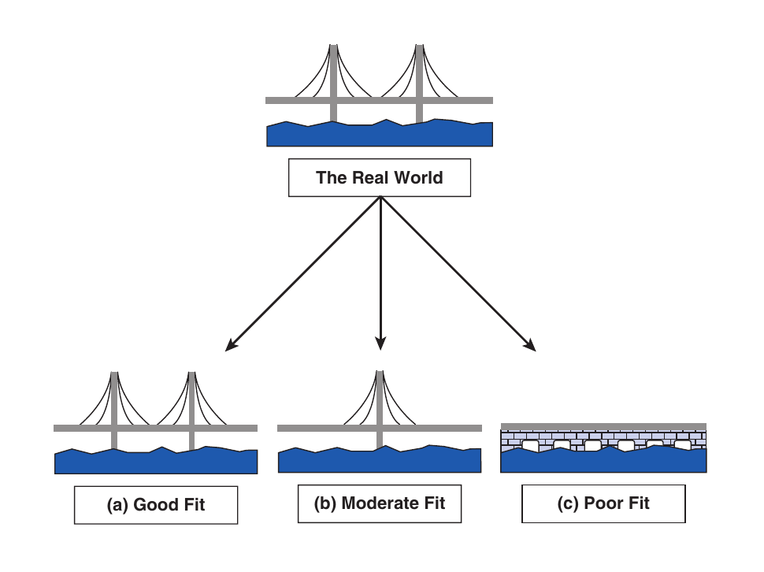

```{r setup, include=FALSE}
options(htmltools.dir.version = FALSE,
        eval = TRUE, warning = FALSE, message = FALSE)
knitr::opts_chunk$set(warning = FALSE, message = FALSE, fig.retina = 3, fig.asp = 0.8, fig.width = 7, out.width = "120%")

library(tidyverse)
library(gt)
library(gtExtras)
library(rstatix)
library(palmerpenguins)


```


class: title-slide, left, top

# `r rmarkdown::metadata$title`

## `r rmarkdown::metadata$subtitle`

### `r rmarkdown::metadata$author`

<br>


<span style='color:white;'>Slides released under</span> [CC-BY 2.0](https://creativecommons.org/licenses/by/2.0/)&nbsp;&nbsp;`r fontawesome::fa("creative-commons", "white")``r fontawesome::fa("creative-commons-by", "white")` ]   

<div style = "position: absolute;top: 0px;right: 0px;"></img></div>

---

layout: true

<div class="my-footer"><span>Philip Leftwich - 5023Y Courses Slido.com #3598190</span></div>


---
class: center, middle

## The Golem of Prague

```{r, echo = FALSE, out.width="70%", fig.alt = "Rabbi Judah Loew of Prague with his creation the Golem"}

```

*People feared giving the power of life to this golem. These proved founded when the power granted upon the golem led it to take innocent lives while blindly following its creator’s instructions*

---
class: center, middle, inverse

### This story highlights how well-intended instruction, without the subtleties of environmental context, can result in serious negative consequence


---

## Statistical models are golems

*Statistical models are similar to golems in that, beyond their given directives, they do not ascertain any knowledge or intent of their own.*

*They hold no wisdom or power to understand the context of where they are being applied, and whether their resulting output is appropriate for the given situation.* 

*They are just a set of instructions made to analyze data to challenge beliefs, inspire intuition, or validate hypotheses*

---

## What is a statistical model?

One of the simplest statistical models in biology is the **mean**

.left-code[


| Lecturer     | Friends |
| ----------- | ----------- |
| Mark      | 5       |
| Tony   | 3     |
| Becky | 3    |
| Ellen   | 2      |
| Phil   | 1     |
| **Mean **  | **2.6**      |

]

.right-plot[

We already *know* this is a hypothetical value as you can't have 2.6 friends (I think?)

Now with any model we have to know how well it fits/ how accurate it is

]

---

## Models are always wrong

.right-plot[


```{r, echo = FALSE, fig.alt = " Model bridges"}


```

]

.left-code[

A model is a representation of what we think is going on in the real world. It can be a good fit, or a poor fit. 

A well fitted model could be used to make *predictions* about what might happen in the real world. 

A poorly fitted model could also make *predictions* but they might be disastrously wrong.

]

---

## Assess fit:

### Sum of squared errors, variance, standard deviation

Phil has **1** friend

The model assumes each lecturer has **2.6** friends

The deviance is **-1.6** friend

Model **overestimates** number of friends for this lecturer 😔


---

## Standard Deviation

 *variance*:

$$
s^2 = {\sum(x - \overline x)^2\over n - 1}
$$

$$
s^2 = {sum~of~squared~errors\over n - 1}
$$

Square root of sample *variance*

A measure of *total dispersion* around the mean

$$
s = \sqrt{\sum(x - \overline x)^2\over n - 1}
$$

Smaller SD σ = more values close to the mean, larger SD = greater data spread away from the mean.

---
class: center

Small $s$ = taller, narrower
Large $s$ = squatter, wider

```{r, eval = FALSE}
rnorm(n = 1000,mean = 0,sd = 1)
rnorm(n = 1000,mean = 0,sd = 2)
rnorm(n = 1000,mean = 0,sd = 3)
```

```{r, echo = FALSE, message = FALSE, warning = FALSE, out.width = "60%"}

library(patchwork)

`SD = 1` <- rnorm(n = 1000, mean = 0, sd = 1)
`SD = 2` <- rnorm(n = 1000, mean = 0, sd = 2)
`SD = 3` <- rnorm(n = 1000, mean = 0, sd = 3)

tibble(`SD = 1`, `SD = 2`, `SD = 3`) %>% 
pivot_longer(cols = everything(), names_to = "Standard Deviation", values_to = "values") %>% 
  ggplot(aes(x = values, fill = `Standard Deviation`))+
  geom_histogram()+
  facet_wrap(~ `Standard Deviation`)+
  theme_classic()+
  theme(legend.position = "none")+
  labs(x = " ",
       y = "Frequency")


```

---


## Responsible statistics

- Users of statistical models must take responsibility for the assumptions and shortcomings of their model

--

- Apply them responsibly and appropriately

--

- Avoid misinterpretation

--

- Understand the limitations


---

## Understand models

One of the best ways to make sure you are using your ~~golems~~ statistical models appropriately is to understand how they work.

- Learn to compute models by hand

- Once familiar, leverage software to implement faster

---
class: center, middle, inverse


## Going beyond the data

## Inferential statistics

---

## Standard Error

- We saw how well the means represents a sample of data

--

- We collect samples because *we don't have access to the entire population*

--

- But if we want to make predictions or inferences, we need to know **how well a sample represents the population**

---

## Sampling

Each time we take a sample, they will vary slightly

.right-plot[

```{r, echo = FALSE, warning = FALSE, out.width = "95%"}

library(DiagrammeR)

grViz("digraph {
  
graph[layout = dot]

a[label = 'Population mean = 3']
b[label = 'Sample mean = 3']
c[label = 'Sample mean = 4']
d[label = 'Sample mean = 5']
e[label = 'Sample mean = 1']
f[label = 'Sample mean = 2']
g[label = 'Sample mean = 4']

a -> b
a -> c
a -> d
a -> e
a -> f
a -> g


}")


```

]

.left-code[


- Going *back* to standard deviation, small standard deviations showed data points were close to the mean, large standard deviations the points were further away


- If you were able to calculate the deviation between *sample means* you would know how much variability there is between samples


- The standard deviation of sample means is called the **standard error**

]

---

## Central limit theorem

- We cannot generate **hundreds** of samples

- We rely on approximation

- When samples are sufficiently large ( > 30), the sampling distribution should have a mean equal to the population mean within a standard deviation of the equation below: 

$$
SE = {\sigma\over{\sqrt{n}}}
$$
This is the **central limit theorem**

---

## Confidence intervals

- Standard error gives us some idea of the sample accuracy of the mean.

--

- But we might want to calculate *precise* boundaries for where we think the mean is.

--

- These are **Confidence intervals**

---

## Common misconception

"There is a 95% chance that the **true** population mean is within this range"

--

The mean either *is* or *is not* within this range

--

"If we repeat this experiment many times, 95% of our computed confidence intervals would contain the *true mean*"

Frame the probability around the intervals not the population parameter.

```{r, echo = FALSE, out.width="60%", fig.alt = " Confidence Intervals"}

knitr::include_graphics("images/CI-experiments.png")
```

---

## Confidence levels

Can be constructed by YOU:

Do you want to know the range within which you will capture the mean...

* 90% of the time

--

* 95%

--

* 99%


---

## Calculating a Confidence interval

$$
{95\%~CI} = {\overline x \pm 1.96*SE}
$$
--


$$
{90\%~CI} = {\overline x \pm 1.645*SE}
$$
--


$$
{66\%~CI} = {\overline x \pm 1*SE}
$$


---

## Z distribution

So far we have used the z-distribution. This is also know as the  **normal distribution** data, where we have population $\mu$ and $\sigma$.

When we don't know the population mean and SD

--

Then we cannot be sure of our uncertainty

--

Three choices: 

1. Assume we have a big enough sample size and CLT fixes this

--

2. Use another type of sampling distribution (e.g. t-distribution)

--
3. Bootstrap our sampling distribution


---

## Bootstrapping

```{r, echo = FALSE, out.width="120%", fig.alt = "With as few as 10 data points in our random sample, it is possible to do  bootstapped resampling (minimum ~ 1000 samples). We can use this to find the sampling distribution of the mean, se and 95% CI "}

knitr::include_graphics("images/bootstrapping.png")
```

---

## Bootstrapping

.left-code[

```{r, eval = TRUE}
library(boot)

flipper <- penguins %>% 
  filter(sex == "male") %>% 
  pull(flipper_length_mm)

mean_fun <- function(x,i){
  mean(x[i])
}

boot_1000 <- boot( #<<
  data = flipper,#<<
  statistic = mean_fun,#<<
  R = 1000#<<
)


```
]


.right-plot[

```{r}
boot_1000
```

]

---

.left-code[

```{r, eval = FALSE}
ggplot()+
  aes(boot_1000$t)+
  geom_histogram()

```

]


.right-plot[

```{r, echo = FALSE}
ggplot()+
  aes(boot_1000$t)+
  geom_histogram()

```

]

---

## Bootstrap Confidence Intervals

```{r}
boot.ci(boot_1000,
        conf = 0.95,
        type = "perc")

```

---

## Responsible Golem making

- Understand your models

- Understand the limitations of your model

- Apply them responsibly

- Interpret them responsibly

---

class: center, middle, inverse

# Next time: Linear Models

### Reading 

 Chapter 2: Discovering Statistics using R/SPSS - Andy Field

 Chapter 5: The New Statistics - Andy Hector

