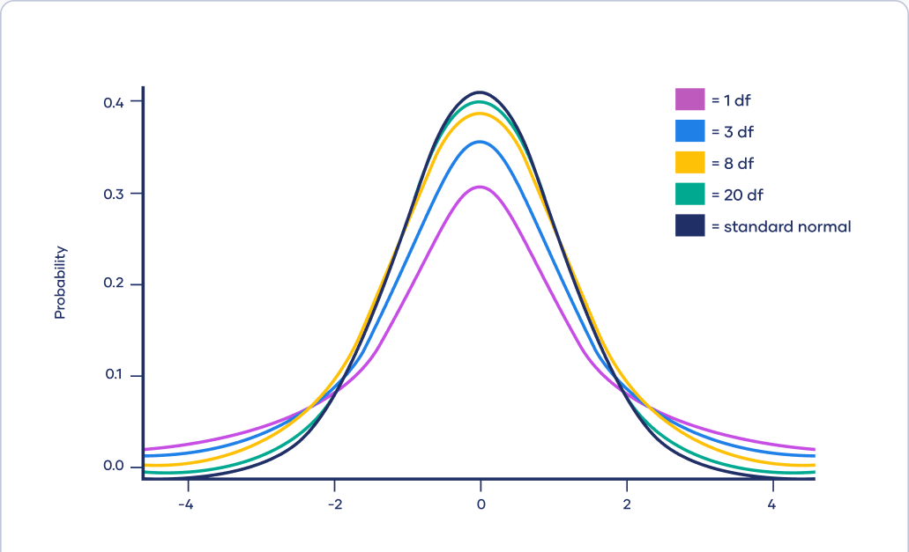
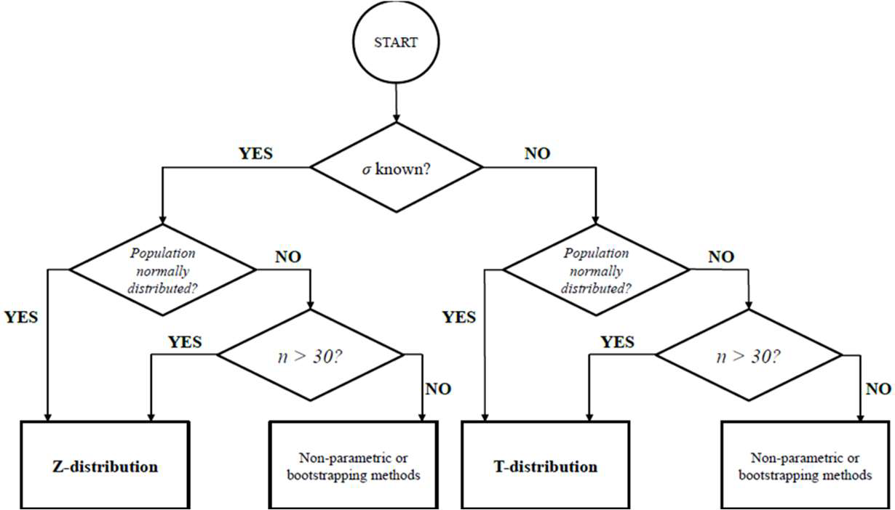
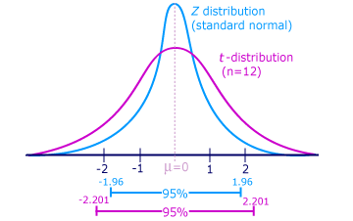
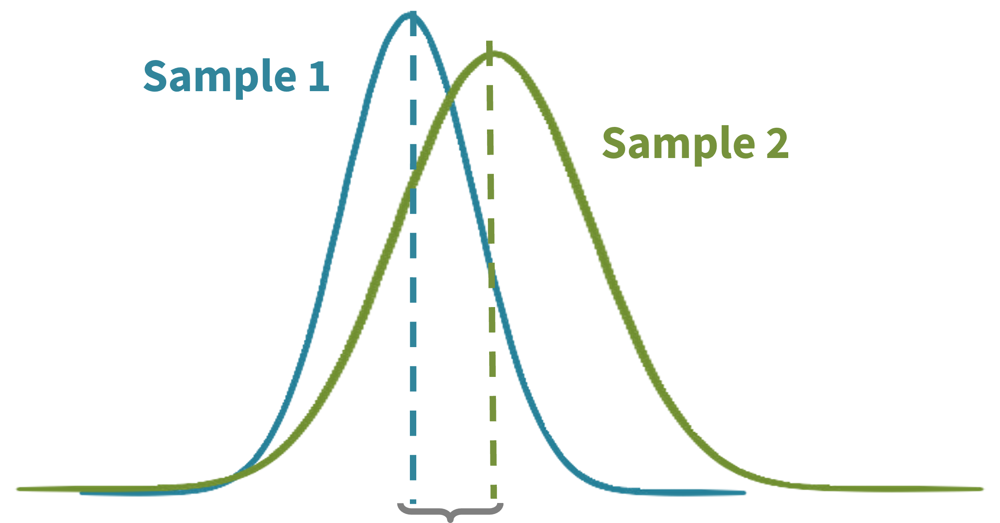
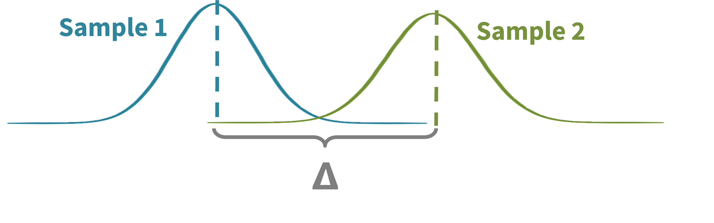
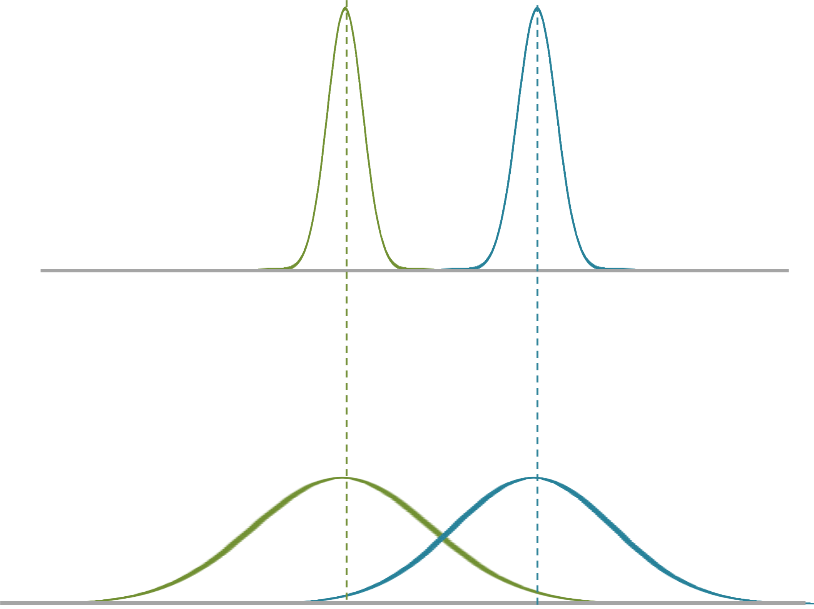
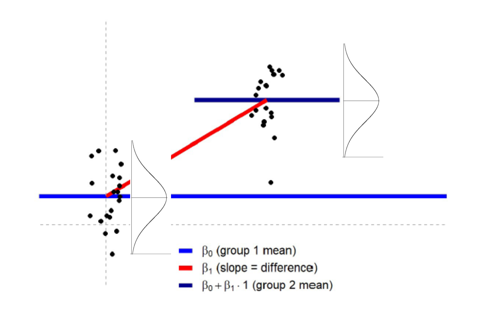

```{r setup, include=FALSE}
options(htmltools.dir.version = FALSE,
        eval = TRUE, warning = FALSE, message = FALSE)
knitr::opts_chunk$set(warning = FALSE, message = FALSE, fig.retina = 3, fig.asp = 0.8, fig.width = 7, out.width = "120%")

library(tidyverse)
library(gt)
library(gtExtras)
library(rstatix)
library(palmerpenguins)


```


class: title-slide, left, top

# `r rmarkdown::metadata$title`

## `r rmarkdown::metadata$subtitle`

### `r rmarkdown::metadata$author`

<br>


<span style='color:white;'>Slides released under</span> [CC-BY 2.0](https://creativecommons.org/licenses/by/2.0/)&nbsp;&nbsp;`r fontawesome::fa("creative-commons", "white")``r fontawesome::fa("creative-commons-by", "white")` ]   

<div style = "position: absolute;top: 0px;right: 0px;"></img></div>

---

layout: true

<div class="my-footer"><span>Philip Leftwich - Physalia Courses</span></div>

---
class: center

```{r, echo = FALSE, out.width="70%", fig.alt = "T distributions"}

```

Z-distribution is the *standard normal distribution* - it is unaffected by sample size, only $\mu$ and $\sigma$. 

T-distribution has *greater probabilities in the tails*, and is influence by sample size (*n*)

---
class: center

### If I don't know the population SD (which is more likely in the real world)...

```{r, echo = FALSE, out.width="60%", fig.alt = "Choose your statistical distribution method"}

```

---
class:center

## 95% CI for t distribution

$$
\bigg[\overline x - t * {s\over {\sqrt n}}
$$


$$
\overline x + t *{s\over {\sqrt n}}\bigg]
$$


```{r, echo = FALSE, out.width="50%", fig.alt = "Critical t"}

```

---

.pull-left[

```{r}
library(rstatix)

penguins %>% 
  t_test(flipper_length_mm ~ 1,
         detailed = T) %>% 
  gt()
```
]


.pull-right[
```{r}
library(BSDA)

flipper <- penguins %>% 
  drop_na(flipper_length_mm) %>% 
  pull(flipper_length_mm)

z.test(flipper, 
       alternative = "two.sided", 
       mu = 0, 
       sigma.x = sd(flipper), 
       conf.level = 0.95)

```
]


---
class: center, middle

## Two-sample t-tests

**Q. When testing the difference between two population means, what is the null hypothesis for the difference in their means?**


---

We know that even when samples **are** drawn from the same population, the samples means won't be exactly the same

```{r, echo = FALSE, out.width="90%", fig.alt = ""}

```


---

When can we determine that two sample means are different **enough**? To have come from *different* populations?

```{r, echo = FALSE, out.width="50%", fig.alt = ""}


```

---

## Two-sample t-test

* Compare the means of two samples

* Null hypothesis: there is no difference between the population means

--

* t-statistic: based on difference in sample **means, sd & n**

* For a given sample size and t-value, how unlikely is to have two random samples *at least* this different IF both samples are drawn from identical/same populations. 

---

## Variance matters

```{r, echo = FALSE, out.width="60%", fig.alt = "Equal means, but different variance"}


```

---

### Example

Example: A botanist is studying the mass of pollen transported by individual bees from two different hives (Hive A and Hive B). 

She collects pollen samples from 62 bees in Hive A (mean pollen mass = 31.4 mg) and 67 bees in Hive B (mean pollen mass = 36.7 mg). Variances for each hive are 225.0 mg^2 and 186.0 mg^2, respectively. 


**Is there a significant difference in pollen mass transported per bee for the two hives studied?**


Variance $s^2$ = Sum of squared residuals/ n


Standard deviation (s) = $\sqrt Variance$


---

* **Calculate the difference in means, and the standard error of the difference in means**

.pull-left[

Mean Difference = 36.7 - 31.4

Mean Difference = 5.3

]

.pull-right[


$$
SED = \sqrt{s^2_1\over n_1} + {s^2_2\over n_2}
$$


$$
SED = \sqrt{225\over 62} + {186\over 67}
$$


$$
SED = \sqrt{3.63} + {2.78}
$$


$$
SED = 2.53
$$


]

---

* **Calculate the difference in means, and the standard error of the difference in means**

.pull-left[

Mean difference = 5.3


* **Calculate 95% confidence intervals**

Assuming a normal distribution this would be 1.96 * SED = 4.96


Assuming a *t* distribution = ( $\alpha$ = 0.975, *df* = 129-2, *SED* = 2.53 ) = 5.008


95% CI range = 5.3 [± 5.008] = 0.292 - 10.308 

]

.pull-right[

$$
SED = 2.53
$$

```{r, echo = FALSE, out.width="80%", fig.alt = "T distributions"}

```

]


---

* **Calculate the difference in means, and the standard error of the difference in means**

.pull-left[

Mean difference = 5.3

]

.pull-right[

$$
SED = 2.53
$$

]


* **Calculate 95% confidence intervals**

95% CI range = 5.3 [± 5.008] = 0.292 - 10.308 

* **Describe the estimated mean difference**

**The mass of pollen transported per bee in Hive B is on average 5.3mg more than Hive A [0.29 - 10.3] (mean [± 95% CI])**

---

**The mass of pollen transported per bee in Hive B is on average 5.3mg more than Hive A [0.29 - 10.3] (mean [± 95% CI])**

**Q. Will this be a statistically significant difference?**

$$
\alpha = 1 - C
$$

--

As the 95% CI calculated from the *t* distribution *do not* cross 0, we can say that their is a > 5% probability of observing at least this difference in means under the assumption that the null hypothesis is true

--

**"At P ≤ 0.05 bees from Hive B transport at least 0.29mg of pollen more per bee than Hive A"**

---

## Calculate precise p-values

FIND THE CRITICAL VALUE OF t

**You are not expected to be able to do this by hand. This requires finding the degrees of freedom and use a critical t value table (R will calculate this for you)**

Critical value for t at 127 df and 𝛼 = 0.05 is **1.98**

FIND THE t-STATISTIC FOR YOUR SAMPLES (here, equal variances)

$$
t_{sample}={difference \over SED}={5.3 \over 2.53}=2.09
$$

For a *t*-value of 2.09 at *df* 127, *p* = 0.0115

---

## p = 0.0115

IF the null hypothesis is true (samples are taken from populations with the same mean), the probability that we would have taken two samples that are at least this different by random chance (means, taking into account data spread, etc.) is 1.15%.

--

**“Pollen mass transported by individual bees in Hive A (32 ± 15 mg [mean ± sd],  n = 62) and Hive B (38 ± 13.6 mg [mean ± sd], n = 67) differed significantly (t(127) = 2.09, p = 0.0115).”**

.left-code[
```{r, eval = FALSE}

hive_data %>% 
  t_test(pollen_mass ~ hive,
         var.equal = T)

```

]

.right-plot[


```

	Two Sample t-test

data:  hive_a and hive_b

t = 2.09, df = 127, p-value = 0.01152

alternative hypothesis: true difference in means is not equal to 0

95 percent confidence interval:
0.294166 10.30808


```

]

---
class: center, middle, inverse


## Linear Models

---

## Linear models


.left-code[

* Difference tests: t-test, ANOVA, ANCOVA

* Association tests: Regressions

]

.right-plot[
```{r, echo = FALSE, out.width="60%", fig.alt = "Introduction to linear models"}
knitr::include_graphics("images/linear_model_difference.png")
knitr::include_graphics("images/linear_model_regression.png")
```
]

---

## R does most of the work for you

```{r, eval = FALSE}

hive_lsmodel <- lm(pollen_mass ~ hive, data = hive_data)

```

```
Coefficients:
             Estimate Std. Error t value Pr(>|t|)    
(Intercept)    29.160      1.792  16.274   <2e-16 ***
hiveb		  -5.33       2.53    2.09   0.0115 *  
---
Signif. codes:  0 ‘***’ 0.001 ‘**’ 0.01 ‘*’ 0.05 ‘.’ 0.1 ‘ ’ 1

```

---

## Linear model assumptions

.pull-left[

Are the same as those that apply to a Student's T-test

1) Normality of the residual variance

2) Equality of the residual variance

]

.pull-right[

```{r, echo = FALSE, out.width="100%", fig.alt = "Introduction to linear models"}


```

]

---


class: center, middle, inverse 

## Keep learning

 Statistics & Data Handling Skills in Biology  - Ennos & Johnson


 Discovering Statistics (SPSS or R versions)  - Andy Field


 The New Statistics - Andy Hector
