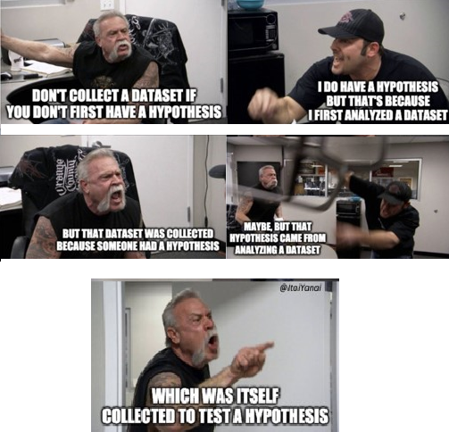
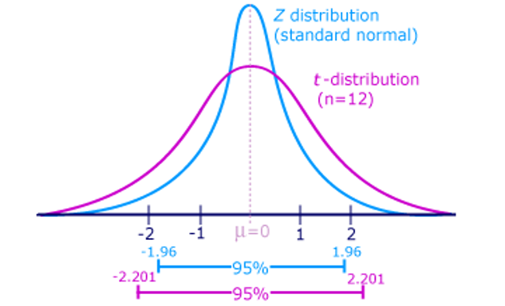
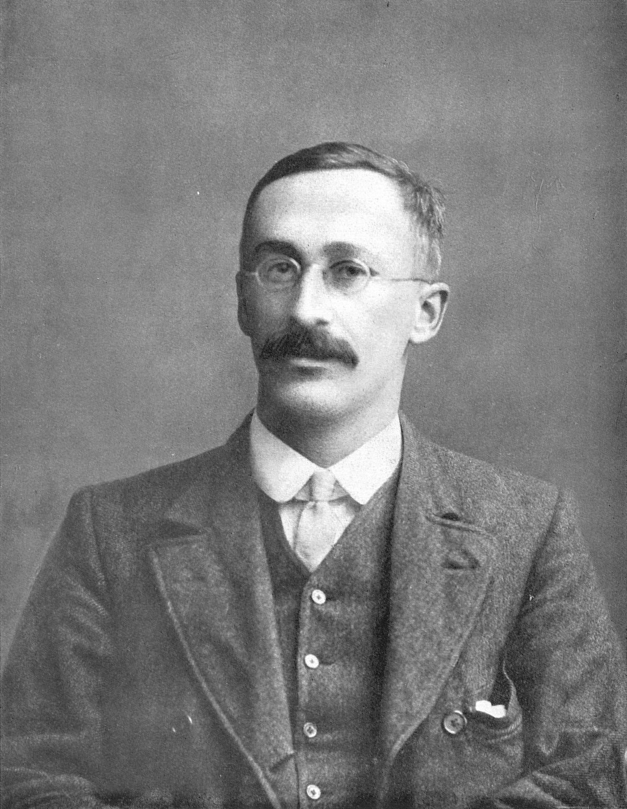

```{r setup, include=FALSE}
options(htmltools.dir.version = FALSE,
        eval = TRUE, warning = FALSE, message = FALSE)
knitr::opts_chunk$set(warning = FALSE, message = FALSE, fig.retina = 3, fig.asp = 0.8, fig.width = 7, out.width = "120%")

library(tidyverse)
library(gt)
library(gtExtras)
library(rstatix)
library(palmerpenguins)


```


class: title-slide, left, top

# `r rmarkdown::metadata$title`

## `r rmarkdown::metadata$subtitle`

### `r rmarkdown::metadata$author`

<br>


<span style='color:white;'>Slides released under</span> [CC-BY 2.0](https://creativecommons.org/licenses/by/2.0/)&nbsp;&nbsp;`r fontawesome::fa("creative-commons", "white")``r fontawesome::fa("creative-commons-by", "white")` ]   

<div style = "position: absolute;top: 0px;right: 0px;"></img></div>

---

layout: true

<div class="my-footer"><span>Philip Leftwich - 5023Y Courses Slido.com #2858224</span></div>


---

## Hypothesis testing

The null and alternative hypotheses are the foundation of hypothesis testing

The **null hypothesis**, denoted by *H0*, represents the default assumption that there is no relationship between the variables being studied or that there is no difference between two groups. In other words, the null hypothesis assumes that any observed difference is due to chance or random variation.

The alternative hypothesis, denoted by *H1*, is the opposite of the null hypothesis. It represents the claim that there is a relationship between the variables or that there is a difference between two groups.

---

class: top, right

.pull-left[


.left[ You (or someone) state a hypothesis/claim.

You collect data to test that hypothesis/claim.

Based on the data you collect, you ask yourself: ]

]


```{r, echo = FALSE, out.width = "50%", fig.align = "right"}

```


---

class: top, right

.pull-left[


.left[ You (or someone) state a hypothesis/claim.

You collect data to test that hypothesis/claim.

Based on the data you collect, you ask yourself: 


*Do I have enough evidence to make me think that my null hypothesis/claim is wrong? Or do I lack evidence to dispute it?*]

]

```{r, echo = FALSE, out.width = "50%", fig.align = "right"}

```


---

## Hypothesis testing

*Null Hypothesis*: Koalas and cheetahs run at the same speed

--

*Alternative hypothesis*: Koalas and cheetahs **do not** run at the same speed

--

Data collected: (n = 20 each): $\overline x$ cheetah speed = 62mph, $\overline x$ koala speed = 0.2mph

Conclusion: I think I have sufficient evidence to reject my null hypothesis (it is wrong); koalas and cheetahs do not run at the same speed

```{r, echo = FALSE}
knitr::include_graphics("images/koala_cheetah.png")
```

---
class: middle, center,inverse

## Did we prove that koalas and cheetahs run at different speeds?


---
class: middle, center,inverse

## Did we prove that koalas and cheetahs run at different speeds?


## No

---

## Reject the Null

We decided we had sufficient evidence to reject the null hypothesis that koalas and cheetahs run at the same speed. 

--

We decided it was *too surprising* to get this result if the null hypothesis were true. 

--

What is our cutoff for keeping or rejecting a null hypothesis?

--

**YOU DECIDE** 🫵

--

*But there are agreed standards...

---

## Hypothesis testing

Significance levels (alpha, $\alpha$): the probability of rejecting a **true** null hypothesis.

--

Most common $\alpha$ = 0.05 (but 0.01, 0.001 also common)

--

What about *p*?

---

## P-value

.pull-left[


NULL HYPOTHESIS: The mean claw length of velociraptors is 11.4 inches.


(…you collect some data from 18 velociraptor fossils to test that hypothesis)


]

.pull-right[

```{r, echo = FALSE, out.width = "80%"}

```

]

---

## P-value

.pull-left[


NULL HYPOTHESIS: The mean claw length of velociraptors is 11.4 inches.


(…you collect some data from 18 velociraptor fossils to test that hypothesis)


You CHOOSE Significance Level: α = 0.05


You FIND a p-value, p = 0.12


]

.pull-right[

```{r, echo = FALSE, out.width = "80%"}

```

]

---

## P-value

.pull-left[


NULL HYPOTHESIS: The mean claw length of velociraptors is 11.4 inches.


(…you collect some data from 18 velociraptor fossils to test that hypothesis)


You CHOOSE Significance Level: α = 0.05


You FIND a p-value, p = 0.12


Do you have enough evidence to **reject the null hypothesis**? 

What do you conclude?

]

.pull-right[

```{r, echo = FALSE, out.width = "80%"}

```

]

---

## What is a P-value?

--

IF the null hypothesis is true, 

--

it is the probability that we could have taken a random sample from the population described by the null hypothesis and have found a sample mean (or means difference) at least this different from the null mean by random chance. 


---

## Are two distributions the same or different?

```{r, echo = F, out.width = "60%"}
plot_two_normals <- function(mean1 = 0, sd1 = 1, mean2 = 0.5, sd2 = 1) {
  x <- seq(-5, 5, by = 0.1)
  y1 <- dnorm(x, mean = mean1, sd = sd1)
  y2 <- dnorm(x, mean = mean2, sd = sd2)
  plot(x, y1, type = "l", col = "red", xlab = "X", ylab = "Density", main = "Two Normal Distributions")
  lines(x, y2, col = "blue", lty = "dashed")
  legend("topright", c("Population 1", "Population 2"), lty = c("solid", "dashed"), col = c("red", "blue"))
}

plot_two_normals()

```

---

## A normal disribution of the difference


```{r, echo = F}
plot_mean_diff <- function(mean1 = 0, sd1 = 1, mean2 = 0.5, sd2 = 1, sample_size = 20) {
    library(graphics)
    sd <- sqrt(sd1^2/sample_size + sd2^2/sample_size)
    x <- seq(-5, 5, by = 0.1)
    mean_diff <- rnorm(10000, mean = mean2 - mean1, sd = sd)
    y <- dnorm(x, mean = mean2 - mean1, sd = sd)
    plot(x, y, type = "l", col = "black", xlab = "Difference in Means", ylab = "Density", main = "Mean Difference Distribution")
    abline(v = 0, col = "red", lty = 2)
    xmin <- mean2 - mean1 - 1.96 * sd
    xmax <- mean2 - mean1 + 1.96 * sd
    ymin <- 0
    ymax <- max(y)
    rect(xmin, ymin, xmax, ymax, col = "grey", density = 20, angle = 45)
    legend("topright", legend = "95% \n Confidence Interval", fill = "grey")
}

```

.left-code[

$Mean~difference = \overline x_1 - \overline x_2$

$SED = \sqrt{s_1^2\over n_1}+{s_2^2\over n_2}$


${95\%~CI} = {\overline x \pm 1.96*SE}$

]

.plot-right[

```{r, out.width = "50%"}

plot_mean_diff(mean1 = 0, sd1 = 1, mean2 = 0.5, sd2 = 1, sample_size = 20)

```

]

---


```{r, out.width = "60%"}
plot_mean_diff(mean1 = 0, sd1 = 0.5, mean2 = 0.5, sd2 = 0.5, sample_size = 20)

```


---


```{r, out.width = "60%"}
plot_mean_diff(mean1 = 0, sd1 = 1, mean2 = 0.5, sd2 = 1, sample_size = 40)
```

---

```{r, out.width = "60%"}
plot_mean_diff(mean1 = 0, sd1 = 1, mean2 = 0.7, sd2 = 1, sample_size = 20)
```

---

## z and t-statistics

1) Do we usually **know** the true population mean and sd?

--

2) If we do not the is our uncertainty *greater or lesser* than the z distribution?

--

3) What do you think a distribution with greater uncertainty, would look like compare to a z-distribution?

---

```{r, echo = F, out.width = "80%"}
x <- seq(-5, 5, by = 0.1)
y1 <- dt(x, df = 1)
y2 <- dt(x, df = 3)
y3 <- dt(x, df = 8)
y4 <- dt(x, df = 30)
y5 <- dnorm(x)
plot(x, y1, type = "l", col = "red", 
     xlab = "x", 
     ylab = "Density", 
     main = "T Distributions and Normal Distribution",
     ylim = c(0,0.4),
     xlim = c(-5, 5))
lines(x, y2, col = "blue")
lines(x, y3, col = "green")
lines(x, y4, col = "purple")
lines(x, y5, col = "black", lty = 2)
legend("topright", legend = c("df = 1", "df = 3", "df = 8", "df = 30", "Normal"), col = c("red", "blue", "green", "purple", "black"), lty = c(1, 1, 1, 1, 2))

```

---

z is the standard normal distribution

t-distribution is closely related, but influenced by sample size *n* and has **fatter tails**

.pull-left[

```{r, echo = FALSE}

```
]

.pull-right[

```{r, echo = FALSE, fig.cap = "The student - William Sealy Gossett", out.width = "60%"}

```

]

---

## Using t

You will *almost never know* a populations true SD

You cannot *be sure* sample sizes are large enough to satisfy central limit theorem

Calculate Confidence intervals based on *t-distribution*

${95\%~CI} = {\overline x \pm t*SE}$

*Calculating t based on sample size WILL affect confidence intervals*

---
class: center, middle, inverse

## Linear models and t-tests

---

## observed t value


```{r, echo = F}

darwin <- read_csv(here::here("data", "darwin.csv"))

```


.right-plot[


```{r}
lsmodel <- lm(height~type, data = darwin)
summary(lsmodel)
```


]


.left-code[

Observed *t* is the product of the mean difference divided by the Standard error of the difference

${t=}{difference\over~SE}$ 

${-2.437=}{-2.617\over1.074}$


]

---


## Critical t-value

Critical *t* is the threshold value above which you exceed your chosen $\alpha$ threshold 

.pull-left[

p = 0.05 when t > than:

| Df    | Critical t-value |
| ----------- | ----------- |
|1     | 12.7       |
| 5 | 2.57       |
| 10 | 2.22     |
| 20 | 2.08     |
| 28 | 2.048
| 30 | 2.04    |

]

--

.pull-right[

${95\%~CI} = {\overline x \pm t_{critical}*SE}$

${95\%~CI} = {-2.617 \pm 2.048*1.07}$

${95\%CI;[-4.81:-0.417]} = {-2.617 \pm 2.19}$

---

## 95% Confidence intervals

${95\%CI;[-4.81:-0.417]} = {-2.617 \pm 2.19}$

```{r}
lsmodel %>% 
  broom::tidy(., conf.int = T)
```

--

*Selfed plants are shorter on average than crossed plants (mean -2.61 inches; 95% CI [-0.417:-4.82])*

*The minimum height difference (at 95% confidence) is 0.417 inches*


---

## Paired and unpaired t-tests

.pull-left[

**Independent t-tests**

Assumes all data points are independent/not-related

Fits each datapoint to each set of data independently

```{r, eval = F}
lm(height~type, data = darwin)
```

]

.pull-right[

**Paired t-tests**

Assumes each *pair* of data points is related (not independent)

Fits the model to the *differences* betwee the pairs rather than the raw values

```{r, eval = F}
lm(height~type+pair, data = darwin)
```

]

This choice will depend on the nature of the data *and* if it helps improve the fit of your model

---

class: center, middle, inverse

# Next time: P-values, Type 1 & 2 errors

### Reading 

 Chapter 9: Discovering Statistics using R/SPSS - Andy Field

 Chapter 7: The New Statistics - Andy Hector

