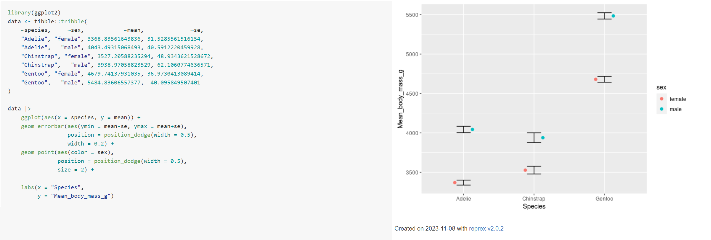
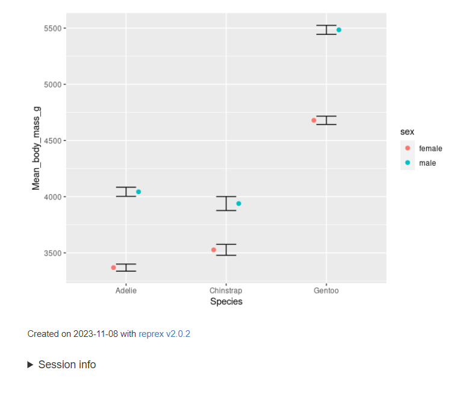

```{r setup, include=FALSE}
options(htmltools.dir.version = FALSE,
        eval = TRUE, warning = FALSE, message = FALSE)
knitr::opts_chunk$set(warning = FALSE, message = FALSE, fig.retina = 3, fig.asp = 0.8, fig.width = 7, out.width = "120%")

library(tidyverse)
library(gt)
library(gtExtras)
library(rstatix)
library(palmerpenguins)
library(gt)
library(countdown)

```


class: title-slide, left, top

# `r rmarkdown::metadata$title`

## `r rmarkdown::metadata$subtitle`

### `r rmarkdown::metadata$author`

<br>


<span style='color:white;'>Slides released under</span> [CC-BY 2.0](https://creativecommons.org/licenses/by/2.0/)&nbsp;&nbsp;`r fontawesome::fa("creative-commons", "white")``r fontawesome::fa("creative-commons-by", "white")` ]   


<div style = "position: absolute;top: 0px;right: 0px;"></img></div>


---

# Session Outline

- Writing tidyverse functions

- Reprexing for issue resolution

---

## Writing a tidyverse style function

```{r}
penguin_summary <- penguins |> 
  summarise(mean = mean(body_mass_g, na.rm = T))

  
```


```{r, eval = F}
penguin_summary <- function(select_var){
  penguins |> 
  summarise(mean = mean(select_var, na.rm = T))
}

```

```
Error in `summarise()`:
ℹ In argument: `mean = mean(select_var, na.rm = T)`.
Caused by error:
! object 'body_mass_g' not found
Run `rlang::last_trace()` to see where the error occurred.

```

Why does this error occur? Because the {tidyverse} utilizes tidy evaluation

---

## What is tidy evaluation?

**Tidy evaluation:** A framework for controlling how expressions and variables in your code are evaluated by tidyverse functions.

- Allows programmers to select variables based on their position, name, or type

- Useful for passing variable names as inputs to functions that use tidyverse packages like dplyr and ggplot2

- {dplyr} verbs rely on tidy evaluation to resolve programming commands

---

## Tidy evaluation

Two types of tidy evaluation:

- **Data-masking**, used by: `arrange()`, `count()`, `filter()`, `group_by()`, `mutate()`, and `summarise()`

- **Tidy-select**, used by: `across()`, `rename()`, `select()`, and `pull()`

To determine which type of tidy evaluation a function uses, look at the help file

---

## Data masking

.pull-left[
- Data-masking is a distinctive feature of R whereby programming is performed directly on a data set, with columns defined as normal objects.

- Almost all base R functions use **unmasked programming**

```
mean(penguins$body_mass_g + penguins$flipper_length_mm)
#[1] 4402.67
```
Referring to columns without `$` is an error - Where is the data?

```
mean(body_mass_g + flipper_length_mm)
# Error: object 'body_mass_g' not found
```


]

.pull-right[
- While data-masking makes it easy to program interactively with data frames, it makes it harder to create functions.


- Equivalent code with functions from dplyr that use data masking

```
# Data masking allows you to reference columns without using $
penguins |> 
summarise(mean = mean(body_mass_g + flipper_length_mm))
# A tibble: 1 × 1
#   mean
#  <dbl>
#1 4403.

```
]


---

# Writing functions with dplyr verbs that use data-masking

Data masking introduces ambiguity with respect to what you mean by "variable".

**env-variables:** objects (variables) that live in the environment; usually created with <-

```
# example of an env-variable
x <- 3
```

**data-variables:** variables that live in the data frame; usually arise from reading in data or manipulating data that was read in to create new variables in a data frame

```
# example of a data variable: body_mass_g on df penguins (and mpenguins is an env-variable!)
penguins$body_mass_g
```

**Relation to data masking:** Data masking allows you to reference data-variables without specifying the env-variable they arise from. Allows for shorthand in code, but introduces problems when writing functions.

---

## Writing functions with data masking

- `{dplyr}` verbs that use data masking:

`arrange()`, `count()`, `filter()`, `group_by()`, `mutate()`, and `summarise()`

- Data masking introduces ambiguity with respect to what you mean by "variable".

- Ambiguity is clarified by indicating to R where to look for an object (within a data frame or within the environment) via 

`.data$varname, .data[[group_var]], .env$global_var_name`

---

# Passing "quoted" arguments to summarise


```{r, eval = FALSE}

penguin_summary <- function(select_var){
  penguins |> 
  summarise(mean = mean(.data[[select_var]], na.rm = T))
}

penguin_summary("body_mass_g")

```

```
# A tibble: 1 × 1
   mean
  <dbl>
1 4202.
```

---


## Quasiquotation


Passing data-masked arguments to functions requires injection (also known as quasiquotation) with the embracing operator {{·}}

This is needed because under the hood data-masking works by defusing R code to prevent its immediate evaluation.

The defused code is resumed later on in a context where data frame columns are defined.


```{r}
penguin_summary <- function(select_var){
  penguins |> 
  summarise(mean = mean({{select_var}}, na.rm = T))
}

penguin_summary(body_mass_g)
penguin_summary("body_mass_g") # Works either way

```

---

## Quasiquotation

The {{.}} is a shortcut for `!!enquo(.)` Where `rlang::enquo()` captures and quote an argument or an expression. The result of `enquo()` is a quosure, which is a combination of the quoted expression and its associated environment.

`!!` This is the unquote operator. It's used to unquote or unsplice the contents of a quosure. In other words, it takes the quoted expression out of the quosure and evaluates it.

```{r}
penguin_summary <- function(select_var){
  
  select_var <- enquo(select_var)
  
 penguins |> 
  summarise(mean = mean(!!select_var, na.rm = T))
  
}

penguin_summary(body_mass_g)

```

- But {{}} is more flexible - `enquo` expects a data-masked variable

---

## Using {{.}}


```{r}
my_total <- function(data, var_1, var_2){
data |> 
  summarise(new_mean = mean({{var_1}} + {{var_2}}, na.rm = T))
}

my_total(penguins, body_mass_g, flipper_length_mm)

```


## Passing quoted arguments to filter()


```{r}
penguins |> 
  filter(body_mass_g < 3500)
```

---

## Passing quoted arguments to filter()

```{r}
filter_function <- function(filter_condition){
  penguins |> 
  filter(filter_condition)
}
```

```{r, eval = F}

filter_function("body_mass_g < 3500")

```
```
Error in `filter()`:
ℹ In argument: `filter_condition`.
Caused by error:
..................
```

Why did we get this note? The character condition needs to be **an expression**

**expression** is an object that represents an action that can be performed by R

---

## Passing quoted arguments to filter()

Can use !! injector & rlang::parse_expr()

`rlang::parse_expr:` transforms text into an un-evaluated expression 

!! unquotes the character string

```{r, eval = F}
filter_function <- function(filter_condition){
  penguins |> 
  filter(!!rlang::parse_expr(filter_condition))
}


filter_function("body_mass_g < 3500")

```

```
# A tibble: 71 × 8
   species island    bill_length_mm bill_depth_mm
   <fct>   <fct>              <dbl>         <dbl>
 1 Adelie  Torgersen           40.3          18  
 2 Adelie  Torgersen           36.7          19.3
 3 Adelie  Torgersen           34.1          18.1

```


---

## {{.}} to filter()


```{r}
filter_function <- function(filter_condition){
  penguins |> 
    filter({{filter_condition}})
}

filter_function(body_mass_g < 3500)

```

---

## Passing quoted arguments to mutate()

```{r, eval = F}
ratio_function <- function(mutate_var1, mutate_var2){
  penguins |> 
    mutate(ratio = mutate_var1/mutate_var2)
}

```

```
Error in `mutate()`:
ℹ In argument: `ratio = mutate_var1/mutate_var2`.
Caused by error in `mutate_var1 / mutate_var2`

```

---
## Passing quoted arguments to mutate()

```{r}
ratio_function <- function(mutate_var1, mutate_var2){
    penguins |> 
        mutate(ratio = .data[[mutate_var1]]/.data[[mutate_var2]])
}

ratio_function("bill_length_mm", "bill_depth_mm")

```

---

## Using {{}}

```{r}
ratio_function <- function(mutate_var1, mutate_var2) {
  penguins |> 
    mutate(ratio = {{mutate_var1}} / {{mutate_var2}})
}

ratio_function(bill_length_mm, bill_depth_mm)

```

---

```{r}


my_ratio_function <- function(var1, var2) {
  var1 <- ensym(var1)  # Convert input to symbol
  var2 <- ensym(var2)
  penguins |> 
    mutate(ratio = !!var1 / !!var2)  # Unquote and use the symbols
}

# Call with column names
my_ratio_function("bill_length_mm", "bill_depth_mm")
# Call with column names
my_ratio_function(bill_length_mm, bill_depth_mm)


```


---
## Enquo or ensym


| Feature            | `enquo()`                                  | `ensym()`                               |
|--------------------|--------------------------------------------|-----------------------------------------|
| **Captures**        | Expressions (quosures)                    | Symbols (column names, single symbols)  |
| **Usage**           | For complex expressions (e.g., logical conditions) | For individual column names or symbols |
| **Resulting Object**| Quosure (expression with environment)     | Symbol                                  |
| **Complexity**      | Can handle more complex expressions       | Handles only simple column references   |
| **Example Input**   | `bill_length_mm > 40`                     | `"bill_length_mm"` or `bill_length_mm`  |


When to Use:

- `enquo()`: Use it when you want to capture a complex expression that includes operators, comparisons, or multiple parts.
- `ensym()`: Use it when you're only dealing with simple column names or strings representing column names.


---

class: center, middle, inverse

# Tidy-select

---

## Writing functions with verbs that use tidy-select

To write functions using {dplyr} verbs that use tidy-select: In selecting functions, can put the variable name in "quotes" or use `all_of()`, `any_of()` helper functions to select variables


---

## Writing functions with verbs that use tidy-select

- `any_of()`: selecting any of the listed variables

- `all_of()`: for strict selection. If any of the variables in the character vector is missing, an error is thrown

- Can also use `!all_of()` to select all variables not found in the character vector supplied to `all_of()`


```{r}
my_select_function <- function(select_variable){
  penguins |> 
   select(all_of(select_variable))
  }

my_select_function(select_variable = c("species", "sex")) |> 
  glimpse()

```

---

## Quoted arguments select

```{r, eval = F}

my_select_function <- function(select_variable){
    penguins |> 
        select(select_variable)
}

my_select_function(select_variable = c("species", "sex")) |> 
    glimpse()

```

```
Warning message:
Using an external vector in selections was deprecated in tidyselect 1.1.0.
ℹ Please use `all_of()` or `any_of()` instead.
```

---

## Passing unquoted arguments to dplyr verbs that use tidy-select

```{r, eval = F}
my_select_function <- function(select_variable){
    penguins |> 
        select(select_variable)
}

my_select_function(select_variable = c(species, sex))
```

```
Error: object 'species' not found

```
---
## Passing unquoted arguments to dplyr verbs that use tidy-select

Similar to with data-masking functions, {{ }} ("curly-curly") allows us to pass unquoted arguments to dplyr verbs

```{r}

my_select_function <- function(select_variable){
    penguins |> 
        select({{select_variable}})
}

my_select_function(select_variable = c(species, sex)) |> 
    glimpse()

```

- Function will now work with quoted or unquoted arguments

---

class: center, middle, inverse

# How to reprex

---

## How to make minimal reproducible examples

The term *reprex* stands for reproducible example.

If you ever ask for R help on a forum or want to report an issue on a GitHub repository you will be asked for example code that reproduces the problem; a *reprex*.

--

Here are several nice overviews on how to make a reproducible example that are worth reviewing:

[RStudio Community guide](https://community.rstudio.com/t/faq-how-to-do-a-minimal-reproducible-example-reprex-for-beginners/23061)  
[Stack Overflow canonical thread](https://stackoverflow.com/questions/5963269/how-to-make-a-great-r-reproducible-example)  
[Tidyverse help guide](https://www.tidyverse.org/help/)

---

## What is in a reprex?

A reprex should include:    
    
> - A minimal dataset, necessary to reproduce the issue  

> - The minimal runnable code necessary to reproduce the issue, which can be run
on the given dataset, and including the necessary information on the used packages  

*From the RStudio Community guide*

---

## Why should I reprex?

Making a minimal, reproducible example can take time. It can be easy to convince yourself to skip the process and "just get the help I need".

But the time is ultimately worth spending. 💸

--


> - 80% of the time creating an excellent reprex reveals the source of your problem. It’s amazing how often the process of writing up a self-contained and minimal example allows you to answer your own question.  

> - The other 20% of time you will have captured the essence of your problem in a way that is easy for others to play with. This substantially improves your chances of getting help!

*From the tidyverse help guide*

???

A lot of times you can solve your own problem while working towards a minimal, reproducible example.


---

## The problem

I have made a summary tibble of mean penguin body mass by species and sex


```{r}

penguins_body_mass_summary <- penguins |> 
  drop_na(sex) |> 
  group_by(species, sex) |> 
  summarise(mean = mean(body_mass_g, na.rm = T),
            n = n(),
            sd = sd(body_mass_g, na.rm = T),
            se = sd/sqrt(n))

penguins_body_mass_summary

```

---

## The problem

.left-code[
.tiny[
```{r, eval = F}

penguins_body_mass_summary |> 
ggplot(aes(x = species, y = mean)) +
    geom_point(data = penguins,
      aes(
        x = species,
        y = body_mass_g,
        colour = sex),
        alpha = .2,
        position = position_jitterdodge(dodge.width = 0.5))+
    geom_errorbar(aes(
        ymin = mean-se, ymax = mean+se),
        position = position_dodge(width = 0.5),
        width = 0.2) +
    geom_point(aes(
        color = sex), 
        position = position_dodge(width = 0.5),
        size = 2) +
    labs(x = "Species",
         y = "Mean body mass g") +
    theme_minimal() +
  theme(legend.position = "none")

```
]
]

.right-plot[

```{r, echo = F}

penguins_body_mass_summary |> 
ggplot(aes(x = species, y = mean)) +
    geom_point(data = penguins,
      aes(
        x = species,
        y = body_mass_g,
        colour = sex),
        alpha = .2,
        position = position_jitterdodge(dodge.width = 0.5))+
    geom_errorbar(aes(
        ymin = mean-se, ymax = mean+se),
        position = position_dodge(width = 0.5),
        width = 0.2) +
    geom_point(aes(
        color = sex), 
        position = position_dodge(width = 0.5),
        size = 2) +
    labs(x = "Species",
         y = "Mean body mass g") +
    theme_minimal() +
  theme(legend.position = "none")

```

]


---

## Get help

```{r, echo = FALSE, out.width="100%", fig.alt = "Ask for help in a smart way"}
knitr::include_graphics("images/geordi_help.png")
```

---

## Minimal code

Provide only the most basic/minimal code that helps demonstrate your issue: 

Is this minimal code?

.left-code[
.tiny[
```{r, eval = F}

penguins_body_mass_summary|> 
ggplot(aes(x = species, y = mean)) +
      geom_errorbar(
        aes(ymin = mean-se, 
            ymax = mean+se),
            position = position_dodge(width = 0.5),
            width = 0.2) +
    geom_point(
      aes(color = sex), 
      position = position_dodge(width = 0.5),
      size = 2) +
    labs(x = "Species",
         y = "Mean body mass (g)")

```
]
]

.right-plot[
.tiny[
```{r, eval = F}

penguins_body_mass_summary|> 
ggplot(aes(x = species, y = mean)) +
      geom_errorbar(
        aes(ymin = mean-se, 
            ymax = mean+se),
            position = position_dodge(width = 0.5),
            width = 0.2) +
    geom_point(
      aes(color = sex), 
      position = position_dodge(width = 0.5),
      size = 2) +
    labs(x = "Species",
         y = "Mean body mass (g)")

```
]
]


---

## Use a built-in dataset

```{r}
head(mpg)
```

```{r}

head(iris)

```

---

## Make some fake data

```{r}

species <- c("Adelie", "Adelie", "Chinstrap", "Chinstrap", "Gentoo", "Gentoo")
sex <- c("female", "male", "female", "male", "female", "male")
mean <- c(3368.83561643836, 4043.49315068493, 3527.20588235294, 3938.97058823529, 4679.74137931035, 5484.83606557377)
n <- c(73, 73, 34, 34, 58, 61)
sd <- c(269.380101843856, 346.811553187978, 285.333911718307, 362.137550068121, 281.578293642631, 313.15859562038)
se <- c(31.5285561516154, 40.5912220459928, 48.9343621528672, 62.1060774636571, 36.9730413089414, 40.095849507401)

my_data <- tibble(species, sex, mean, n, sd, se)

my_data


```


---

## Datapasta

- Check your data carefully:

```{r, eval = F}
datapasta::dpasta(penguins_body_mass_summary)

```

```
tibble::tribble(
     ~species,     ~sex,            ~mean,  ~n,              ~sd,              ~se,
     "Adelie", "female", 3368.83561643836, 73L, 269.380101843856, 31.5285561516154,
     "Adelie",   "male", 4043.49315068493, 73L, 346.811553187978, 40.5912220459928,
  "Chinstrap", "female", 3527.20588235294, 34L, 285.333911718307, 48.9343621528672,
  "Chinstrap",   "male", 3938.97058823529, 34L, 362.137550068121, 62.1060774636571,
     "Gentoo", "female", 4679.74137931035, 58L, 281.578293642631, 36.9730413089414,
     "Gentoo",   "male", 5484.83606557377, 61L,  313.15859562038,  40.095849507401
  )
```


---

## Minimal data

Just like with our code, we want to keep things as simple as possible:

```{r}

data <- penguins_body_mass_summary |> 
  select("species", "sex", "mean", "se")

data
```


---

## Make a reprex

.tiny[

```{r, eval = F}

reprex::reprex({
  data <- tibble::tribble(
     ~species,     ~sex,            ~mean,              ~se,
     "Adelie", "female", 3368.83561643836, 31.5285561516154,
     "Adelie",   "male", 4043.49315068493, 40.5912220459928,
  "Chinstrap", "female", 3527.20588235294, 48.9343621528672,
  "Chinstrap",   "male", 3938.97058823529, 62.1060774636571,
     "Gentoo", "female", 4679.74137931035, 36.9730413089414,
     "Gentoo",   "male", 5484.83606557377,  40.095849507401
  )
  
data |> 
ggplot(aes(x = species, y = mean)) +
    geom_errorbar(aes(ymin = mean-se, ymax = mean+se),
                  position = position_dodge(width = 0.5),
                  width = 0.2) +
    geom_point(aes(color = sex), 
               position = position_dodge(width = 0.5),
               size = 2) +

    labs(x = "Species",
         y = "Mean_body_mass_g")
  
})


```

]

```
#> Error in ggplot(data, aes(x = species, y = mean)): could not find function "ggplot"
```

---

## Recreate the issue/error


.tiny[

```{r, eval = F}

reprex::reprex({
  library(ggplot2)
  data <- tibble::tribble(
     ~species,     ~sex,            ~mean,              ~se,
     "Adelie", "female", 3368.83561643836, 31.5285561516154,
     "Adelie",   "male", 4043.49315068493, 40.5912220459928,
  "Chinstrap", "female", 3527.20588235294, 48.9343621528672,
  "Chinstrap",   "male", 3938.97058823529, 62.1060774636571,
     "Gentoo", "female", 4679.74137931035, 36.9730413089414,
     "Gentoo",   "male", 5484.83606557377,  40.095849507401
  )
  
data |> 
ggplot(aes(x = species, y = mean)) +
    geom_errorbar(aes(ymin = mean-se, ymax = mean+se),
                  position = position_dodge(width = 0.5),
                  width = 0.2) +
    geom_point(aes(color = sex), 
               position = position_dodge(width = 0.5),
               size = 2) +
    
    labs(x = "Species",
         y = "Mean_body_mass_g")
  
})

```

]

---

## Reprex output


```{r, echo = FALSE, out.height="400px"}

```


---

## Session Info

.pull-left[

```{r, eval = F}

reprex::reprex({
  ...
},
session_info = TRUE)

```

]

.pull-right[

```{r, echo = FALSE, out.width="100%"}

```

]

---

class:center, middle, inverse


## Solving our issue

---
```{r, echo = FALSE}
countdown(minutes = 0, seconds = 13, top = 0)
```
.left-code[
.tiny[

```{r, eval = F}

penguins_body_mass_summary |> 
ggplot(aes(x = species, y = mean, group = sex)) + #<<
    geom_point(data = penguins,
    aes(x = species,
        y = body_mass_g,
        colour = sex),
        alpha = .2,
       position = position_jitterdodge(dodge.width = 0.5))+
    geom_errorbar(
      aes(
        ymin = mean-se, ymax = mean+se),
        position = position_dodge(width = 0.5),
        width = 0.2) +
    geom_point(
      aes(
        color = sex), 
        position = position_dodge(width = 0.5),
        size = 2) +
    labs(x = "Species",
         y = "Mean body mass g") +
  theme_minimal() +
  theme(legend.position = "none")


```

]
]

.right-plot[
.tiny[

```{r, echo = F}

penguins_body_mass_summary |> 
ggplot(aes(x = species, y = mean, group = sex)) + #<<
    geom_point(data = penguins,
    aes(x = species,
        y = body_mass_g,
        colour = sex),
        alpha = .2,
       position = position_jitterdodge(dodge.width = 0.5))+
    geom_errorbar(
      aes(
        ymin = mean-se, ymax = mean+se),
        position = position_dodge(width = 0.5),
        width = 0.2) +
    geom_point(
      aes(
        color = sex), 
        position = position_dodge(width = 0.5),
        size = 2) +
    labs(x = "Species",
         y = "Mean body mass g") +
  theme_minimal() +
  theme(legend.position = "none")


```

]
]
